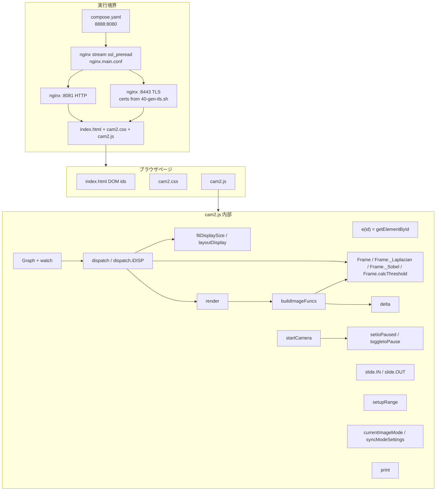
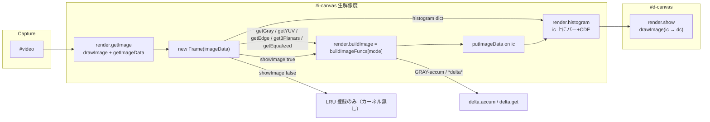

# JSCam (`cam2.js`) 現行システム設計書

| 項目 | 内容 |
| --- | --- |
| 文書タイトル | JSCam live-camera bench 現行アーキテクチャ設計書 |
| 対象 | `/app/jscam/cam2.js` および付随する HTML / CSS / Docker / nginx |
| 著者 | JSCam maintainers |
| 日付 | 2026-09-13 |
| ステータス | Draft |
| 種別 | 現行システムの記述（greenfield 再設計ではない） |

---

## Overview

JSCam はブラウザ上で動作するライブカメラ画像処理ベンチである。`navigator.mediaDevices.getUserMedia` で取得した映像を、ネイティブ解像度の内部 canvas (`#i-canvas`) に取り込み、`Frame` オブジェクト上でグレースケール・YUV・エッジ・ヒストグラム・Otsu 二値化・蓄積差分などを計算し、表示 canvas (`#d-canvas`) に描画する。処理モードは `buildImageFuncs` のキーで切り替え、そのキーに関係ない設定は `[data-modes]` と `syncModeSettings` で隠す。FPS は generator `Graph` が HUD に描く。

本システムは `cam.js` の後継である `cam2.js` を中核とする。`cam.js` にあった typo / 計算バグ（`videoHeight`、RGB プレーン参照、Laplacian の符号、ヒストグラム均等化の `Vmin`、Frame ID 衝突、FPS 統計、`histogram` 命名、蓄積バッファサイズ）を修正したうえで、contain レイアウト・I/O 一時停止・secure context カメラ起動・単一ポート HTTP/HTTPS 多重化を足している。サーバ側は Docker 上の nginx がホストポート `8888` を `ssl_preread` で HTTP (`8081`) と TLS (`8443`) に振り分ける。

---

## Background & Motivation

### 現行の位置づけ

`/app/jscam` は単一ページの静的アプリである。ビルドツールもモジュールバンドラも無く、`index.html` が `cam2.css` と `cam2.js` を直読みする。`cam2.js` は約 1095 行の `'use strict'` グローバルスクリプトで、画像処理カーネル・描画・UI 配線・カメラ起動をすべて同一ファイルに持つ。

### `cam.js` から `cam2.js` への修正（事実）

| 箇所 | `cam.js` | `cam2.js` |
| --- | --- | --- |
| ビデオ寸法 | `video.videoHeigh`（typo。常に `undefined` → 0 判定が壊れる） | `video.videoHeight` |
| エッジ method 例外 | `` `not support ${methdo}` `` | `` `not supported ${method}` `` |
| RGB Sobel プレーン | `G = plane[0]`, `B = plane[0]`（R を 3 回使う） | `G = plane[1]`, `B = plane[2]` |
| Laplacian | `Uint8ClampedArray` に符号付き和を直接代入（負値が 0 にクランプされ、コントラストが潰れる） | `Int16Array` に生値を書き、`Math.abs` してから `Uint8ClampedArray` へ |
| 均等化 `Vmin`（cdf-min） | `V.reduce(Math.min, 0)`。CDF `V[i]∈[0,1]` なので `Vmin` は **常に 0**。補正が走らず `E = V[g]*255`。`255/(1-Vmin)` は常に 255 で、`Infinity` には到達しない | `reduce(..., Infinity)` で真の CDF 最小を取る |
| 均等化ゼロ除算 | 上記のため未到達。全画素がビン 0（`Vmin===1`）のケースは未処理 | `((1-Vmin)==0) ? 0 : 255/(1-Vmin)`。一様黒画像をガード |
| Frame ID | `Math.round(performance.now()*10)`（同一ミリ秒で衝突しうる） | `++Frame.serial` の単調増加 |
| FPS Graph | `values=[0]`, `min=0`, `sum` に生 `fpc` を加算、`scale = height/abs(max)`（max=0 で Inf） | 空配列開始、`min=Infinity` / `max=-Infinity`、平滑値を統計に使い、`max==0` なら scale=0 |
| 命名 | `histgram` | `histogram` |
| 蓄積バッファ | `accum` は `_next` の長さでしか拡張しない。初回は `_next=[]` のためサイズが足りない | 先に `current = frame.getGray()` の長さで `aBuffer` を拡張 |

### 解決している運用上の痛み

1. **getUserMedia は secure context 必須**。LAN IP の `http://` ではカメラが動かない。nginx stream で同一ポート `8888` に HTTP と HTTPS を載せ、`http://127.0.0.1:8888` か `https://<host>:8888` で開ける。
2. **表示サイズと内部解像度の分離**。処理はカメラ生解像度、表示はステージ（開いているサイドパネル幅を差し引く）への contain フィット。
3. **一時停止でフレームを残す**。`canvas.width` / `height` 代入はビットマップをクリアするため、pause 中は CSS サイズだけ更新する。
4. **一時停止ボタンは映像のレイアウトを壊さない**。`#dcanvas-layer` 左上の absolute overlay（`.io-hud`）。
5. **モードに関係ないスライダを出さない**。蓄積係数は `GRAY-accum` / `BW-delta` / `Gray-delta` のときだけ `#field-afactor` を見せる。

---

## Goals & Non-Goals

### Goals（現行システムの守るべき契約）

- ブラウザだけでカメラ映像をリアルタイム処理し、モード切替で結果を確認できること。
- 内部処理解像度は `video.videoWidth` × `video.videoHeight`。表示はアスペクト比を保った contain。
- サイドパネル開閉に応じてステージ実効幅を変え、映像がパネルの下に潜らないこと。パネルは `.app` の CSS grid 列に入り、`slide.OUT` の `display:none` で列が潰れる。
- 選択中の画像モードに関係ない設定をパネルから隠すこと（現行は Accumulation factor のみ）。
- 一時停止中は最後の処理フレームを表示し続け、ウィンドウリサイズには CSS だけで追従すること。
- 非 secure context ではカメラを呼ばず、localhost HTTP / 同一ポート HTTPS への誘導を出すこと。
- ホスト `8888` 一ポートで HTTP と HTTPS の両方を受け付けること。

### Non-Goals（現行は対象外。本設計書も再発明しない）

- サーバサイド画像処理、WebSocket、録画、ファイルアップロード。
- WebGL / WebGPU / WASM / Worker へのオフロード（現状はメインスレッドの画素ループ）。
- 認証・マルチユーザ・永続設定。
- `cam.js` との並行メンテ。`cam2.js` が正本。`cam.js` 自体は修正前スナップショットとしてリポジトリに残す（決定 5）。
- マイク、複数カメラ選択 UI、解像度キャップ（constraints は `{audio:false, video:true}` のまま。PR 4 は延期）。
- ES modules / TypeScript / バンドラ。現状はグローバルスクリプト。
- `file://` で開くこと。`originWithScheme` は `location.port` が空だと `:8888` 無しの URL を作り、誘導リンクが壊れる。

---

## Proposed Design

現行実装の構造を、実行境界 → モジュール → フレームパイプライン → レイアウト → 制御ループの順で記述する。

### 実行境界（Docker / nginx）

ホストは `compose.yaml` でコンテナポート `8080` を `8888` に出す。

```
Host :8888  ──►  container :8080  (nginx stream, ssl_preread)
                      │
                      ├─ $ssl_preread_protocol == ""  →  127.0.0.1:8081  (HTTP)
                      └─ otherwise (TLS)              →  127.0.0.1:8443  (HTTPS)
```

| ファイル | 役割 |
| --- | --- |
| `/app/compose.yaml` | `jscam:local` を build。`8888:8080`。`TLS_SAN` を渡す。下記「再マウント vs 再ビルド」参照。Compose の `healthcheck:` キーは無い。 |
| `/app/jscam/Dockerfile` | `nginx:1.27-alpine` + openssl。`40-gen-tls.sh` を `/docker-entrypoint.d/` に置く。静的ファイルを `/usr/share/nginx/html/` へ COPY。`EXPOSE 8080`。**イメージの** `HEALTHCHECK` が `wget -qO- http://127.0.0.1:8081/healthz`（Alpine `wget` の実行は本設計書では未検証）。8081 応答はポート 8080 / `ssl_preread` の生存を証明しない（Open Question 6）。 |
| `/app/jscam/nginx.main.conf` | `stream { ssl_preread on; }` で 8080 を 8081/8443 に分岐。`http { include conf.d/*.conf; }`。`proxy_timeout 1d`（長寿命接続向け。静的配信では実害は小さい）。 |
| `/app/jscam/nginx.conf` | 8081 と 8443 で同じ document root。`Cache-Control: no-store`。`Permissions-Policy: camera=(self), microphone=()`。`/healthz` → `200 ok`。 |
| `/app/jscam/40-gen-tls.sh` | 起動時に自己署名証明書。SAN 既定 `DNS:localhost,IP:127.0.0.1`。`TLS_SAN` で追加（例 `IP:192.168.1.10`）。825 日、RSA 2048。 |

カメラが動く URL:

- `http://127.0.0.1:8888/` または `http://localhost:8888/`（secure context 例外）
- `https://<host>:8888/`（自己署名のため、ヘルプは "Advanced, then Proceed" を案内する）

`http://<LAN-IP>:8888/` は insecure のため `getUserMedia` は呼ばない。`startCamera` が `window.isSecureContext` を見てヘルプを出す。

再マウント vs 再ビルド:

| 変更対象 | 反映方法 |
| --- | --- |
| `index.html`, `cam2.css`, `cam2.js` | compose の ro bind mount。ブラウザ再読込（`Cache-Control: no-store`）。イメージ再ビルド不要。 |
| `nginx.conf` → `/etc/nginx/conf.d/default.conf` | ファイルはマウントされるが nginx は自動 reload しない。`nginx -s reload` またはコンテナ再作成。stream / `ssl_preread` / `proxy_timeout` はここには無い。 |
| `nginx.main.conf`（8080 多重化, `proxy_timeout`） | イメージに COPY されるだけ。`--build` が必要。 |
| `40-gen-tls.sh`, `Dockerfile` | `--build`。 |
| `TLS_SAN` | エントリポイントが証明書を作り直すのでコンテナ再作成。イメージ再ビルドは不要。 |

### フロントエンド構成

```
index.html          lang="en"。画面コピーは英語
 ├─ cam2.css          レイアウト / テーマ / overlay
 └─ cam2.js           処理・制御のすべて
      hidden canvas   #i-canvas （CSS: 1×1 / opacity:0 / position:absolute / overflow:hidden / pointer-events:none。ビットマップは生解像度）
```

DOM の役割分担:

- `#video` … getUserMedia のシンク。サイドパネルの `Input preview`。`autoplay playsinline muted`。
- `#i-canvas` … 内部処理バッファ。`body` 直下。CSS は `position:absolute; width/height:1px; opacity:0; pointer-events:none; overflow:hidden`。
- `#d-canvas` … ユーザに見える出力。`#dcanvas-layer` 内。
- `#dcanvas-layer` … 表示サイズの CSS ボックス。一時停止 HUD の containing block。
- `#layers` (`.stage`) … contain フィットの親。CSS `padding: 0.5rem`。JS は padding を書かない。
- `#side-panel` … `.app` grid の 2 列目。`Image mode` / `Draw image` / `Input preview` / 条件付き `Accumulation factor` / `Frame interval` / `Log`。初期状態は開。
- `#field-afactor` … `data-modes="GRAY-accum,BW-delta,Gray-delta"`。初期 `hidden`。`syncModeSettings` がトグル。
- `.io-hud` … `#io-pause[data-io-pause]` と `#io-paused-badge`。`position:absolute; top/left:0.5rem`。レイアウト幅を取らない。

### モジュール構造



`cam2.js` にクラスモジュールや `export` は無い。以下はファイル内の事実上の境界である。

| シンボル | 種類 | 責務 |
| --- | --- | --- |
| `e` | 関数 | `document.getElementById` の短縮。 |
| `Graph` | generator function | FPS（または任意のカウンタ）時系列を canvas に描く。 |
| `Frame` | コンストラクタ + 静的メソッド | 1 フレームの画素派生キャッシュ。 |
| `buildImageFuncs` | オブジェクト | モード名 → `ImageData` 生成関数。 |
| `delta` | オブジェクト | グレースケール EMA 蓄積と差分。 |
| `render` | オブジェクト | 内部/表示 canvas、ヒストグラム重畳、リサイズ。 |
| `fitDisplaySize` / `layoutDisplay` | 関数 | contain フィット。pause 時は CSS のみ。 |
| `dispatch` / `dispatch.iDISP` | 関数 + generator | メインループ。 |
| `watch` | 関数 | 500ms 周期で `Graph` を進める。 |
| `slide` | オブジェクト | パネルの opacity / display アニメ。 |
| `setupRange` | 関数 | range + ± ボタン + output をコールバックに接続。 |
| `currentImageMode` / `syncModeSettings` | 関数 | `#image-mode` のキーと `[data-modes]` の `hidden` を同期。 |
| `startCamera` 一式 | 関数 | secure context 検査と getUserMedia。 |
| I/O pause 一式 | 関数 | `dispatch.paused` と `video.pause()`。 |

### 1 フレームのデータフロー



`dispatch.iDISP` の本体（`cam2.js` 761–798 行付近）:

1. `video.videoWidth/Height == 0` なら 100ms 提案して continue（カメラ未起動・未デコード）。
2. `layoutDisplay(video, true)` … 表示 CSS サイズを計算し、`render.resize(disp, [vw, vh])` で両 canvas のビットマップを合わせる。
3. `render.getImage(video)` … 内部 canvas に `drawImage` し `getImageData`。
4. `new Frame(imageData)` … LRU (`HIGH=20`, `LOW=10`) に載せる。
5. `dispatch.showImage` が真なら `render.frame`（ここで初めて `buildImageFuncs` / Sobel / Laplacian / Otsu / `delta` が走る）→ `for (let k in newFrame.histogram)` で内部 canvas に重畳 → `render.show`。`histogram` は `Object.create(null)` なので `for…in` は自前キーだけ見る。PR 6 で `{}` に「簡略化」してはならない。
6. `showImage === false` なら 3–4 まで（capture + LRU 登録）。カーネルも `putImageData` も `drawImage` も走らない。チェックボックス `Draw image` は blit 専用スイッチではない。

generator はループ先頭で `yield suggestion` する。**最初の `next()` は空の `new Frame`×4 と `yield 0` だけで、映像処理は 2 回目から。** そのあと `dispatch()` は `r.value`（いま yield された suggestion）で `setTimeout` する。未準備時の 100ms は「直前イテレーションが書いた suggestion」として次の待ちに乗る。

処理はすべてメインスレッド。640×480 で画素あたり数回の JS ループ、1080p では 1 フレーム数百万演算。目標 FPS は「`setTimeout(dispatch.duration + suggestion)` が回る速さ」であり、固定 30/60 ではない。`pause`（0–500ms, step 10）がフレーム後の追加待ち。

負荷の目安:

| 解像度 | 画素数 | RGBA `ImageData` | 典型モード（灰+Sobel） |
| --- | --- | --- | --- |
| 640×480 | 3.07e5 | 1.23 MiB | メインスレッドで数十 FPS が見込める |
| 1280×720 | 9.22e5 | 3.69 MiB | モード次第で 15–30 FPS 前後 |
| 1920×1080 | 2.07e6 | 8.29 MiB | Sobel/Laplacian/RGB エッジは単桁〜十数 FPS になりうる |

実 FPS は CPU とカメラドライバに依存する。HUD の `Graph` は **非 pause の `iDISP` イテレーション回数** を 500ms で換算する（後述。カメラ前の idle では処理 FPS ではない）。

### カメラ起動シーケンス

```mermaid
sequenceDiagram
  participant U as User
  participant Btn as #camera-start
  participant SC as startCamera
  participant Ctx as window.isSecureContext
  participant GUM as mediaDevices.getUserMedia
  participant V as #video
  participant OV as #camera-overlay
  participant P as setIoPaused

  U->>Btn: click
  Btn->>SC: onclick
  SC->>V: muted / autoplay / playsinline
  SC->>Ctx: 検査
  alt insecure
    SC->>U: showInsecureHelp<br/>http://127.0.0.1:8888 と https://host:8888
  else secure
    alt mediaDevices.getUserMedia が無い
      SC->>U: This browser does not support the camera API.
    else API あり
      SC->>GUM: {audio:false, video:true}
      alt 許可
        GUM-->>SC: MediaStream
        SC->>V: srcObject = stream; play()
        SC->>OV: classList.add("is-live")
        SC->>P: setIoPaused(false)
        Note over P: Pause ボタンを enabled
      else 拒否 / デバイス無し
        GUM-->>SC: error.name + message
        SC->>U: camera disabled: ...
      end
    end
  end
```

ページロード時にも `!window.isSecureContext` なら `showInsecureHelp()` を呼ぶ（ボタンを押す前に理由を出す）。`#link-localhost` / `#link-https` は `originWithScheme` で現在のポートを保った URL に差し替える。

成功後 `#camera-overlay` に `.is-live` が付き `display:none`。失敗時はオーバーレイが残る。

### Pause と Run ループ

```mermaid
stateDiagram-v2
  [*] --> Boot: スクリプト評価
  Boot --> Running: dispatch.run=true; dispatch()
  Running --> Running: iDISP.next() + count++<br/>未準備なら suggestion=100（~10 FPS）<br/>準備済みなら layout+Frame+任意描画<br/>setTimeout(duration + suggestion)
  Running --> Paused: toggleIoPause / setIoPaused(true)
  Paused --> Running: setIoPaused(false)
  Paused --> Paused: layoutDisplay(video, false)<br/>canvas ビットマップは触らない<br/>setTimeout(100)
  Running --> Stopped: dispatch.run=false
  note right of Paused
    video.pause()
    CSS だけ fit
    最後の putImageData を保持
  end note
  note right of Running
    video.play()
    毎フレーム render.resize の可能性
  end note
```



`dispatch` (747–760 行):

- `dispatch.run === false` なら即 return（再スケジュールしない）。現行コードは起動直後に `true` にして以降切らない。
- `dispatch.paused === true` なら `layoutDisplay(e('video'), false)` のみ。100ms 後に再入。**`dispatch.count` は増やさない**（pause 中だけ Graph は 0 に近づく）。
- それ以外は常に `iDISP.next()` → `setTimeout(dispatch, dispatch.duration + r.value)` → `dispatch.count.value++`。`count` は **非 pause の generator イテレーション回数**であり、画素処理フレーム数ではない。`video.videoWidth==0`（および `layoutDisplay` 失敗）でも suggestion=100 を yield したイテレーションを数える。
- カメラ未起動時は約 10 Hz で回るため、HUD は **~10 FPS** を示す。処理メータとして読むと誤る。
- `r.value` はいまの `next()` が yield した suggestion。未準備時 100、通常 0。最初の `next()` の yield は初期値 0（warmup のみ）。

`setIoPaused`:

- `dispatch.paused` を設定。
- ストリームがあるとき `video.pause()` または `video.play()`（play の rejection は `print`）。
- `syncIoPauseButtons` が `[data-io-pause]` を更新: `disabled = !hasStream`、`aria-pressed`、ラベル `Pause` / `Resume`、`#io-paused-badge` の `hidden`（表示時テキスト `Paused`）。

**なぜ pause で `render.resize` しないか。** `HTMLCanvasElement.width` / `height` の代入はコンテキストをリセットしビットマップを透明にする。一時停止中にウィンドウやパネル幅が変わると `layoutDisplay(..., true)` は凍結フレームを消す。よって pause パスは `resizeBitmap=false` で `#dcanvas-layer` の CSS `width`/`height` だけ変え、`#d-canvas` は CSS で引き伸ばす。

### レイアウト（contain、パネル幅）

`fitDisplaySize(videoW, videoH)`:

1. `#layers` の `clientWidth/Height` から **既存の CSS padding**（`.stage` の `0.5rem`）だけを引く。パネル幅はここでは触らない。
2. `scale = min(maxW/videoW, maxH/videoH)`。
3. `floor` した整数 CSS ピクセルを返す。最小 1。

`layoutDisplay` は `#dcanvas-layer` にそのサイズを書き、`aspect-ratio: auto` で CSS 初期値 `4/3` を上書きする。`resizeBitmap` が真のときだけ `render.resize(disp, [videoWidth, videoHeight])`。表示ビットマップは **CSS ピクセル**（`disp`）であり、`devicePixelRatio` は掛けない。`#d-canvas` は CSS `width/height:100%` で引き伸ばされる。2× ディスプレイでは出力が柔らかい（R16）。

pause パスで `width = cssW * dpr` してはならない。ビットマップ代入は凍結フレームを消す（R2）。dpr 対応を足すなら、リサイズ前にビットマップをコピーする。

`.io-hud` は layer の absolute 子であり、`fitDisplaySize` の計算に入らない。これが「pause ボタンはレイアウト空間を取ってはならない」という制約の実装である。

パネル配置:

- `.app` は `grid-template-columns: 1fr auto`、`grid-template-rows: auto 1fr`。`.workspace` は列 1、`#side-panel` は列 2 行 2（`position: relative`、幅 `min(22rem, 100vw)`）。
- パネルが開いている間は grid が workspace を狭める。`#layers` の client 幅がそのまま contain の上限になる。
- `slide.OUT` が `display:none` にすると auto 列が潰れ、workspace が全幅になる。`slide.IN` は `display:block` のあと 250ms で opacity を線形補間する（1ms `setTimeout`。`requestAnimationFrame` ではない）。
- `#panel-close-button` はパネル見出し内（`.panel-close` は `position:static`）。`#panel-open-button` は閉時だけ出す FAB（`.panel-fab`）。

### 画像処理の詳細

#### `Frame` ライフサイクル

コンストラクタはプレースホルダの `getSize` / `getGray` / `getEdge` / `getRGBA`（空配列）と no-op `getImage` を置き、`image instanceof ImageData` なら `feed` する。その後 `++Frame.serial` を ID にし、`Frame.array` / `Frame.map` に登録。長さが `HIGH`(20) を超えたら `LOW`(10) まで古い ID を `delete`。

`feed` が実メソッドをバインドする:

- `getSize()` → `[width, height]`
- `getNum()` → `width * height`
- `getRGBA()` → `imageData.data`（参照。コピーしない）
- `getImage()` → 元の `ImageData`
- `getYUV` / `getGray` / `getEdge` / `getEqualized` / `get3Planars` → 初回計算用の `_get*`。成功後、同名プロパティをクロージャで上書きし、2 回目以降は再計算しない。
- `edgeFuncs` / `histogram` は `Object.create(null)`（`for…in` がプロトタイプキーを見ない。`{}` に置き換えないこと）。

**注意:** パイプラインは `Frame.map` を ID で引かない。`getId()` の呼び出し元も無い。それでも LRU（`Frame.map` / `getId` / HIGH=20 / LOW=10）は残す（決定 1）。PR 1 で削除するのは空の `new Frame`×4 など死ローカルだけ。

#### 色空間

- **Gray** (`_getGray`): `Math.round(0.299R+0.587G+0.114B)` を `Uint8ClampedArray` に代入。`histogram['gray']`。`Math.round` は半数を +∞ 方向。
- **YUV** (`_getYUV`):
  - `Y = 0.299R + 0.587G + 0.114B` を `Uint8ClampedArray` に代入（ECMAScript `ToUint8Clamp`。半数は even、範囲外は 0/255）。
  - `U = -0.169R - 0.331G + 0.500B`、`V = 0.500R - 0.419G - 0.081B` を素の `Array` に符号付き float のまま。
  - インターリーブ `UV = [u0, v0, u1, v1, …]`（長さ `num*2`）。
  - `histogram['gray']` を **上書き**する。
- **Y と Gray は一致しない。** `GRAY-frame` は `getYUV().Y` を使う。`.5` の丸めとクランプ経路が違うため、`getGray()` とは 1 階調ずれうる。先に gray を計算するとヒストグラムキーも衝突する。
- **3 planes** (`_get3Planars`): R/G/B を別 `Uint8ClampedArray` + 各 256 bin。
- **Equalize** (`_getEqualized`): gray の CDF `V[i]∈[0,1]`、`Vmin = min(V)`（初期値 `Infinity`）、`E = (V[g]-Vmin)*factor`。`factor = (1-Vmin)==0 ? 0 : 255/(1-Vmin)`（全画素ビン 0 で `Vmin===1`）。

#### エッジ

オフセット `O` は幅 `w` の 3×3 近傍を **1 次元 packed バッファ** にしたもの:

```
O = [-w-1, -w, -w+1,  -1, 0, 1,  w-1, w, w+1]
start = O[8] = w+1
end   = src.length + O[0] = len - w - 1
```

ループは `for (i = start; i < end; ++i)`。2 次元の `x=1..w-2, y=1..h-2` ではない。

640×480 の例: `i` は `641 .. 306558`。

- **未書き込み（`dst.fill(0)` のまま）:** 先頭行ほぼ全部、2 行目の col0、最終行とそれに接する数画素。
- **左右端は書く。** 行の col0 / col(w-1) でも `i±1` が前行末・次行頭にラップする。左右はゼロボーダーではなく **行跨ぎのラップアーティファクト**。
- 真の 2-D ハローを足す PR は `x=1..w-2`, `y=1..h-2` で回し、左右をスキップすること。

| method | 実装 | 出力 |
| --- | --- | --- |
| `'laplacian'` | カーネル `[1,1,1, 1,-8,1, 1,1,1]` を `Int16Array` に畳み込み、`Math.abs` して `Uint8ClampedArray`（>255 は 255） | 8 近傍 Laplacian の絶対値 |
| `'sobel'` | Gx/Gy、`sqrt(Ix²+Iy²)` を gray に。代入先が `Uint8ClampedArray` なので 255 クランプ | 勾配強度 |
| `'sobel.rgb'` | 各プレーンに Sobel、画素ごと `max(eR,eG,eB)` | 色エッジ |

未知 method は throw。結果は `edgeFuncs[method]` と `histogram[method]` に残す。

#### Otsu (`Frame.calcThreshold`)

256 bin のクラス間分散 `w1*w2*(m1-m2)²` を最大にする閾値 `k`。`w1==0 || w2==0` はスキップ。`8colors`（R/G/B 独立）と `Bin-edge`（`sobel.rgb`）が使う。

#### `delta`

```
aBuffer[t] = (1-factor)*aBuffer[t-1] + factor * gray_from_previous_accum
out[i]     = abs( blend(aBuffer, currentGray)[i] - aBuffer[i] )
```

- `factor` 既定 0.5。`#afactor`（0–1, step 0.05）。大きいほど新フレームを強く反映（HTML の hint と一致）。スライダ UI は `GRAY-accum` / `BW-delta` / `Gray-delta` のときだけ見える。隠しても `delta.factor` は最後の値のまま。
- `time` 既定 100ms。この間隔未満なら `accum` は return（ただし cam2 は先に `aBuffer` を `current.length` まで拡張する）。
- `_next` は「次に成功する `accum` でブレンドする gray」。遅延は表示 1 フレームではなく **1 accum 周期（既定 ~100ms）**。表示 30 FPS ならおよそ 3 フレーム前の gray を混ぜる。
- コールドスタート: 初回成功時 `_next` はまだ空で、`aBuffer` はゼロ埋め。黒からフェードインする。
- `_delta` は必要なら `Uint8ClampedArray` に張り替える。`get` の中間 `l` は素の `Array`（クランプしないブレンド）。
- `GRAY-accum` は float の `aBuffer[i]` を `ImageData` のチャネルへ代入する。表示時に `ToUint8Clamp` される。
- `threshold` (20) はコメントアウトされており未使用。`BW-delta` は `d[i]==0` かどうかで白黒。

### 描画とヒストグラム重畳

`render.frame` は `buildImageFuncs` の返す `ImageData` を内部 canvas に `putImageData` する。その直後、`dispatch.iDISP` が `newFrame.histogram` の **すべてのキー** について `render.histogram` を呼ぶ。

`render.histogram` の画素契約は **内部 canvas（カメラ生解像度）座標系**。表示では `render.show` が `dc.drawImage(ic, 0, 0, dc.width, dc.height)` するため、ストリップは contain フィットに乗って拡縮される。数値（x=10、幅 1px、高さ `ic.height/3`）を CSS/`dc` ピクセルに直書きすると、640 表示と 1920 内部で見た目が一致しない。PR 3 は同じ内部座標で描いてから `render.show` と同様にスケールすること。

- バー: `fillRect(x, ic.height-1-h, 1, h)`。`x` は 10 から 1px 刻みで 256 本（カバー幅 266px、左下寄せ）。単位は `ic` のビットマップピクセル。
- バー高さ = `bins[i] * (ic.height/3) / max(bins)`。CDF 線高さスケール = `(ic.height/3) / numPixels`。底は `ic.height-1`。
- キーごとに `rgba()` を **2 回**（バー、続いて CDF）。`rgba()` は先に `color = (color+1) % 8` してから `COLOR8[color]` を `rgba(...,0.5)` にする。
- `dispatch.iDISP` がループ前に `render.histogram.color = 0` とするため、最初のキーのバーは `COLOR8[1]`（赤）、CDF は `COLOR8[2]`（緑）。**黒 (`COLOR8[0]`) はスキップされる。**
- `index.html` の "The histogram overlays the bottom-left of the image." はコピー上の表現。実装は左下 256px ストリップであり、全幅の下帯ではない。

これは内部 canvas に焼き込まれる。表示 canvas はそれを `drawImage` するだけなので、ヒストグラムは映像の一部として見える。独立レイヤでもトグルでもない。`dispatch.showImage` を外すと **カーネル・ヒストグラム・blit が全部止まる**（capture+LRU のみ）。**決定 2:** この焼き込みを PR 3 で overlay に分離する。

`render.COLOR8` は `C-edge(Sobel)` の疑似カラー（強度を 32 で割った 0–7）とヒストグラム色で共有。

### 起動時配線（スクリプト末尾の副作用）

評価順:

1. `Graph` / `Frame` / `buildImageFuncs` / `delta` / `render` 定義。
2. `render.ic` / `render.dc` を DOM から取得。
3. `watch()` 開始（カメラより先）。
4. `dispatch.run=true; dispatch()`。カメラ前からループが回る。`videoWidth==0` なら suggestion=100 の idle。HUD は **~10 FPS**（0 ではない）。
5. パネル open/close、`print`、`show-image`、`image-mode` を `for (let k in buildImageFuncs)` で填充（`Object.keys` ではない。プレーンオブジェクトでは同じ順だが、プロトタイプにメソッドを足すと変わる）。初期モードは挿入順の先頭 `'GRAY-frame'`。`image-mode.onchange` は `render.buildImage` を差し替え、`syncModeSettings()` を呼ぶ。填充直後にも `syncModeSettings()` する（初期 `GRAY-frame` なので `#field-afactor` は隠れたまま）。
6. `setupRange('afactor', ...)` / `setupRange('pause', ...)`。range は **`onchange`（ドラッグ中は発火せず、離したとき）**。`±` ボタンは即時 `cb`。`input` イベントは未使用。`#afactor` は hidden 中でも配線済み。値は `delta.factor` に残る。
7. `[data-io-pause]` に `toggleIoPause`。初期 `syncIoPauseButtons`（ストリーム無し → disabled）。
8. `#camera-start` → `startCamera`。insecure ならヘルプ表示。`getUserMedia` が無ければ `This browser does not support the camera API.`

`dispatch.iDISP` は起動時に `new Frame` を 4 回（空）。キャッシュを温める以上の効果は無い。同じ IIFE の `ic` / `dc` ローカルも未使用。`watch.last = 0` も未読。ループ末尾の `//delta.accum(newFrame)` はコメントのまま。

---

## API / Interface Changes

本節は現行の「公開相当」インタフェースである。ES module の public API は無い。契約は DOM id とグローバル関数/オブジェクト。

### DOM id 契約（カメラ/I/O を含む）

`e(id)` と CSS セレクタが依存する id。改名は JS と HTML と CSS を同時に変えること。ブログ記事埋め込み用の `s18-` プレフィックスは廃止した（単体ページのため）。`cam.js` スナップショットは旧 id のまま。

| id | 要素 | 契約 |
| --- | --- | --- |
| `video` | `<video autoplay playsinline muted>` | getUserMedia シンク兼プレビュー。`srcObject` の有無が「カメラ起動済み」。 |
| `i-canvas` | `<canvas>` body 直下 | 内部ビットマップ。CSS: `position:absolute; width/height:1px; opacity:0; overflow:hidden; pointer-events:none`。`width/height` 属性は JS が生解像度に更新。 |
| `d-canvas` | `<canvas width=640 height=480>` | 表示。CSS は layer いっぱい。ビットマップは CSS px（dpr なし）。 |
| `dcanvas-layer` | `.stage-layer` | 表示ボックス。JS が px 幅高さを書く。`.io-hud` の親。 |
| `layers` | `.stage` | contain 計算の基準。CSS padding のみ。JS は padding を書かない。 |
| `fps-chart` | `<canvas 240×56>` | Graph 描画先。 |
| `fps-caption` | `<p>` | `FPS range min:max, ave n`。 |
| `side-panel` | `<aside class="panel">` | `.app` grid 列 2。初期 display=block。`slide` が display/opacity を操作。 |
| `panel-open-button` | `.panel-fab` | CSS 既定 `display:none`。パネル閉後に JS が `block`。 |
| `panel-close-button` | `.panel-close` | パネル見出し内。`position:static`。初期表示。 |
| `image-mode` | `<select>` | JS が `buildImageFuncs` のキーで `Option` を add。change で `syncModeSettings`。 |
| `show-image` | checkbox | `dispatch.showImage`。false は capture+LRU のみ（カーネルも blit もしない）。 |
| `field-afactor` | `.field[data-modes]` | 蓄積 UI のラッパ。`data-modes="GRAY-accum,BW-delta,Gray-delta"`。初期 `hidden`。 |
| `afactor` / `-output` / `-increase` / `-decrease` | range 一式 | `setupRange` 命名規則 `name`, `name-output`, `name-increase`, `name-decrease`。range は `onchange`（ドラッグ中は無視）。 |
| `pause` / `-output` / `-increase` / `-decrease` | range 一式 | `dispatch.duration`（ms）。I/O pause とは別。`data-modes` 無し（常時表示）。 |
| `message` | ログ | `print` が直近 7 行を `<br>` で描く。 |
| `io-pause` | button `[data-io-pause]` | セレクタは id ではなく `data-io-pause`。複数可。 |
| `io-paused-badge` | span | `hidden` トグル。 |
| `camera-overlay` / `camera-status` / `camera-help` / `camera-start` | 起動 UI | `.is-live` で非表示。 |
| `link-localhost` / `link-https` | 誘導リンク | insecure 時に href/text を書き換え。 |

`setupRange(name, label, cb)` は `name` をベースに 4 id を要求する。新しいスライダを足すなら HTML をこの規則に合わせる。モード限定ならラッパに `data-modes` を付け、`.field` / `.check` を使う（後述）。

### モード連動設定

```javascript
currentImageMode();   // #image-mode の selected value。未選択なら ''
syncModeSettings();   // document.querySelectorAll('[data-modes]') の hidden を同期
```

契約:

- `data-modes` はカンマ区切りの `buildImageFuncs` キー。`split(',')` のみ。**空白は trim しない**（`GRAY-accum, BW-delta` は一致しない）。
- 現在のモードがリストに無ければ `element.hidden = true`。あれば `false`。
- 呼ぶタイミング: `image-mode` の option 填充直後、および `onchange`。
- 隠すのは UI だけ。`setupRange` のコールバックと `delta.factor` / `dispatch.duration` は hidden 中も有効。

現行のマーク:

| 要素 | `data-modes` | 初期 |
| --- | --- | --- |
| `#field-afactor` | `GRAY-accum,BW-delta,Gray-delta` | HTML に `hidden`。起動時モードは `GRAY-frame` なので同期後も隠れる |
| `#pause` の field | （属性なし） | 常時表示 |
| `Draw image` / `Input preview` / `Log` | （属性なし） | 常時表示 |

CSS: `.field { display: grid }` が UA の `[hidden] { display: none }` を上書きするため、`.field[hidden], .check[hidden] { display: none }` が必須。新しいモード限定コントロールを `.field` / `.check` 以外にするなら、同じ上書きを足すこと。

### `Frame`

```javascript
const f = new Frame(imageData); // ImageData でなければ feed しないプレースホルダ
f.getId();            // number, ++Frame.serial
f.getSize();          // [width, height]
f.getNum();           // width*height
f.getRGBA();          // Uint8ClampedArray 長さ num*4（ImageData 共有）
f.getImage();         // ImageData
f.getGray();          // Uint8ClampedArray, Math.round(BT.601)
f.getYUV();           // { Y: Uint8ClampedArray ToUint8Clamp, UV: Array }
                      // UV = [u0,v0,...]; U=-0.169R-0.331G+0.500B; V=0.500R-0.419G-0.081B
                      // Y と getGray() は丸めが違い、GRAY-frame は Y を使う
f.getEqualized();     // Uint8ClampedArray
f.get3Planars();      // [R,G,B] 各 Uint8ClampedArray
f.getEdge(method);    // 'laplacian' | 'sobel' | 'sobel.rgb'
f.histogram;          // { gray?, equalization?, R?, G?, B?, laplacian?, sobel?, 'sobel.rgb'? }
Frame.calcThreshold(histogram256); // Otsu k
Frame.HIGH === 20; Frame.LOW === 10;
Frame.map[id]; Frame.array; Frame.serial;
```

静的カーネル `Frame._Laplacian(dst, src, O)` / `Frame._Sobel(dst, src, O)` は `O` が長さ 9 の画素オフセットであることを前提にする。`dst.fill(0)` する。

### `Graph`

```javascript
const gen = Graph(data, label, canvasName, captionName, color);
// data は { value: number }。value は読み出し後 0 に戻される。
// 500ms ごとに gen.next()。内部で EMA(AFACTOR=0.2)。
// リング: low = round(canvas.width/STEP), high = low*1.5, STEP=2
// 240px 幅なら low=120, high=180 サンプル。
```

`watch` は `Graph(dispatch.count, 'FPS', 'fps-chart', 'fps-caption', 'rgba(255,0,255,0.5)')` を 500ms で回す。`dispatch.count.value` は **非 pause の `iDISP` イテレーション回数**（画素処理フレーム数ではない）。カメラ未起動の 100ms idle も含むので HUD は ~10 FPS。0 になるのは `dispatch.paused` のときだけ。caption は `innerText`（`print` の `innerHTML` とは別）。

### `render`

```javascript
render.ic; render.dc;           // canvas 要素
render.buildImage;              // (ic, frame) => ImageData
render.COLOR8;                  // 8 色
render.histogram(frame, bins);  // ic 左下 x=10, 幅1px×256, 高さ ic.height/3。キーあたり色2つ。color は呼ぶ前に +1（0 番黒をスキップ）
render.frame(frame);            // putImageData(buildImage())
render.getImage(src);           // drawImage(src) → getImageData
render.show();                  // dc.drawImage(ic)
render.resize(dispXY, internalXY); // 幅高さ変更時のみ代入（クリア副作用）
```

### `delta`

```javascript
delta.aBuffer;      // Array of number, 長さは初回以降 num
delta.factor;       // 0..1
delta.time;         // accum 最小間隔 ms, 既定 100
delta.threshold;    // 未使用
delta.accum(frame); // EMA 更新。スロットルは delta.time（既定 100ms）。_next は 1 accum 周期遅れ
delta.get(frame);   // accum + 絶対差分 Uint8ClampedArray。初回は aBuffer=0 からフェード
```

### `dispatch`

```javascript
dispatch.run;        // false でループ停止（再起動は dispatch() を呼び直す）
dispatch.paused;     // true で処理スキップ + CSS のみフィット
dispatch.duration;   // 追加待ち ms
dispatch.count;      // { value } 非 pause の iDISP 回数（idle 100ms を含む）
dispatch.showImage;  // false なら capture+LRU のみ。buildImageFuncs / histogram / show は呼ばない
dispatch.iDISP;      // generator。先頭 yield。初回 next は warmup のみ
```

### `buildImageFuncs` キー

`(ic, frame) => ImageData`。`ic` 引数はどのモードも未使用。

| キー | 入力 | 出力 |
| --- | --- | --- |
| `GRAY-frame` | `getYUV().Y`（`getGray()` ではない） | Y を RGB に複製 |
| `GRAY-Histogram equalization` | `getEqualized()` | 均等化グレー |
| `G-edge(Laplacian)` | `getEdge('laplacian')` | 絶対 Laplacian |
| `G-edge(Sobel)` | `getEdge('sobel')` | グレー Sobel |
| `C-edge(Sobel)` | `getEdge('sobel')` | `COLOR8[floor(e/32)]` |
| `YUV-frame` | `getYUV()` | Y+1.402V, Y-0.344U-0.714V, Y+1.772U（canvas がクランプ） |
| `UV:RG-frame` | `getYUV().UV` | R=U+128, G=V+128, B=0 |
| `RGB-frame` | `getImage()` | 入力をそのまま返す |
| `GRAY-accum` | `delta.accum` + float `aBuffer` | 蓄積グレー（代入時クランプ）。`#field-afactor` 表示 |
| `BW-delta` | `delta.get` | 非零を 255。`#field-afactor` 表示 |
| `Gray-delta` | `delta.get` | 絶対差分。`#field-afactor` 表示 |
| `8colors` | 3 planes + Otsu | チャネルごと 0/255 |
| `Bin-edge` | `getEdge('sobel.rgb')` + Otsu | 二値エッジ |

キー文字列は UI ラベルそのもの。リネームはセレクトの表示とログ `image mode:` と、該当する `data-modes` 属性を変える。

### カメラ起動

```javascript
const constraints = { audio: false, video: true };
startCamera();          // #camera-start
                        // !mediaDevices.getUserMedia →
                        //   setCameraStatus('This browser does not support the camera API.')
showInsecureHelp();     // isSecureContext が false。file:// ではポート無し URL になりうる
setCameraStatus(msg);   // print + #camera-status
originWithScheme(scheme, hostname); // ポート維持
```

ストリーム停止 API は無い。ページ離脱に `track.stop()` は呼ばない。

### I/O pause

```javascript
document.querySelectorAll('[data-io-pause]'); // 全ボタン
setIoPaused(boolean);
toggleIoPause();
syncIoPauseButtons();
```

HTML は `#io-pause` に `data-io-pause` と `aria-pressed="false"` と `disabled` を付ける。JS は id に依存せず data 属性で探す。

---

## Data Model Changes

永続ストレージは無い。状態はメモリと DOM。

### フレーム状態

```
Frame.map: { [serial: number]: Frame }
Frame.array: number[]   // 挿入順。shift で追い出し
Frame 1 個あたり:
  ImageData (width*height*4 bytes)
  必要に応じて gray / Y / UV / E / R,G,B / edge 各 method
  histogram: { [key: string]: number[256] }
```

最大 20 インスタンス。1080p で派生配列が揃うと 1 フレーム数十 MiB になりうる。追い出しは参照を外すだけなので、どこかが Frame を保持していれば GC されない。現行ループはローカル `newFrame` のみ。

### 蓄積バッファ

`delta.aBuffer` は解像度が上がったときだけ伸ばす。下がっても縮めない。カメラ切替で解像度が変わると古い画素が末尾に残る可能性は、現在の単一 `getUserMedia({video:true})` では起きにくい。

### マイグレーション

サーバ状態が無いのでマイグレーションは不要。静的ファイルを置き換えればよい。`index.html` / `cam2.css` / `cam2.js` の bind mount は再ビルド無しでブラウザ再読込に反映する。`nginx.conf` はマウントされても reload が要る。`nginx.main.conf` / 証明書スクリプトは `--build` またはコンテナ再作成。証明書はコンテナ起動ごとに作り直す（永続ボリューム無し）。

---

## Alternatives Considered

現行コードが選んでいるものと、意図的に採っていない案。

### 1. 処理解像度 = 表示解像度（棄却）

表示 canvas だけを使い、フィット後のピクセルで処理する案。実装は単純で CPU も減る。棄却理由: エッジや Otsu がウィンドウサイズに依存し、パネル開閉で閾値が変わる。現行は内部を生解像度に固定し、表示だけスケールする。

### 2. `requestAnimationFrame` メインループ、または `while` + async delay（未採用）

現行は `setTimeout` + generator。vsync 非同期でジッタがあるが、`dispatch.duration` を `setTimeout` の第二引数に足せる。単一 `while (true) { await delay(...) }` は同等の間隔を async で書けるが、現行ファイルに async が無く、generator の `yield suggestion` 契約を捨てることになる。rAF は表示平滑化に向くが「処理後に N ms」を自分で `lastProcessed` と比較する必要がある。ベンチ目的で timeout + `Graph` を優先。rAF 化は PR 7。

### 3. ヒストグラムを別 canvas / overlay DOM にする（現行は未採用。後続 PR 3 で採用）

現行は内部 canvas に半透明描画する方が短い。トレードオフとして `Draw image` がヒストグラムも消す。**決定 2:** 専用 overlay + 独立チェックボックスに分離する（PR 3。任意ではない）。

### 4. Worker + `OffscreenCanvas`（未採用）

1080p Sobel のメインスレッド占有を避ける。ただし `ImageBitmap` 転送と `cam2.js` のグローバル状態（`delta.aBuffer`、`render.ic`）の分割が要る。現行の「1 ファイルで追える」ことを優先。

### 5. HTTP と HTTPS を別ホストポートにする（棄却）

`8888` と `8443` を両方 publish する方が nginx stream より単純。棄却理由: 利用者には「どのポートがカメラ用か」を増やしたくない。`ssl_preread` で同一 `8888` にまとめる。localhost HTTP の secure context 例外と、LAN 向け自己署名 HTTPS を一本の URL 規則で案内する。

### 6. Laplacian を符号付きのまま疑似カラーする（未採用）

ゼロ交差の可視化には有用。現行はエッジ強度ベンチとして `abs` + 0–255 クランプ。負値を捨て、255 超を飽和させる。

### 7. Let's Encrypt / 正規 CA vs 起動時自己署名（棄却）

LAN デモで公開 DNS と 80 番 ACME を要求しない。`40-gen-tls.sh` の自己署名 + `TLS_SAN` で足りる。ブラウザ警告は受容。HSTS も載せない。

### 8. 表示ビットマップに `devicePixelRatio` を掛ける（未採用）

シャープになるが、pause 中の `canvas.width = cssW * dpr` は凍結フレームを消す（R2）。現行は CSS px の backing store。HiDPI は後続 PR で、リサイズ前コピーが前提。

---

## Security & Privacy Considerations

| 脅威 | 深刻度 | 扱い |
| --- | --- | --- |
| カメラ映像の漏洩 | High | 映像はブラウザ内だけ。サーバへは上がらない。静的ファイルのみ。 |
| 非 HTTPS での getUserMedia | High | `isSecureContext` で API を呼ばない。誘導 UI。 |
| 自己署名 TLS | Medium | ブラウザ警告。MITM 耐性は無い。LAN デモ用。`TLS_SAN` で IP/DNS を合わせる。 |
| 証明書の再生成 | Low | 起動のたび新しい鍵。HSTS は未設定（自己署名と相性が悪い）。 |
| マイク | Low | constraints で audio false。`Permissions-Policy: microphone=()`。 |
| XSS via `print` | Low | `print` は `innerHTML` で文字列連結。`msg` にカメラエラー名が入る。現状ソースは自分たちだが、エスケープしていない。FPS caption は `innerText`。 |
| キャッシュ | Low | `Cache-Control: no-store`。古い JS がカメラ権限付きで残るのを避ける。 |
| 権限ポリシー | Low | `Permissions-Policy: camera=(self)` は **クロスオリジン iframe** のカメラを拒否する。同一オリジンの `self` 埋め込みは許可。 |
| CSP | Low | 未設定。LAN デモとしては許容。インラインは HTML に無く、script は `cam2.js` のみ。 |
| ストリーム生存 | Medium | `track.stop()` 無し。タブを閉じるまでカメラ LED が付いたままになりうる。一時停止は `video.pause()` のみでトラックは live。 |
| `file://` | Low | Non-goal。`originWithScheme` のヘルプリンクが `:8888` 無しになる。 |

認証・CSRF・Cookie は対象外（ステートレス静的サイト）。

---

## Observability

- **ログ UI:** `#message`。リング 7 本。`print()`。サイズ変更、モード、range、camera enabled/disabled、io paused/resumed。
- **FPS HUD:** 500ms。caption に range と平均。canvas スパークライン。`count` は非 pause の `iDISP` 回数。カメラ未起動時 ~10 FPS。`dispatch.paused` のときだけ 0 に落ちる。`showImage=false` でも idle/capture イテレーションは数える（カーネル時間は乗らない）。
- **カメラ状態:** `#camera-status` と `print` の二重。getUserMedia 失敗は `error.name` + `message`。API 欠如は固定英語 `This browser does not support the camera API.`。video 欠如は `video element not found`。insecure は `Camera is blocked at …` と "Advanced, then Proceed"。
- **nginx:** アクセスログ既定、error_log notice。`/healthz` は access_log off。**イメージ `HEALTHCHECK`** はコンテナ内 HTTP 8081 のみ（stream の 8080 / `ssl_preread` は見ない。Open Question 6）。Compose `healthcheck:` は無い。
- **メトリクスバックエンド:** 無し。ブラウザ Performance パネルと HUD が観測手段。
- **アラート:** 無し。カメラ失敗は画面メッセージのみ。

推奨（未実装）: `performance.now()` で `getImage` / `buildImage` / `putImageData` を分けてログする。1080p でどのモードが重いか切り分けられる。

---

## Rollout Plan

現行はすでに動作する静的アプリ + コンテナである。本設計書はドキュメント追加が第一段。

1. **PR 0（本文書）:** コード変更なし。設計書を `/app/jscam/cam2-design.md` に置く。
2. 以降の PR は末尾 **PR Plan** の DAG に従う。直交する PR（1∥2、3∥1、8∥5）は独立にレビュー・マージできる。**PR 5 → PR 7 → PR 6 は独立マージ不可**（分割はループ改修の後）。PR 3 は意図する後続（任意ではない）。PR 4（解像度 cap）は延期し、必須チェーンに含めない。
3. **フラグ:** コードの feature flag は無い。モード select と checkbox が実行時スイッチ。破壊的変更は `buildImageFuncs` キーを残し新キーを足す。
4. **ステージング:** `docker compose up --build`。検証 URL は `http://127.0.0.1:8888/` と `https://<LAN>:8888/`。JS/CSS/HTML だけの変更は mount 済みなら再ビルド不要。
5. **ロールバック:** 静的ファイルとイメージタグを戻す。サーバ状態なし。bind mount 開発の HTML/CSS/JS は git revert で即反映。nginx stream / TLS はイメージ戻し。
6. **証明書:** 起動時生成。ロールバック単位に含めない。

---

## Key Decisions

現行実装が固定している判断。変更するなら互換性とこの節を更新する。

1. **正本は `cam2.js`。`cam.js` は修正前スナップショットとしてリポジトリに残す。**  
   理由: typo と計算バグが処理結果を変える。メンテ対象は `cam2.js` のみ。`cam.js` は対照用に削除しない（決定 5）。

2. **内部 canvas はカメラ生解像度、表示 canvas は contain フィット。表示 backing store は CSS ピクセルで、`devicePixelRatio` を掛けない。**  
   理由: アルゴリズムをビューポートから独立させる。表示側の `width/height` 代入はリサイズ時だけ。dpr を pause パスで掛けると R2 で凍結フレームが消える。

3. **一時停止は処理ループと `<video>` を止め、canvas ビットマップはリサイズしない。**  
   理由: `canvas.width` 代入が凍結フレームを消す。HUD は `#dcanvas-layer` の CSS overlay で、レイアウト幅に入れない。

4. **現行のヒストグラムは内部 canvas 左下（x=10, 幅 256px, 高さ ic.height/3）に焼き込む。意図する後続は PR 3 で overlay に分離する。**  
   理由（現行）: 追加 DOM なし。`index.html` の "bottom-left of the image" は全幅下帯ではなく、この左下ストリップを指す。  
   理由（後続）: 独立チェックボックスとクリーンな内部 `ImageData` が必要（決定 2）。画素契約と座標系は PR 3 を参照。

5. **Laplacian は符号付き畳み込み → abs → 0–255 クランプ。**  
   理由: `Uint8ClampedArray` へ負値を直接書くと 0 になりエッジが消える（`cam.js` のバグ）。abs 後も 255 超は飽和する。

6. **Frame ID は `++Frame.serial`。キャッシュは 10–20 の LRU。`Frame.map` / `getId` は残す。**  
   理由: `performance.now()` ベース ID は衝突する。現行ループは ID 参照しないが、LRU は削除しない（決定 1）。PR 1 でも触らない。

7. **メインループは `setTimeout` + generator。rAF ではない。**  
   理由: `dispatch.duration`（`Frame interval` スライダ）を素直に足せる。ベンチの処理 FPS を `Graph` で測る。

8. **ホスト 8888 を `ssl_preread` で HTTP/HTTPS 多重化。**  
   理由: getUserMedia の secure context。localhost HTTP と LAN HTTPS を同じポート番号で案内できる。

9. **カメラ constraints は `{audio:false, video:true}` のみ。ユーザジェスチャ起動。解像度キャップは入れない。**  
   理由: 自動再生ポリシと permission UX。解像度は UA 既定のまま（決定 4）。PR 4 は必須作業ではない。

10. **派生画像は Frame メソッドの自己上書きでメモ化する。**  
    理由: 同一フレームで gray と Laplacian と histogram が gray を共有。再計算しない。`feed` し直さない限り無効化も無い。

11. **ステージ実効幅は CSS grid が決める。JS は `paddingRight` を書かない。CSS `cqw` の 4:3 ボックスはライブ後に `aspect-ratio:auto` で破棄。**  
    理由: `.app` は `1fr / auto`。パネルは列 2 のフローに入り、`slide.OUT` の `display:none` で列が潰れる。`fitDisplaySize` は `#layers` の client サイズから CSS padding だけ引く。fixed overlay だと映像の下に潜る。

12. **蓄積 `aBuffer` は `Array`（Clamped ではない）。差分出力だけ `Uint8ClampedArray`。遅延は 1 表示フレームではなく 1 accum 周期（`delta.time`）。**  
    理由: EMA の小数を保持する。cam2 は初回 `current.length` で拡張し、空 `_next` でもバッファ不足にならない。

13. **`dispatch.showImage === false` は capture + Frame LRU のみ。カーネルも blit もしない。**  
    理由: `buildImageFuncs` は `render.frame()` 経由だけで、それが `if (dispatch.showImage)` 内。チェックラベルは `Draw image` だが、負荷を落とすスイッチとしても機能する（R5）。

14. **`dispatch.count` は非 pause の `iDISP` 回数。**  
    理由: `count++` は `paused` 早期 return の後、画素処理の成否の外。HUD の「FPS」はカメラ前 ~10、pause 中 0。処理メータにしたいなら PR 5 で `suggestion==100` のとき加算しない。

15. **モードに関係ない設定は `[data-modes]` + `syncModeSettings` で隠す。値は隠しても保持する。**  
    理由: Accumulation factor は `GRAY-accum` / `BW-delta` / `Gray-delta` 以外では無意味。`Frame interval` は全モードの待ち時間なので常時出す。カンマ区切りは trim しない。`.field[hidden] { display: none }` を落とすと grid が表示を復活させる。

---

## 既知の制約とリスク

| ID | 内容 | 深刻度 | 緩和（現行 / 今後） |
| --- | --- | --- | --- |
| R1 | getUserMedia は secure context 必須。LAN の HTTP は失敗する | High | 起動時検査、localhost / HTTPS 誘導、8888 多重化 |
| R2 | 表示 canvas のビットマップリサイズは内容クリア。pause 中に `render.resize` すると凍結フレームが消える | High | `layoutDisplay(..., false)`。今後 pause 中リサイズが必要なら Offscreen コピーを別途保持 |
| R3 | Laplacian abs + Uint8 clamp。符号と 255 超の強度を失う | Medium | cam2 で符号付きバッファ経由にはした。可視化モードは未提供 |
| R4 | ヒストグラムが内部 canvas に焼ける。`showImage` と分離できない。`ic.width < 266` だとバーが切れる | Medium | 現状は生解像度前提。低解像度カメラで崩れる |
| R5 | メインスレッド画素ループ。1080p + `sobel.rgb` で UI が固まりうる | High | モード切替、`pause`、**`Draw image` オフ（カーネルごと停止）**。解像度 cap（PR 4）は延期。Worker は未実装 |
| R6 | 自己署名証明書。警告無視が必要。SAN 不一致だとまた警告 | Medium | `TLS_SAN`。ドキュメントで手順を固定 |
| R7 | `Frame.map` / `getId` は現行ループから未使用。空 `new Frame`×4 は死にコード | Low | LRU は残す（決定 1）。warmup `new Frame`×4 だけ PR 1 で削除 |
| R8 | `getGray` と `getYUV` が両方 `histogram['gray']` を書く | Low | 呼び出し順でヒストグラム重畳が変わる。`GRAY-frame` は YUV 経路 |
| R9 | `print` の `innerHTML` 非エスケープ | Low | 入力は内部文字列。外部入力を足すなら textContent へ |
| R10 | MediaStream を stop しない。pause してもカメラ占有 | Medium | ページクローズ任せ。明示 Stop は後続 PR |
| R11 | `delta.time=100` により蓄積は最大約 10 Hz。EMA 入力は 1 accum 周期遅れ。表示 30 FPS なら約 3 フレーム前 | Low | 仕様。スライダ未接続。コールドスタートはゼロ埋めからフェード |
| R12 | CSS `.stage-layer` の 4:3 はカメラ前プレースホルダ。実カメラが 16:9 でも起動前は 4:3 | Low | 起動後 JS が上書き |
| R13 | `slide` が 1ms timeout。バックグラウンドタブでパネルアニメが伸びる | Low | 250ms 想定。機能影響なし |
| R14 | `YUV-frame` / `UV:RG-frame` の計算値が 0–255 外。ImageData 経由でクランプ | Low | 色ずれとして受容 |
| R15 | 畳み込みは 1-D 範囲 `w+1 .. len-w-2`。左右端は行跨ぎラップ。上下はほぼ未書き込み 0。1px ゼロボーダーではない | Low | 真のハローは `x=1..w-2, y=1..h-2`。現状を「外周 1px 修正」してはならない |
| R16 | 表示ビットマップ = CSS px。`devicePixelRatio` 無し。HiDPI で柔らかい | Medium | 現行契約。pause 中に dpr を掛けない（R2）。シャープ化はリサイズ前コピーが前提 |
| R17 | カメラ未起動でも `dispatch.count` が増え、HUD が ~10 FPS を示す | Low | 仕様。PR 5 で idle を除外する選択肢 |
| R18 | `data-modes` は `split(',')` のみで trim しない。キー前後の空白は一致しない | Low | 現行 HTML は空白無し。新しい属性もカンマ直後に空白を置かない |

---

## Open Questions

### 決定済み（2026-09-12、これ以上議論しない）

1. **`Frame` LRU を残すか。**  
   **決定:** 残す。`Frame.map` / `getId` / `HIGH=20` / `LOW=10` は PR 1 でも削除しない。現行ループは ID を引かないが、契約として保持する。

2. **ヒストグラムを映像から分離するか。**  
   **決定:** 分離する。PR 3（専用 overlay + 独立チェックボックス）は意図する後続であり、任意作業ではない。画素は内部（`ic`）座標で描き `render.show` と同様にスケールする。

4. **カメラ解像度を固定するか。**  
   **決定:** 固定しない。`{audio:false, video:true}` の UA 既定を維持する。PR 4（ideal 解像度セレクト）は延期し、必須チェーンに入れない。負荷はモード切替・`pause`・`showImage` で落とす。

5. **`cam.js` をリポジトリに残すか。**  
   **決定:** 残す。修正前スナップショット。正本は `cam2.js`。並行メンテはしない。

### 未決

3. **`dispatch.duration` と I/O pause の用語衝突。** UI は `Frame interval`、コードは `pause`。リネームは DOM 契約変更。
6. **healthcheck を stream ポート 8080 経由にするか。** 現状 8081 直叩きなので `ssl_preread` の死を検知しない。
7. **Laplacian のスケール。** abs 後 255 clamp で強いエッジが飽和する。`min(255, abs/k)` の k をスライダにするか。

---

## References

- `/app/jscam/cam2.js` — 正本（本設計書の対象）
- `/app/jscam/cam.js` — 修正前。バグ対照用
- `/app/jscam/index.html` — DOM 契約
- `/app/jscam/cam2.css` — overlay / contain / パネル
- `/app/compose.yaml`, `/app/jscam/Dockerfile`, `/app/jscam/nginx.main.conf`, `/app/jscam/nginx.conf`, `/app/jscam/40-gen-tls.sh`
- [getUserMedia secure contexts](https://developer.mozilla.org/en-US/docs/Web/API/MediaDevices/getUserMedia)
- [Canvas の width/height 代入はビットマップをリセットする](https://html.spec.whatwg.org/multipage/canvas.html#attr-canvas-width)
- Otsu, N. “A Threshold Selection Method from Gray-Level Histograms,” IEEE Trans. SMC, 1979
- BT.601 luma 係数 `0.299 / 0.587 / 0.114`

---

## PR Plan

現行はすでにマージ可能な状態である。以下は **残作業を独立レビュー可能な単位に割った順序**。PR 0 以外はコード変更。

依存（ファイル分割をループ改修の後に置く）:

```
PR 0
 ├─ PR 1 死コード（LRU は残す）     ─┐
 ├─ PR 2 カメラ stop                 │ 並列可
 ├─ PR 3 histogram overlay【意図する後続】─┘
 ├─ PR 5 計測 ──► PR 7 rAF ──► PR 6 ファイル分割
 │                                    （PR 3 先行で histogram 所属が安定）
 └─ PR 8 新 Laplacian キー（分割より前。PR 5/7 と並列可）

PR 4 解像度 cap — 延期（必須チェーン外。決定 4）
```

PR 5 / 7 の対象は分割前の単一 `cam2.js`。PR 6 は 5 と 7 の後（および PR 1。PR 3 は意図する後続なので、分割より先にマージして histogram の所属を安定させる）。**独立マージできるのは直交枝だけ**（1∥2、3∥1、8∥5）。5/7/6 はチェーン。メインループを触る PR を分割と並列にしない。PR 4 は必須ではない。

### PR 0 — Document existing JSCam / cam2 architecture

- **タイトル:** `docs: cam2.js 現行システム設計書`
- **対象ファイル:** `/app/jscam/cam2-design.md`（本文書）。コードなし。
- **依存:** なし
- **内容:** アーキテクチャ、DOM 契約、`buildImageFuncs` キー、`[data-modes]`、pause の CSS-only フィット、grid パネル、nginx 8888 多重化、既知リスクを固定する。以降の PR の判断基準。

### PR 1 — Dead code hygiene (behavior-preserving)

- **タイトル:** `refactor: remove unused Frame warmup and dead locals`
- **対象:** `/app/jscam/cam2.js`
- **依存:** PR 0
- **内容:** 削除対象をこれだけにする:
  - `dispatch.iDISP` 先頭の `new Frame`×4
  - 同 IIFE の未使用ローカル `ic`, `dc`
  - `watch.last = 0`
  - `//delta.accum(newFrame)`
  - 未使用 `delta.id` / `delta.threshold`
  - コメントアウト `setupRange('dthreshold')`
  - `cam2.js` に `histgram` 識別子は残っていない（リネーム済み）。触らない。
  - **`getId` / `Frame.map` / LRU は削除しない**（決定 1）。コメントアウトもしない。
  **画素計算は変えない。**

### PR 2 — Explicit camera stop and stream lifecycle

- **タイトル:** `feat: stop MediaStream tracks when leaving live view`
- **対象:** `/app/jscam/cam2.js`, `/app/jscam/index.html`, `/app/jscam/cam2.css`
- **依存:** PR 0。PR 1 と並列可
- **内容:** 「カメラ停止」ボタン。全 `track.stop()`、`srcObject=null`、overlay を戻す、`setIoPaused` を disabled に。`pagehide` でも stop。pause（凍結表示）と stop（デバイス解放）を UI で分ける。R10 の緩和。

### PR 3 — Histogram overlay that does not mutate the internal frame

- **タイトル:** `feat: draw histograms on a dedicated overlay, not i-canvas`
- **対象:** `/app/jscam/cam2.js`, `/app/jscam/index.html`, `/app/jscam/cam2.css`
- **依存:** PR 0。PR 1 と並列可。**意図する後続（任意ではない）。** 決定 2。
- **内容:** `show-image` から独立した「ヒストグラムを重ねる」チェック。内部 `ImageData` をクリーンに保つ。
  **座標系（必須）:** 画素契約の数値は `#i-canvas` / カメラ生解像度。overlay canvas のビットマップを `ic` と同じ `videoWidth×videoHeight` にし、現行 `render.histogram` をそこに描き、`render.show` と同様に `drawImage(..., dc.width, dc.height)`（または layer CSS で同じ contain スケール）する。
  **dc 後段に直描きする場合:** `sx = dc.width / ic.width`、`sy = dc.height / ic.height` を掛け、`x'=10*sx`、バー幅 `1*sx`、高さは `ic.height/3 * sy`（底は `dc.height-1`）。256px を表示 CSS にそのまま置いてはならない（256/640 と 256/1920 で見た目が変わる）。
  **画素パリティ:** x=10、幅 1px × 256 bin、高さ `ic.height/3`、底 `ic.height-1`、キーあたり色 2 つ、ループ前 `color=0` のため最初は赤バー + 緑 CDF（`COLOR8[0]` 黒はスキップ）。左下ストリップ。R4。

### PR 4 — Camera constraints (resolution cap) — 延期

- **タイトル:** `feat: allow ideal capture resolution to cap CPU`（実装しない。記録のみ）
- **対象:** なし（必須チェーン外）
- **依存:** なし。決定 4 により **延期**。再開する場合は PR 2 の後が望ましい。
- **内容:** セレクト（既定 / 640 / 1280 / 1920）と `video.width.ideal` は採用しない。constraints は `{audio:false, video:true}` のまま。負荷対策は R5（モード、`pause`、`showImage`）。この PR を必須作業としてスケジュールしない。

### PR 5 — Processing-time instrumentation in the FPS HUD

- **タイトル:** `feat: log per-stage frame times next to Graph`
- **対象:** `/app/jscam/cam2.js`（分割前）、必要なら `#message` / caption
- **依存:** PR 0。PR 7 / PR 6 より前
- **内容:** `getImage` / `new Frame`+`buildImage` / `histogram` / `show` を `performance.now()` で計測し、500ms 集約。ループは `setTimeout` のまま（Key Decision 7）。
  **任意の挙動変更（この PR で決めて実装する）:** `suggestion==100`（未準備 idle）のとき `dispatch.count` を増やさない。HUD を capture/processing メータに近付ける。採否を PR 説明に明記する。

### PR 7 — requestAnimationFrame display path with duration still honored

- **タイトル:** `feat: vsync-aligned dispatch while keeping pause`
- **対象:** `/app/jscam/cam2.js`（分割前）
- **依存:** PR 5（前後の FPS を比較するため）。PR 6 より前
- **内容:** `setTimeout` の `dispatch` をやめ、**rAF ループは 1 本**。現行の待ちは `setTimeout(dispatch.duration + r.value)` で、未準備時 `r.value === 100`（KD 14 / R17: HUD ~10 FPS）。PR 7 はこれを捨てて vsync 毎に idle `iDISP` してはならない。

  スケジューリング:
  1. `lastProcessedEnd`（処理**終了**時刻）と `lastSuggestion`（直前イテレーションが yield した値。初期 0）を保持する。
  2. `dispatch()` はループの開始/再開入口。`dispatch.run=true` のとき **rAF を 1 回**予約する（現行が `dispatch()` を呼び直すのと同等）。`run===false` なら次の rAF を予約しない。
  3. 各 rAF コールバックの末尾（pause 中も含む）で、`run` が真なら次の rAF を必ず予約する。pause 解除を vsync で観測するため。rAF と `setTimeout` を混在させない。
  4. `dispatch.paused`: **`iDISP` も `count++` もしない。** `layoutDisplay` もこの rAF では呼ばない。レイアウトは `ResizeObserver`（`#layers` およびパネル）だけが `layoutDisplay(video, false)` する。100ms poll 禁止。dpr は掛けない（R16）。HUD は 0 のまま（count が増えない）。
  5. 非 pause: `minWait = max(dispatch.duration, lastSuggestion)`。`now - lastProcessedEnd < minWait` なら処理スキップ（rAF だけ繋ぐ）。既定 `duration=0` かつカメラ未準備 `suggestion=100` でも **~10 Hz を維持**する。idle を vsync レートに上げるなら、その PR で R17 / KD 14 を更新すること（本 PR の既定ではない）。
  6. 間隔を満たしていれば `iDISP` 1 回を実行し、`lastSuggestion = r.value`、`lastProcessedEnd = performance.now()`（終了直後）、非 pause なら `count++`。未準備なら yield 100 が次の `minWait` に入る。

  R2 と R17 を維持したままジッタを減らす。

### PR 8 — Signed Laplacian / unclamped edge preview (opt-in mode)

- **タイトル:** `feat: add Laplacian signed-magnitude view`
- **対象:** `/app/jscam/cam2.js` (`getEdge`, `buildImageFuncs` 新キー)
- **依存:** PR 0。**PR 6 より前**（単一ファイルのキー追加）。PR 5/7 と並列可
- **内容:** 既存 `G-edge(Laplacian)` は互換維持。新キーで零を 128 にした符号付き、または `abs/k` スケール。R3 / Open Question 7。

### PR 6 — Split cam2.js along existing module boundaries

- **タイトル:** `refactor: split Frame, delta, render, camera into script files`
- **対象:** 新規 `/app/jscam/frame.js` 等、`index.html` の script 順、`Dockerfile` / `compose.yaml` の COPY と volume
- **依存:** **PR 1, PR 5, PR 7。** PR 3（意図する後続）と PR 8 が先なら所属とキーが安定する。PR 4 は不要。
- **内容:** グローバル契約は維持（バンドラ無し）。`Frame` / `delta` / `render`+`buildImageFuncs` / `dispatch`+layout / camera+pause / パネル UI（`setupRange`, `syncModeSettings`）。`histogram` は `Object.create(null)` のまま。回帰は全モードの目視と `#field-afactor` の表示切替。Key Decision 1 の正本を複数ファイルに拡張する。ループと計測はすでに PR 5/7 済みであること。

各 PR の完了条件: `http://127.0.0.1:8888/` でカメラ開始、全 `buildImageFuncs` キー切替、`GRAY-accum` / delta でのみ Accumulation factor 表示、パネル開閉での contain、一時停止後の凍結フレーム保持、ウィンドウリサイズ、insecure URL でのヘルプ表示。

