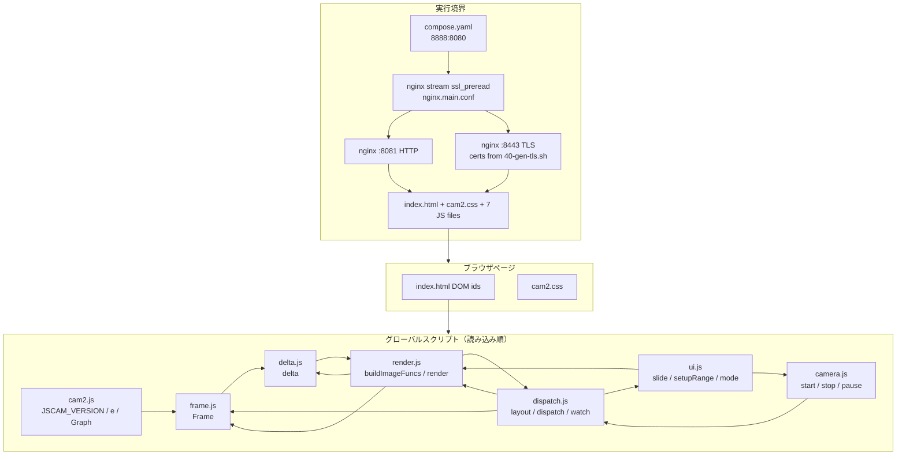
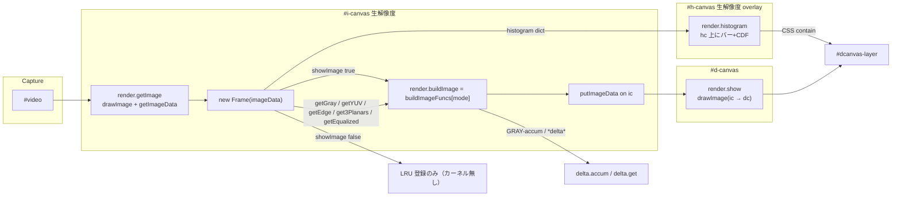

# JSCam (`cam2`) 現行システム設計書

| 項目 | 内容 |
| --- | --- |
| 文書タイトル | JSCam live-camera bench 現行アーキテクチャ設計書 |
| 対象 | `/app/jscam/` の分割グローバルスクリプト（`cam2.js` / `frame.js` / `delta.js` / `render.js` / `dispatch.js` / `ui.js` / `camera.js`）および付随する HTML / CSS / Docker / nginx |
| 著者 | JSCam maintainers |
| 日付 | 2026-09-14 |
| ステータス | Draft（PR 1, 2, 3, 5, 6, 7, 8 まで実装済み。PR 4 は延期） |
| 種別 | 現行システムの記述（greenfield 再設計ではない） |

---

## Overview

JSCam はブラウザ上で動作するライブカメラ画像処理ベンチである。`navigator.mediaDevices.getUserMedia` で取得した映像を、ネイティブ解像度の内部 canvas (`#i-canvas`) に取り込み、`Frame` オブジェクト上でグレースケール・YUV・エッジ・ヒストグラム・Otsu 二値化・蓄積差分などを計算し、表示 canvas (`#d-canvas`) に描画する。ヒストグラムは内部 `ImageData` には焼き込まず、専用 overlay (`#h-canvas`) に ic 解像度で描く。処理モードは `buildImageFuncs` のキーで切り替え、そのキーに関係ない設定は `[data-modes]` と `syncModeSettings` で隠す。FPS は generator `Graph` が HUD に描き、`#fps-caption` にステージ平均時間（get / frm / hist / show）を足す。

本システムは `cam.js` の後継である。画像処理カーネル・描画・UI・カメラ起動はバンドラ無しのグローバルスクリプトに分割している（PR 6）。`cam.js` にあった typo / 計算バグ（`videoHeight`、RGB プレーン参照、Laplacian の符号、ヒストグラム均等化の `Vmin`、Frame ID 衝突、FPS 統計、`histogram` 命名、蓄積バッファサイズ）を修正したうえで、contain レイアウト・I/O 一時停止・明示的なカメラ停止・secure context カメラ起動・単一 rAF ループ・単一ポート HTTP/HTTPS 多重化を足している。サーバ側は Docker 上の nginx がホストポート `8888` を `ssl_preread` で HTTP (`8081`) と TLS (`8443`) に振り分ける。

---

## Background & Motivation

### 現行の位置づけ

`/app/jscam` は単一ページの静的アプリである。ビルドツールもモジュールバンドラも無く、`index.html` が `cam2.css` と次の順のグローバルスクリプトを直読みする（PR 6）:

`cam2.js`（`JSCAM_VERSION`, `e`, `Graph`）→ `frame.js` → `delta.js` → `render.js` → `dispatch.js` → `ui.js` → `camera.js`

ES module の `import` / `export` は無い。契約は DOM id とページグローバルである。現行 JS（`cam2.js` と 6 分割ファイル）のインデントはタブ。オブジェクトリテラルのメソッド本体は `{` の内側で 1 段下げる（`cam.js` 由来の `Frame.prototype` / `buildImageFuncs` のずれは直した）。`cam.js` スナップショットはスペースのまま。

### `cam.js` から `cam2` への修正（事実）

| 箇所 | `cam.js` | 現行 `cam2` |
| --- | --- | --- |
| ビデオ寸法 | `video.videoHeigh`（typo。常に `undefined` → 0 判定が壊れる） | `video.videoHeight` |
| エッジ method 例外 | `` `not support ${methdo}` `` | `` `not supported ${method}` `` |
| RGB Sobel プレーン | `G = plane[0]`, `B = plane[0]`（R を 3 回使う） | `G = plane[1]`, `B = plane[2]` |
| Laplacian | `Uint8ClampedArray` に符号付き和を直接代入（負値が 0 にクランプされ、コントラストが潰れる） | `Int16Array` に生値を書き、既定モードは `Math.abs` してから `Uint8ClampedArray` へ。opt-in の `laplacian.signed` は零を 128 にシフト |
| 均等化 `Vmin`（cdf-min） | `V.reduce(Math.min, 0)`。CDF `V[i]∈[0,1]` なので `Vmin` は **常に 0**。補正が走らず `E = V[g]*255`。`255/(1-Vmin)` は常に 255 で、`Infinity` には到達しない | `reduce(..., Infinity)` で真の CDF 最小を取る |
| 均等化ゼロ除算 | 上記のため未到達。全画素がビン 0（`Vmin===1`）のケースは未処理 | `((1-Vmin)==0) ? 0 : 255/(1-Vmin)`。一様黒画像をガード |
| Frame ID | `Math.round(performance.now()*10)`（同一ミリ秒で衝突しうる） | `++Frame.serial` の単調増加 |
| FPS Graph | `values=[0]`, `min=0`, `sum` に生 `fpc` を加算、`scale = height/abs(max)`（max=0 で Inf） | 空配列開始、`min=Infinity` / `max=-Infinity`、平滑値を統計に使い、`max==0` なら scale=0 |
| 命名 | `histgram` | `histogram`（`Object.create(null)`。`{}` にしない） |
| 蓄積バッファ | `accum` は `_next` の長さでしか拡張しない。初回は `_next=[]` のためサイズが足りない | 先に `current = frame.getGray()` の長さで `aBuffer` を拡張 |

### 解決している運用上の痛み

1. **getUserMedia は secure context 必須**。LAN IP の `http://` ではカメラが動かない。nginx stream で同一ポート `8888` に HTTP と HTTPS を載せ、`http://127.0.0.1:8888` か `https://<host>:8888` で開ける。
2. **表示サイズと内部解像度の分離**。処理はカメラ生解像度、表示は全画面ステージへの contain フィット。Controls / トップバーは映像の上に overlay。
3. **一時停止でフレームを残す**。`canvas.width` / `height` 代入はビットマップをクリアするため、pause 中は CSS サイズだけ更新する（`ResizeObserver`。rAF では layout しない）。
4. **カメラ開始・停止は同じ HUD スロット。** `.io-hud` 左端が `Start camera` ⇄ `Stop camera`（同時には出さない）。ライブ中だけ右に `Pause`。中央 overlay は説明と insecure ヘルプのみ。レイアウト幅は取らない。
5. **モードに関係ないスライダを出さない**。蓄積係数は `GRAY-accum` / `BW-delta` / `Gray-delta` のときだけ `#field-afactor` を見せる。
6. **ヒストグラムは映像から独立**。`Draw histogram` は `Draw image` とは別チェック。内部 `ImageData` はクリーン（PR 3）。
7. **カメラ LED を明示的に消せる**。`Stop camera` と `pagehide` / `beforeunload` で `track.stop()`（PR 2）。pause は `video.pause()` のみでトラックは live。

---

## Goals & Non-Goals

### Goals（現行システムの守るべき契約）

- ブラウザだけでカメラ映像をリアルタイム処理し、モード切替で結果を確認できること。
- 内部処理解像度は `video.videoWidth` × `video.videoHeight`。表示はアスペクト比を保った contain。
- トップバー・Controls・Pause/Stop は映像レイヤ上の overlay。Controls 背景は 50% 透明。ステージは常に全画面。`#layers` クリック（操作部品以外）で chrome を全非表示／再表示。
- 選択中の画像モードに関係ない設定をパネルから隠すこと（現行は Accumulation factor のみ）。
- 一時停止中は最後の処理フレームを表示し続け、ウィンドウリサイズには CSS だけで追従すること。
- カメラ停止は全トラックを `stop()` し、`srcObject` を外し、overlay を戻すこと。pause とは別操作。
- 起動前に `enumerateDevices` で `videoinput` をスキャンすること。1 台なら従来どおり起動。2 台以上なら列挙の先頭で起動し、`#camera-select` で切替できること。
- 使っているカメラの `getCapabilities()` に、再構成なしで変えられる項目があれば Controls の `#camera-params` に出すこと。width/height/frameRate は出さない。
- 入力プレビュー `#video` の表示は縦横とも最大 640 CSS px。超える辺はアスペクト比を保って縮小（内部処理解像度は生サイズのまま）。
- ヒストグラムは `#h-canvas` overlay。画素契約は ic 座標（x=10、1px×256、高さ `height/3`、底 `height-1`、キーあたり色 2 つ）。`Draw histogram` は `Draw image` から独立。
- 非 secure context ではカメラを呼ばず、localhost HTTP / 同一ポート HTTPS への誘導を出すこと。
- ホスト `8888` 一ポートで HTTP と HTTPS の両方を受け付けること。
- グローバルスクリプト分割をバンドラ無しで維持し、`histogram` は `Object.create(null)` のままにすること。

### Non-Goals（現行は対象外。本設計書も再発明しない）

- サーバサイド画像処理、WebSocket、録画、ファイルアップロード。
- WebGL / WebGPU / WASM / Worker へのオフロード（現状はメインスレッドの画素ループ）。
- 認証・マルチユーザ・永続設定。
- `cam.js` との並行メンテ。正本は分割後の cam2 スクリプト群。`cam.js` 自体は修正前スナップショットとしてリポジトリに残す（決定 5）。
- マイク、キャプチャ解像度キャップ（PR 4 は延期。プレビュー表示の 640px 制限は対象。constraints の `width`/`height` ideal は入れない）。
- ES modules / TypeScript / バンドラ。現状はグローバルスクリプト（ファイルは分割済み）。
- `file://` で開くこと。`originWithScheme` は `location.port` が空だと `:8888` 無しの URL を作り、誘導リンクが壊れる。

---

## Proposed Design

現行実装の構造を、実行境界 → モジュール → フレームパイプライン → レイアウト → 制御ループの順で記述する。

### 実行境界（Docker / nginx）

ホストは `compose.yaml` でコンテナポート `8080` を `8888` に出す。

```
Host :8888  ──►  container :8080  (nginx stream, ssl_preread)
                      │
                      ├─ $ssl_preread_protocol == ""  →  127.0.0.1:8081  (HTTP)
                      └─ otherwise (TLS)              →  127.0.0.1:8443  (HTTPS)
```

| ファイル | 役割 |
| --- | --- |
| `/app/compose.yaml` | `jscam:local` を build。`8888:8080`。`TLS_SAN` を渡す。下記「再マウント vs 再ビルド」参照。Compose の `healthcheck:` キーは無い。 |
| `/app/jscam/Dockerfile` | `nginx:1.27-alpine` + openssl。`40-gen-tls.sh` を `/docker-entrypoint.d/` に置く。静的ファイル（`index.html` `cam2.css` と 7 本の JS）を `/usr/share/nginx/html/` へ COPY。`EXPOSE 8080`。**イメージの** `HEALTHCHECK` が `wget -qO- http://127.0.0.1:8081/healthz`（Alpine `wget` の実行は本設計書では未検証）。8081 応答はポート 8080 / `ssl_preread` の生存を証明しない（Open Question 6）。 |
| `/app/jscam/nginx.main.conf` | `stream { ssl_preread on; }` で 8080 を 8081/8443 に分岐。`http { include conf.d/*.conf; }`。`proxy_timeout 1d`（長寿命接続向け。静的配信では実害は小さい）。 |
| `/app/jscam/nginx.conf` | 8081 と 8443 で同じ document root。`Cache-Control: no-store`。`Permissions-Policy: camera=(self), microphone=()`。`/healthz` → `200 ok`。 |
| `/app/jscam/40-gen-tls.sh` | 起動時に自己署名証明書。SAN 既定 `DNS:localhost,IP:127.0.0.1`。`TLS_SAN` で追加（例 `IP:192.168.1.10`）。825 日、RSA 2048。 |

カメラが動く URL:

- `http://127.0.0.1:8888/` または `http://localhost:8888/`（secure context 例外）
- `https://<host>:8888/`（自己署名のため、ヘルプは "Advanced, then Proceed" を案内する）

`http://<LAN-IP>:8888/` は insecure のため `getUserMedia` は呼ばない。`startCamera` が `window.isSecureContext` を見てヘルプを出す。

再マウント vs 再ビルド:

| 変更対象 | 反映方法 |
| --- | --- |
| `index.html`, `cam2.css`, `cam2.js`, `frame.js`, `delta.js`, `render.js`, `dispatch.js`, `ui.js`, `camera.js` | compose の ro bind mount。ブラウザ再読込（`Cache-Control: no-store`）。イメージ再ビルド不要。 |
| `nginx.conf` → `/etc/nginx/conf.d/default.conf` | ファイルはマウントされるが nginx は自動 reload しない。`nginx -s reload` またはコンテナ再作成。stream / `ssl_preread` / `proxy_timeout` はここには無い。 |
| `nginx.main.conf`（8080 多重化, `proxy_timeout`） | イメージに COPY されるだけ。`--build` が必要。 |
| `40-gen-tls.sh`, `Dockerfile` | `--build`。 |
| `TLS_SAN` | エントリポイントが証明書を作り直すのでコンテナ再作成。イメージ再ビルドは不要。 |

### フロントエンド構成

```
index.html          lang="en"。画面コピーは英語
 ├─ cam2.css          レイアウト / テーマ / overlay / #h-canvas / caption wrap
 ├─ cam2.js           JSCAM_VERSION, e(id), Graph
 ├─ frame.js          Frame / カーネル / LRU
 ├─ delta.js          蓄積差分
 ├─ render.js         buildImageFuncs, render（ic / dc / hc）
 ├─ dispatch.js       layout, rAF ループ, watch
 ├─ ui.js             パネル, モード, range, print
 └─ camera.js         start / stop / pause, insecure help
      hidden canvas   #i-canvas （CSS: 1×1 / opacity:0 / position:absolute / overflow:hidden / pointer-events:none。ビットマップは生解像度）
      overlay canvas  #h-canvas （#dcanvas-layer 内。ic 解像度ビットマップ、CSS contain）
```

DOM の役割分担:

- `#video` … getUserMedia のシンク。サイドパネルの `Input preview`。`autoplay playsinline muted`。CSS: `max-width: min(100%, 640px); max-height: 640px; object-fit: contain`。内部処理は `videoWidth/Height` の生解像度。ラベル右の `#preview-size` に同じ生サイズ（`W×H`）を出す。
- `#field-camera-select` / `#camera-select` … 2 台以上のときだけ表示。起動前スキャンの先頭デバイスで開始し、change で `deviceId.exact` 切替。
- `#camera-params` … ライブ `getCapabilities()` で動かせる項目だけ。`applyConstraints`。width/height / frameRate は出さない（再構成の待ち）。Stop で hidden。
- `#i-canvas` … 内部処理バッファ。`body` 直下。CSS は `position:absolute; width/height:1px; opacity:0; pointer-events:none; overflow:hidden`。ヒストグラムはここには描かない。
- `#d-canvas` … ユーザに見える出力。`#dcanvas-layer` 内。内部 canvas を `drawImage`。
- `#h-canvas` … ヒストグラム overlay。ビットマップは ic と同じ生解像度。CSS は `#d-canvas` と同様に layer いっぱい（`position:absolute; inset:0; width/height:100%; pointer-events:none`）。
- `#dcanvas-layer` … 表示サイズの CSS ボックス。一時停止 HUD と `#h-canvas` の containing block。
- `#layers` (`.stage`) … contain フィットの親。ヘッダー下の `.workspace` 内。CSS `padding: 0.5rem`。JS は padding を書かない。`ResizeObserver` の対象。クリックで `.app.chrome-hidden` をトグル（`button` / `.panel` / `.topbar` / `.io-hud` 上は無視）。
- `#side-panel` … `.workspace` 内の overlay（右。幅 720px 以下は下からのシート）。ヘッダーとは重ならない。背景 `rgba(18, 21, 29, 0.5)`。初期状態は開。レイアウト幅は取らない。
- `#field-afactor` … `data-modes="GRAY-accum,BW-delta,Gray-delta"`。初期 `hidden`。`syncModeSettings` がトグル。
- `.io-hud` … `#camera-start` と `#camera-stop` は同じ左端スロット（排他表示）。ライブ中のみ `#io-pause` と badge。`position:absolute; top/left:0.5rem`。レイアウト幅を取らない。`#camera-overlay` より前面。

### モジュール構造



クラスモジュールや `export` は無い。以下はファイル境界に沿った事実上の責務である。

| シンボル | ファイル | 種類 | 責務 |
| --- | --- | --- | --- |
| `JSCAM_VERSION` | `cam2.js` | 文字列 | 実装の一意 ID。`ui.js` が Controls 末尾 `#app-version` に書く。**コードまたは設計の修正の最後に必ず更新する。** 形式は `YYYY.MM.DD-HHMMSSZ-<git short HEAD>`（UTC）。 |
| `e` | `cam2.js` | 関数 | `document.getElementById` の短縮。 |
| `Graph` | `cam2.js` | generator function | FPS（または任意のカウンタ）時系列を canvas に描く。 |
| `Frame` | `frame.js` | コンストラクタ + 静的メソッド | 1 フレームの画素派生キャッシュ。 |
| `buildImageFuncs` | `render.js` | オブジェクト | モード名 → `ImageData` 生成関数。 |
| `delta` | `delta.js` | オブジェクト | グレースケール EMA 蓄積と差分。 |
| `render` | `render.js` | オブジェクト | 内部/表示/ヒストグラム canvas、リサイズ。 |
| `fitDisplaySize` / `layoutDisplay` | `dispatch.js` | 関数 | contain フィット。pause 時は CSS のみ。 |
| `displayResize` | `dispatch.js` | `ResizeObserver` | `#layers` だけを監視し `layoutDisplay(video, false)`。パネルは overlay なので見ない。 |
| `dispatch` / `dispatch.loop` / `dispatch.iDISP` | `dispatch.js` | 関数 + rAF + generator | メインループ。`dispatch()` は開始/再開だけ。 |
| `watch` | `dispatch.js` | 関数 | 500ms 周期で `Graph` を進め、caption にステージ時間を足す。 |
| `slide` | `ui.js` | オブジェクト | パネルの opacity / display アニメ。 |
| chrome トグル | `ui.js` | `#layers` click | `.app.chrome-hidden`。操作部品上の click は無視。 |
| `setupRange` | `ui.js` | 関数 | range + ± ボタン + output をコールバックに接続。 |
| `currentImageMode` / `syncModeSettings` | `ui.js` | 関数 | `#image-mode` のキーと `[data-modes]` の `hidden` を同期。 |
| `startCamera` / `stopCamera` / `switchCamera` | `camera.js` | 関数 | 許可プローブ → enumerate → 先頭 `deviceId` で起動。2 台以上はセレクト。切替は旧 track を stop して取り直し。 |
| `syncCameraParams` / `clearCameraParams` | `camera.js` | 関数 | ライブ caps から Controls を生成。`applyConstraints`。attach で同期、stop でクリア。 |
| `syncPreviewSize` | `camera.js` | 関数 | `#preview-size` に生解像度。`loadedmetadata` / `resize` / attach / stop。 |
| `scanCameraSupport` | `camera.js` | 関数 | 対応スキャン。`#support-report` に YES/PARTIAL/NO。ストリームは止めない。 |
| I/O pause 一式 | `camera.js` | 関数 | `dispatch.paused` と `video.pause()`。トラックは止めない。 |

### 1 フレームのデータフロー



`dispatch.iDISP` の本体（`dispatch.js` 55–107 行）:

1. `video.videoWidth/Height == 0` なら suggestion=100 して continue（カメラ未起動・未デコード・停止後）。
2. `layoutDisplay(video, true)` … 表示 CSS サイズを計算し、`render.resize(disp, [vw, vh])` で `dc` / `ic` / `hc` のビットマップを合わせる。失敗なら suggestion=100。
3. `render.getImage(video)` … 内部 canvas に `drawImage` し `getImageData`（ヒストグラムは含まない）。
4. `new Frame(imageData)` … LRU (`HIGH=20`, `LOW=10`) に載せる。
5. `dispatch.showImage` が真なら `render.frame`（ここで初めて `buildImageFuncs` / Sobel / Laplacian / Otsu / `delta` が走る）→ `showHistogram` なら `render.clearHistogram` のあと `for (let k in newFrame.histogram)` で **`#h-canvas` に**重畳 → `render.show`（ic → dc だけ。hc は CSS overlay）。`histogram` は `Object.create(null)` なので `for…in` は自前キーだけ見る。`{}` に「簡略化」してはならない。
6. `showImage === false` なら 3–4 まで（capture + LRU 登録）。カーネルも `putImageData` も `drawImage` も overlay 更新もしない。チェックボックス `Draw image` は blit 専用スイッチではない。
7. 各ステージを `performance.now()` で `dispatch.time` に加算する（getImage / frame / histogram / show）。idle (`continue`) では加算しない。

generator はループ先頭で `yield suggestion` する。**最初の `next()` は `yield 0` だけで、映像処理は 2 回目から。** warmup の `new Frame`×4 は削除済み（PR 1）。`dispatch.loop` は `r.value`（いま yield された suggestion）を `lastSuggestion` に入れ、`minWait = max(dispatch.duration, lastSuggestion)` で次の処理を間引く。未準備時の 100ms は次の待ちに乗る。

処理はすべてメインスレッド。640×480 で画素あたり数回の JS ループ、1080p では 1 フレーム数百万演算。目標 FPS は「rAF 上で `minWait` を満たしたときだけ `iDISP` が回る速さ」であり、固定 30/60 ではない。`Frame interval`（0–500ms, step 10）が `dispatch.duration`。既定 0 かつカメラ準備済みなら vsync に近い。未準備時は suggestion 100 で **~10 Hz idle**（count は増やさない）。

負荷の目安:

| 解像度 | 画素数 | RGBA `ImageData` | 典型モード（灰+Sobel） |
| --- | --- | --- | --- |
| 640×480 | 3.07e5 | 1.23 MiB | メインスレッドで数十 FPS が見込める |
| 1280×720 | 9.22e5 | 3.69 MiB | モード次第で 15–30 FPS 前後 |
| 1920×1080 | 2.07e6 | 8.29 MiB | Sobel/Laplacian/RGB エッジは単桁〜十数 FPS になりうる |

実 FPS は CPU とカメラドライバに依存する。HUD の `Graph` は **`suggestion != 100` の `iDISP` イテレーション回数** を 500ms で換算する。カメラ前の idle と pause 中は count が増えないので FPS は 0 に近づく。

### カメラ起動シーケンス

```mermaid
sequenceDiagram
  participant U as User
  participant Start as #camera-start
  participant Stop as #camera-stop
  participant SC as startCamera
  participant XC as stopCamera
  participant Ctx as window.isSecureContext
  participant GUM as mediaDevices.getUserMedia
  participant V as #video
  participant OV as #camera-overlay
  participant P as setIoPaused

  U->>Start: click
  Start->>SC: onclick
  SC->>V: muted / autoplay / playsinline
  SC->>Ctx: 検査
  alt insecure
    SC->>U: showInsecureHelp<br/>http://127.0.0.1:8888 と https://host:8888
  else secure
    alt mediaDevices.getUserMedia が無い
      SC->>U: This browser does not support the camera API.
    else API あり
      SC->>SC: ++startCamera.generation<br/>Start を disabled
      SC->>GUM: 許可プローブ {audio:false, video:true}
      alt 許可かつ generation 一致
        GUM-->>SC: probe stream
        SC->>SC: probe を即 stop（処理ループには載せない）
        SC->>SC: enumerateDevices → videoinput
        Note over SC: 2台以上なら #camera-select を表示
        SC->>GUM: 先頭 deviceId.exact（id 無ければ video:true）
        GUM-->>SC: MediaStream
        SC->>V: 旧 stream を stop; srcObject = stream; play()
        SC->>OV: classList.add("is-live")
        SC->>P: setIoPaused(false)
        Note over P: Pause / Stop camera を enabled
      else 許可だが generation 不一致（Stop 後など）
        GUM-->>SC: MediaStream
        SC->>SC: stopStreamTracks(stream) して破棄
      else 拒否 / デバイス無し
        GUM-->>SC: error.name + message
        SC->>U: camera disabled: ...
      end
    end
  end

  U->>Stop: click
  Stop->>XC: onclick
  XC->>XC: ++generation（進行中 GUM を無効化）
  XC->>V: 全 track.stop(); srcObject=null
  XC->>OV: classList.remove("is-live")
  XC->>P: setIoPaused(false)
  Note over XC: pagehide / beforeunload でも同じ
```

ページロード時にも `!window.isSecureContext` なら `showInsecureHelp()` を呼ぶ（ボタンを押す前に理由を出す）。`#link-localhost` / `#link-https` は `originWithScheme` で現在のポートを保った URL に差し替える。

成功後 `#camera-overlay` に `.is-live` が付き `display:none`。失敗時および `stopCamera` 後はオーバーレイが残る / 戻る。`stopCamera` は `dispatch.run` を落とさない。ループは `videoWidth==0` の idle（suggestion 100）に戻る。

### Pause と Run ループ

```mermaid
stateDiagram-v2
  [*] --> Boot: スクリプト評価
  Boot --> Running: dispatch.run=true; dispatch()
  Running --> Running: rAF dispatch.loop<br/>minWait 未満なら iDISP スキップ<br/>満たせば iDISP.next()<br/>suggestion!=100 なら count++
  Running --> Paused: toggleIoPause / setIoPaused(true)
  Paused --> Running: setIoPaused(false)
  Paused --> Paused: rAF は継続<br/>iDISP / count / layout なし<br/>ResizeObserver だけ layoutDisplay(video,false)
  Running --> IdleLive: stopCamera
  IdleLive --> Running: startCamera 成功
  note right of Paused
    video.pause() トラックは live
    CSS だけ fit
    最後の putImageData を保持
  end note
  note right of Running
    video.play()
    準備済みなら layout+Frame
    未準備なら suggestion=100（~10 Hz、count なし）
  end note
  note right of IdleLive
    track.stop() srcObject=null
    overlay 復帰
    ループは idle のまま
  end note
```



`dispatch` / `dispatch.loop`（`dispatch.js` 34–54 行）:

- `dispatch()` は開始/再開入口。`run===true` なら rAF を **1 回**予約するだけ。処理本体は `dispatch.loop`。
- rAF は **1 本**。各 callback 末尾で `run` が真なら次の rAF を必ず予約する（pause 中も含む）。`setTimeout` でループしない。
- `dispatch.run === false` なら即 return（次の rAF を予約しない）。現行コードは起動直後に `true` にして以降切らない。`stopCamera` も `run` は落とさない。
- `dispatch.paused === true` なら **`iDISP` も `count++` も `layoutDisplay` もしない**。rAF だけ繋ぐ。レイアウトは `ResizeObserver`（`#layers` と `#side-panel`）が `layoutDisplay(video, false)` する。100ms poll は無い。
- 非 pause: `minWait = max(dispatch.duration, lastSuggestion)`。`now - lastProcessedEnd < minWait` なら処理スキップ。満たせば `iDISP.next()` → `lastSuggestion = r.value` → `lastProcessedEnd = performance.now()`（終了直後）。**`r.value != 100` のときだけ `dispatch.count.value++`**。
- カメラ未起動 / 停止後は suggestion 100 で約 10 Hz idle。HUD の FPS は count が増えないので **0 に近づく**（処理メータ）。
- `r.value` はいまの `next()` が yield した suggestion（直前イテレーションが書いた値）。未準備時 100、通常 0。最初の `next()` の yield は初期値 0。

`setIoPaused`（`camera.js` 20–34 行）:

- `dispatch.paused` を設定。
- ストリームがあるとき `video.pause()` または `video.play()`（play の rejection は `print`）。**トラックは `stop()` しない。**
- `syncIoPauseButtons` が HUD を同期: `.io-hud.is-live` と `hidden`。未起動は `#camera-start` のみ。ライブは Start を隠し `#camera-stop` と `#io-pause` を出す。`attachLiveStream` は params 構築より先に HUD を同期する（params 例外で Pause が残らないように）。

**なぜ pause で `render.resize` しないか。** `HTMLCanvasElement.width` / `height` の代入はコンテキストをリセットしビットマップを透明にする。一時停止中にウィンドウやパネル幅が変わると `layoutDisplay(..., true)` は凍結フレームを消す。よって pause パス（`ResizeObserver`）は `resizeBitmap=false` で `#dcanvas-layer` の CSS `width`/`height` だけ変え、`#d-canvas` / `#h-canvas` は CSS で引き伸ばす。

**pause と stop の違い。** pause は最後の処理フレームを残しカメラ LED を付けたまま。stop はデバイスを解放し overlay を戻す。進行中の `getUserMedia` は `startCamera.generation` 不一致なら stream を直ちに `stop()` して捨てる。

### レイアウト（contain、パネル幅）

`fitDisplaySize(videoW, videoH)`（`dispatch.js` 3–15 行）:

1. `#layers` の `clientWidth/Height` から **既存の CSS padding**（`.stage` の `0.5rem`）だけを引く。パネル幅はここでは触らない。
2. `scale = min(maxW/videoW, maxH/videoH)`。
3. `floor` した整数 CSS ピクセルを返す。最小 1。

`layoutDisplay` は `#dcanvas-layer` にそのサイズを書き、`aspect-ratio: auto` で CSS 初期値 `4/3` を上書きする。`resizeBitmap` が真のときだけ `render.resize(disp, [videoWidth, videoHeight])`。表示ビットマップ `#d-canvas` は **CSS ピクセル**（`disp`）であり、`devicePixelRatio` は掛けない。`#h-canvas` のビットマップは **内部解像度**（`ic` と同じ）。どちらも CSS `width/height:100%`（hc は `inset:0`）で layer に引き伸ばされる。2× ディスプレイでは出力が柔らかい（R16）。

pause / リサイズパスで `width = cssW * dpr` してはならない。ビットマップ代入は凍結フレームを消す（R2）。dpr 対応を足すなら、リサイズ前にビットマップをコピーする。

`.io-hud` は layer の absolute 子であり、`fitDisplaySize` の計算に入らない。これが「pause / start / stop ボタンはレイアウト空間を取ってはならない」という制約の実装である。Start と Stop は左端の同じスロット。Pause はライブ時だけその右。

パネル配置:

- `.app` は `grid-template-rows: auto 1fr`。`.topbar` は 1 行目（フロー。パネルや Pause と重ならない）。`.workspace` は 2 行目で映像 + overlay。
- `#side-panel` と Settings FAB は `.workspace` 内。右 overlay（`z-index: 15`、幅 `min(22rem, 100vw)`）。背景 50% 透明 `rgba(18, 21, 29, 0.5)`。ヘッダーの下にだけ乗る。
- 幅 720px 以下ではパネルは workspace 下端シート（高さ最大 58dvh）。上側の映像をタップして chrome を隠せる。
- `slide.OUT` がパネルだけ `display:none`。`slide.IN` は 250ms opacity（1ms `setTimeout`）。
- `.app.chrome-hidden` はトップバー、パネル、FAB、`.io-hud`、`#camera-overlay` をまとめて `display:none`。トップバー行が潰れて映像が全画面になる。再クリックで外す。
- `#panel-close-button` はパネル見出し内。`#panel-open-button` はパネル閉かつ chrome 表示のとき FAB。
- リサイズは `#layers` の `ResizeObserver` のみ。pause 中でも凍結フレームの CSS フィットは追従する。

### 画像処理の詳細

#### `Frame` ライフサイクル

コンストラクタはプレースホルダの `getSize` / `getGray` / `getEdge` / `getRGBA`（空配列）と no-op `getImage` を置き、`image instanceof ImageData` なら `feed` する。その後 `++Frame.serial` を ID にし、`Frame.array` / `Frame.map` に登録。長さが `HIGH`(20) を超えたら `LOW`(10) まで古い ID を `delete`。

`feed` が実メソッドをバインドする（`frame.js` 112–129 行）:

- `getSize()` → `[width, height]`
- `getNum()` → `width * height`
- `getRGBA()` → `imageData.data`（参照。コピーしない）
- `getImage()` → 元の `ImageData`
- `getYUV` / `getGray` / `getEdge` / `getEqualized` / `get3Planars` → 初回計算用の `_get*`。成功後、同名プロパティをクロージャで上書きし、2 回目以降は再計算しない。
- `edgeFuncs` / `histogram` は `Object.create(null)`（`for…in` がプロトタイプキーを見ない。`{}` に置き換えないこと）。

**注意:** パイプラインは `Frame.map` を ID で引かない。`getId()` の呼び出し元も無い。それでも LRU（`Frame.map` / `getId` / HIGH=20 / LOW=10）は残す（決定 1）。空の `new Frame`×4 など死ローカルは PR 1 で削除済み。

#### 色空間

- **Gray** (`_getGray`): `Math.round(0.299R+0.587G+0.114B)` を `Uint8ClampedArray` に代入。`histogram['gray']`。`Math.round` は半数を +∞ 方向。
- **YUV** (`_getYUV`):
  - `Y = 0.299R + 0.587G + 0.114B` を `Uint8ClampedArray` に代入（ECMAScript `ToUint8Clamp`。半数は even、範囲外は 0/255）。
  - `U = -0.169R - 0.331G + 0.500B`、`V = 0.500R - 0.419G - 0.081B` を素の `Array` に符号付き float のまま。
  - インターリーブ `UV = [u0, v0, u1, v1, …]`（長さ `num*2`）。
  - `histogram['gray']` を **上書き**する。
- **Y と Gray は一致しない。** `GRAY-frame` は `getYUV().Y` を使う。`.5` の丸めとクランプ経路が違うため、`getGray()` とは 1 階調ずれうる。先に gray を計算するとヒストグラムキーも衝突する。
- **3 planes** (`_get3Planars`): R/G/B を別 `Uint8ClampedArray` + 各 256 bin。
- **Equalize** (`_getEqualized`): gray の CDF `V[i]∈[0,1]`、`Vmin = min(V)`（初期値 `Infinity`）、`E = (V[g]-Vmin)*factor`。`factor = (1-Vmin)==0 ? 0 : 255/(1-Vmin)`（全画素ビン 0 で `Vmin===1`）。

#### エッジ

オフセット `O` は幅 `w` の 3×3 近傍を **1 次元 packed バッファ** にしたもの:

```
O = [-w-1, -w, -w+1,  -1, 0, 1,  w-1, w, w+1]
start = O[8] = w+1
end   = src.length + O[0] = len - w - 1
```

ループは `for (i = start; i < end; ++i)`。2 次元の `x=1..w-2, y=1..h-2` ではない。

640×480 の例: `i` は `641 .. 306558`。

- **未書き込み（`dst.fill(0)` のまま）:** 先頭行ほぼ全部、2 行目の col0、最終行とそれに接する数画素。
- **左右端は書く。** 行の col0 / col(w-1) でも `i±1` が前行末・次行頭にラップする。左右はゼロボーダーではなく **行跨ぎのラップアーティファクト**。
- 真の 2-D ハローを足す PR は `x=1..w-2`, `y=1..h-2` で回し、左右をスキップすること。

| method | 実装 | 出力 |
| --- | --- | --- |
| `'laplacian'` | カーネル `[1,1,1, 1,-8,1, 1,1,1]` を `Int16Array` に畳み込み、`Math.abs` して `Uint8ClampedArray`（>255 は 255） | 8 近傍 Laplacian の絶対値。既存 `G-edge(Laplacian)` |
| `'laplacian.signed'` | 同じ生値に `+128` して `Uint8ClampedArray`（零 → 128。負は暗、正は明。範囲外は 0/255） | 符号付きプレビュー。`G-edge(Laplacian signed)`（PR 8） |
| `'sobel'` | Gx/Gy、`sqrt(Ix²+Iy²)` を gray に。代入先が `Uint8ClampedArray` なので 255 クランプ | 勾配強度 |
| `'sobel.rgb'` | 各プレーンに Sobel、画素ごと `max(eR,eG,eB)` | 色エッジ |

未知 method は throw。結果は `edgeFuncs[method]` と `histogram[method]` に残す。既存 `G-edge(Laplacian)` の画素は変えない。

#### Otsu (`Frame.calcThreshold`)

256 bin のクラス間分散 `w1*w2*(m1-m2)²` を最大にする閾値 `k`。`w1==0 || w2==0` はスキップ。`8colors`（R/G/B 独立）と `Bin-edge`（`sobel.rgb`）が使う。

#### `delta`

```
aBuffer[t] = (1-factor)*aBuffer[t-1] + factor * gray_from_previous_accum
out[i]     = abs( blend(aBuffer, currentGray)[i] - aBuffer[i] )
```

- `factor` 既定 0.5。`#afactor`（0–1, step 0.05）。大きいほど新フレームを強く反映（HTML の hint と一致）。スライダ UI は `GRAY-accum` / `BW-delta` / `Gray-delta` のときだけ見える。隠しても `delta.factor` は最後の値のまま。
- `time` 既定 100ms。この間隔未満なら `accum` は return（ただし先に `aBuffer` を `current.length` まで拡張する）。
- `_next` は「次に成功する `accum` でブレンドする gray」。遅延は表示 1 フレームではなく **1 accum 周期（既定 ~100ms）**。表示 30 FPS ならおよそ 3 フレーム前の gray を混ぜる。
- コールドスタート: 初回成功時 `_next` はまだ空で、`aBuffer` はゼロ埋め。黒からフェードインする。
- `_delta` は必要なら `Uint8ClampedArray` に張り替える。`get` の中間 `l` は素の `Array`（クランプしないブレンド）。
- `GRAY-accum` は float の `aBuffer[i]` を `ImageData` のチャネルへ代入する。表示時に `ToUint8Clamp` される。
- `delta.id` / `delta.threshold` は削除済み（PR 1）。`BW-delta` は `d[i]==0` かどうかで白黒。

### 描画とヒストグラム overlay

`render.frame` は `buildImageFuncs` の返す `ImageData` を内部 canvas に `putImageData` する。内部ビットマップは映像だけであり、ヒストグラムは焼かない（PR 3）。

`dispatch.showImage` が真のとき、`dispatch.showHistogram` が真なら `render.clearHistogram()` のあと `newFrame.histogram` の **すべてのキー** について `render.histogram` を呼ぶ。偽なら overlay をクリアするだけ。`Draw histogram` の uncheck は `ui.js` が即 `render.clearHistogram()` する。

`render.histogram` の画素契約は **`#h-canvas`（カメラ生解像度 = ic）座標系**。表示では hc が `#dcanvas-layer` に CSS contain（`inset:0; width/height:100%`）されるため、ストリップは `#d-canvas` と同じフィットに乗って拡縮される。数値（x=10、幅 1px、高さ `hc.height/3`）を CSS/`dc` ピクセルに直書きすると、640 表示と 1920 内部で見た目が一致しない。

- バー: `fillRect(x, hc.height-1-h, 1, h)`。`x` は 10 から 1px 刻みで 256 本（カバー幅 266px、左下寄せ）。単位は `hc` のビットマップピクセル（= ic）。
- バー高さ = `bins[i] * (hc.height/3) / max(bins)`。CDF 線高さスケール = `(hc.height/3) / numPixels`。底は `hc.height-1`。
- キーごとに `rgba()` を **2 回**（バー、続いて CDF）。`rgba()` は先に `color = (color+1) % 8` してから `COLOR8[color]` を `rgba(...,0.5)` にする。
- `dispatch.iDISP` がループ前に `render.histogram.color = 0` とするため、最初のキーのバーは `COLOR8[1]`（赤）、CDF は `COLOR8[2]`（緑）。**黒 (`COLOR8[0]`) はスキップされる。**
- `index.html` の "The histogram overlays the bottom-left of the image." はコピー上の表現。実装は左下 256px ストリップであり、全幅の下帯ではない。

`#h-canvas` は独立レイヤである。`Draw image` を外すとカーネル・blit・overlay 更新が止まる（capture+LRU のみ。最後の overlay はそのまま）。`Draw histogram` だけ外せば映像は動き、overlay は消える。

`render.COLOR8` は `C-edge(Sobel)` の疑似カラー（強度を 32 で割った 0–7）とヒストグラム色で共有。

`render.resize` は `dc` を CSS px、`ic` と `hc` を内部解像度に合わせる。どれも幅高さ変更時のみ代入（クリア副作用）。

### 起動時配線（スクリプト評価の副作用）

`index.html` 末尾の script 順（122–128 行）が評価順である。

1. `cam2.js` … `JSCAM_VERSION` / `e` / `Graph` 定義。
2. `frame.js` … `Frame` 定義。
3. `delta.js` … `delta` 定義。
4. `render.js` … `buildImageFuncs` / `render` 定義。`render.ic` / `dc` / `hc` を DOM から取得。初期 `render.buildImage` は `'RGB-frame'`（直後に ui が先頭モードへ差し替え）。
5. `dispatch.js` … `fitDisplaySize` / `layoutDisplay` / `ResizeObserver`（`#layers` のみ）。`watch()` 開始（カメラより先、500ms `setTimeout`）。`dispatch.run=true; dispatch()`。カメラ前から rAF が回る。`videoWidth==0` なら suggestion=100 の idle。HUD の FPS は idle count を足さないので **0 に近づく**。
6. `ui.js` … パネル open/close、`#layers` クリックで `.app.chrome-hidden` トグル、`print`、`show-image` / `show-histogram`、`image-mode` を `for (let k in buildImageFuncs)` で填充（`Object.keys` ではない。プレーンオブジェクトでは同じ順だが、プロトタイプにメソッドを足すと変わる）。初期モードは挿入順の先頭 `'GRAY-frame'`。`image-mode.onchange` は `render.buildImage` を差し替え、`syncModeSettings()` を呼ぶ。填充直後にも `syncModeSettings()` する（初期 `GRAY-frame` なので `#field-afactor` は隠れたまま）。`setupRange('afactor', ...)` / `setupRange('pause', ...)`。range は **`onchange`（ドラッグ中は発火せず、離したとき）**。`±` ボタンは即時 `cb`。`input` イベントは未使用。`#afactor` は hidden 中でも配線済み。値は `delta.factor` に残る。`#app-version` に `JSCAM_VERSION` を書く。
7. `camera.js` … `[data-io-pause]` に `toggleIoPause`。`#camera-start` → `startCamera`。`#camera-stop` → `stopCamera`。HUD は `syncIoPauseButtons` が排他表示。`#camera-select` → `switchCamera`。`#support-scan` → `scanCameraSupport`。`pagehide` / `beforeunload` → `stopCamera`。初期は Start のみ（Pause / Stop は hidden）。insecure なら overlay にヘルプ。`getUserMedia` が無ければ `This browser does not support the camera API.`

`dispatch.iDISP` に空 `new Frame`×4 は無い。未使用ローカル `ic`/`dc`、`watch.last`、コメントの `delta.accum`、`delta.id` / `delta.threshold`、コメントアウト `setupRange('dthreshold')` も削除済み（PR 1）。

---

## API / Interface Changes

本節は現行の「公開相当」インタフェースである。ES module の public API は無い。契約は DOM id とグローバル関数/オブジェクト。

### DOM id 契約（カメラ/I/O を含む）

`e(id)` と CSS セレクタが依存する id。改名は JS と HTML と CSS を同時に変えること。ブログ記事埋め込み用の `s18-` プレフィックスは廃止した（単体ページのため）。`cam.js` スナップショットは旧 id のまま。

| id | 要素 | 契約 |
| --- | --- | --- |
| `video` | `<video autoplay playsinline muted>` | getUserMedia シンク兼プレビュー。`srcObject` の有無が「カメラ起動済み」。表示は max 640×640 contain。処理は生 `videoWidth/Height`。 |
| `preview-size` | `<output for="video">` | `Input preview` の右。生解像度 `W×H`。未起動・0 サイズは空。`loadedmetadata` / `resize` / attach / stop で `syncPreviewSize`。 |
| `field-camera-select` | `.field` | 2 台以上のとき `hidden=false`。1 台以下と stop 後は hidden。 |
| `camera-select` | `<select>` | `enumerateDevices` の `videoinput`。value は `deviceId`。change で `switchCamera`。GUM 待ち中 disabled。 |
| `camera-params` / `camera-params-fields` | 動的フィールド | ライブ制約 UI。caps に幅または 2 値以上あるキーだけ。`cam-<key>`。 |
| `i-canvas` | `<canvas>` body 直下 | 内部ビットマップ。CSS: `position:absolute; width/height:1px; opacity:0; overflow:hidden; pointer-events:none`。`width/height` 属性は JS が生解像度に更新。ヒストグラムは描かない。 |
| `d-canvas` | `<canvas width=640 height=480>` | 表示。CSS は layer いっぱい。ビットマップは CSS px（dpr なし）。 |
| `h-canvas` | `<canvas width=640 height=480>` | ヒストグラム overlay。ビットマップは ic 生解像度。CSS contain（`inset:0; 100%`）。`pointer-events:none`。 |
| `dcanvas-layer` | `.stage-layer` | 表示ボックス。JS が px 幅高さを書く。`.io-hud` と `#h-canvas` の親。 |
| `layers` | `.stage` | contain 計算の基準。全画面。CSS padding のみ。`ResizeObserver`。素の click で chrome トグル。 |
| `fps-chart` | `<canvas 240×56>` | Graph 描画先。 |
| `fps-caption` | `<p>` | Graph が `FPS ave  (min–max)` を書き、`watch` が `get / frm / hist / show` 平均 ms を足す。CSS: wrap 可、`max-width: 22rem`。 |
| `side-panel` | `<aside class="panel">` | `.workspace` 内 overlay。ヘッダー下。背景 50% 透明。初期 display=block。`slide` が display/opacity。幅 720px 以下は下端シート。 |
| `panel-open-button` | `.panel-fab` | CSS 既定 `display:none`。パネル閉後に JS が `block`。 |
| `panel-close-button` | `.panel-close` | パネル見出し内。`position:static`。初期表示。 |
| `image-mode` | `<select>` | JS が `buildImageFuncs` のキーで `Option` を add。change で `syncModeSettings`。 |
| `show-image` | checkbox | `dispatch.showImage`。false は capture+LRU のみ（カーネルも blit もしない）。 |
| `show-histogram` | checkbox | `dispatch.showHistogram`。`Draw image` から独立。false で overlay をクリア。 |
| `field-afactor` | `.field[data-modes]` | 蓄積 UI のラッパ。`data-modes="GRAY-accum,BW-delta,Gray-delta"`。初期 `hidden`。 |
| `afactor` / `-output` / `-increase` / `-decrease` | range 一式 | `setupRange` 命名規則 `name`, `name-output`, `name-increase`, `name-decrease`。range は `onchange`（ドラッグ中は無視）。 |
| `pause` / `-output` / `-increase` / `-decrease` | range 一式 | `dispatch.duration`（ms）。I/O pause とは別。`data-modes` 無し（常時表示）。ラベルは `Frame interval`。 |
| `support-scan` | button | カメラ対応スキャン。ライブトラックがあれば `getCapabilities` / `getSettings` も読む。 |
| `support-report` | `<pre>` | スキャン結果。`textContent`。初期 `hidden`。`#message` の 7 行リングとは別。 |
| `message` | ログ | `print` が直近 7 行を `<br>` で描く。 |
| `app-version` | `<p class="app-version">` | Controls の最後。`JSCAM_VERSION`（`cam2.js`）。ログの下。 |
| `io-pause` | button `[data-io-pause]` | ライブ中だけ表示。セレクタは `data-io-pause`。ラベル `Pause` / `Resume`。 |
| `io-paused-badge` | span | `hidden` トグル。表示時 `Paused`。 |
| `camera-stop` | button | `Stop camera`。`hasStream` のときだけ enabled。 |
| `camera-overlay` / `camera-status` / `camera-help` | 空状態の説明 | ボタンは持たない。`.is-live` と `.chrome-hidden` で非表示。 |
| `camera-start` / `camera-stop` | `.io-hud` | 同じスロット。未起動は Start（GUM 待ち中 disabled）。ライブは Stop。 |
| `link-localhost` / `link-https` | 誘導リンク | insecure 時に href/text を書き換え。 |

`setupRange(name, label, cb)` は `name` をベースに 4 id を要求する。新しいスライダを足すなら HTML をこの規則に合わせる。モード限定ならラッパに `data-modes` を付け、`.field` / `.check` を使う（後述）。

### モード連動設定

```javascript
currentImageMode();   // #image-mode の selected value。未選択なら ''
syncModeSettings();   // document.querySelectorAll('[data-modes]') の hidden を同期
```

契約:

- `data-modes` はカンマ区切りの `buildImageFuncs` キー。`split(',')` のみ。**空白は trim しない**（`GRAY-accum, BW-delta` は一致しない）。
- 現在のモードがリストに無ければ `element.hidden = true`。あれば `false`。
- 呼ぶタイミング: `image-mode` の option 填充直後、および `onchange`。
- 隠すのは UI だけ。`setupRange` のコールバックと `delta.factor` / `dispatch.duration` は hidden 中も有効。

現行のマーク:

| 要素 | `data-modes` | 初期 |
| --- | --- | --- |
| `#field-afactor` | `GRAY-accum,BW-delta,Gray-delta` | HTML に `hidden`。起動時モードは `GRAY-frame` なので同期後も隠れる |
| `#pause` の field | （属性なし） | 常時表示（`Frame interval`） |
| `Draw image` / `Draw histogram` / `Input preview` / `Log` | （属性なし） | 常時表示 |
| `#field-camera-select` | （属性なし） | 初期 hidden。`videoinput` が 2 以上のとき `syncCameraSelect` が表示 |

CSS: `.field { display: grid }` が UA の `[hidden] { display: none }` を上書きするため、`.field[hidden], .check[hidden] { display: none }` が必須。新しいモード限定コントロールを `.field` / `.check` 以外にするなら、同じ上書きを足すこと。

### `Frame`

```javascript
const f = new Frame(imageData); // ImageData でなければ feed しないプレースホルダ
f.getId();            // number, ++Frame.serial
f.getSize();          // [width, height]
f.getNum();           // width*height
f.getRGBA();          // Uint8ClampedArray 長さ num*4（ImageData 共有）
f.getImage();         // ImageData
f.getGray();          // Uint8ClampedArray, Math.round(BT.601)
f.getYUV();           // { Y: Uint8ClampedArray ToUint8Clamp, UV: Array }
                      // UV = [u0,v0,...]; U=-0.169R-0.331G+0.500B; V=0.500R-0.419G-0.081B
                      // Y と getGray() は丸めが違い、GRAY-frame は Y を使う
f.getEqualized();     // Uint8ClampedArray
f.get3Planars();      // [R,G,B] 各 Uint8ClampedArray
f.getEdge(method);    // 'laplacian' | 'laplacian.signed' | 'sobel' | 'sobel.rgb'
f.histogram;          // Object.create(null): gray?, equalization?, R?, G?, B?,
                      // laplacian?, 'laplacian.signed'?, sobel?, 'sobel.rgb'?
Frame.calcThreshold(histogram256); // Otsu k
Frame.HIGH === 20; Frame.LOW === 10;
Frame.map[id]; Frame.array; Frame.serial;
```

静的カーネル `Frame._Laplacian(dst, src, O)` / `Frame._Sobel(dst, src, O)` は `O` が長さ 9 の画素オフセットであることを前提にする。`dst.fill(0)` する。

### `Graph`

```javascript
const gen = Graph(data, label, canvasName, captionName, color);
// data は { value: number }。value は読み出し後 0 に戻される。
// 500ms ごとに gen.next()。内部で EMA(AFACTOR=0.2)。
// リング: low = round(canvas.width/STEP), high = low*1.5, STEP=2
// 240px 幅なら low=120, high=180 サンプル。
// caption は innerText: `${label} ${ave}  (${min}–${max})`
```

`watch` は `Graph(dispatch.count, 'FPS', 'fps-chart', 'fps-caption', 'rgba(255,0,255,0.5)')` を 500ms で回す（rAF ではない）。そのあと `dispatch.time.n > 0` なら `#fps-caption` に `get / frm / hist / show` の平均 ms（小数 1 桁）を連結し、累積を 0 に戻す。`dispatch.count.value` は **`suggestion != 100` かつ非 pause の `iDISP` イテレーション回数**。カメラ未起動の idle は数えない。0 になるのは pause 中と、カメラ前/停止後の idle。`showImage=false` でも capture イテレーションは数える（カーネル時間は hist/show に乗らない）。caption は `innerText`（`print` の `innerHTML` とは別）。

### `render`

```javascript
render.ic; render.dc; render.hc; // i-canvas / d-canvas / h-canvas
render.buildImage;              // (ic, frame) => ImageData
render.COLOR8;                  // 8 色
render.histogram(frame, bins);  // hc 左下 x=10, 幅1px×256, 高さ hc.height/3。キーあたり色2つ。color は呼ぶ前に +1（0 番黒をスキップ）
render.clearHistogram();        // hc を clearRect
render.frame(frame);            // putImageData(buildImage()) on ic（ヒストグラム無し）
render.getImage(src);           // drawImage(src) → getImageData
render.show();                  // dc.drawImage(ic) のみ。hc は CSS overlay
render.resize(dispXY, internalXY); // dc=disp、ic と hc=internal。変更時のみ代入（クリア副作用）
```

### `delta`

```javascript
delta.aBuffer;      // Array of number, 長さは初回以降 num
delta.factor;       // 0..1
delta.time;         // accum 最小間隔 ms, 既定 100
delta.accum(frame); // EMA 更新。スロットルは delta.time（既定 100ms）。_next は 1 accum 周期遅れ
delta.get(frame);   // accum + 絶対差分 Uint8ClampedArray。初回は aBuffer=0 からフェード
```

`delta.id` / `delta.threshold` は存在しない。

### `dispatch`

```javascript
dispatch.run;              // false で rAF 停止（再起動は dispatch() を呼び直す）
dispatch.paused;           // true で iDISP / count / rAF 内 layout をスキップ
dispatch.duration;         // 追加待ち ms（Frame interval）。minWait の一方
dispatch.count;            // { value } suggestion!=100 の iDISP 回数
dispatch.showImage;        // false なら capture+LRU のみ
dispatch.showHistogram;    // false なら overlay クリア。showImage 内で評価
dispatch.lastProcessedEnd; // 直前 iDISP 終了時刻
dispatch.lastSuggestion;   // 直前 yield。idle 100 が次の minWait に入る
dispatch.time;             // { getImage, frame, histogram, show, n } 500ms で平均してリセット
dispatch.loop;             // 単一 rAF コールバック
dispatch.iDISP;            // generator。先頭 yield。初回 next は yield 0 のみ
dispatch();                // 開始/再開。loop を 1 回 rAF 予約
```

### `buildImageFuncs` キー

`(ic, frame) => ImageData`。`ic` 引数はどのモードも未使用。

| キー | 入力 | 出力 |
| --- | --- | --- |
| `GRAY-frame` | `getYUV().Y`（`getGray()` ではない） | Y を RGB に複製 |
| `GRAY-Histogram equalization` | `getEqualized()` | 均等化グレー |
| `G-edge(Laplacian)` | `getEdge('laplacian')` | 絶対 Laplacian（互換維持） |
| `G-edge(Laplacian signed)` | `getEdge('laplacian.signed')` | 零 = 128 の符号付き |
| `G-edge(Sobel)` | `getEdge('sobel')` | グレー Sobel |
| `C-edge(Sobel)` | `getEdge('sobel')` | `COLOR8[floor(e/32)]` |
| `YUV-frame` | `getYUV()` | Y+1.402V, Y-0.344U-0.714V, Y+1.772U（canvas がクランプ） |
| `UV:RG-frame` | `getYUV().UV` | R=U+128, G=V+128, B=0 |
| `RGB-frame` | `getImage()` | 入力をそのまま返す |
| `GRAY-accum` | `delta.accum` + float `aBuffer` | 蓄積グレー（代入時クランプ）。`#field-afactor` 表示 |
| `BW-delta` | `delta.get` | 非零を 255。`#field-afactor` 表示 |
| `Gray-delta` | `delta.get` | 絶対差分。`#field-afactor` 表示 |
| `8colors` | 3 planes + Otsu | チャネルごと 0/255 |
| `Bin-edge` | `getEdge('sobel.rgb')` + Otsu | 二値エッジ |

キー文字列は UI ラベルそのもの。リネームはセレクトの表示とログ `image mode:` と、該当する `data-modes` 属性を変える。

### カメラ起動 / 停止

```javascript
gumConstraints(deviceId); // deviceId があれば {audio:false, video:{deviceId:{exact}}}
                          // 無ければ {audio:false, video:true}
startCamera();            // #camera-start
                          // 1) 許可プローブ GUM → 即 stop（処理には載せない）
                          // 2) enumerateDevices で videoinput をスキャン
                          // 3) 先頭 deviceId で本起動。2台以上なら #camera-select
                          // generation 不一致なら stream を stop して破棄
switchCamera(deviceId);   // #camera-select change。旧 track.stop のあと取り直し
                          // pause 状態は維持。overlay は live のまま
stopCamera();             // #camera-stop, pagehide, beforeunload
                          // generation++、全 track.stop()、srcObject=null
                          // overlay の .is-live を外す、セレクトを隠す
showInsecureHelp();
setCameraStatus(msg);
syncPreviewSize();      // #preview-size ← video.videoWidth×videoHeight。0 なら空
syncCameraParams();     // attach 後。getCapabilities 同期。GUM のやり直しはしない
clearCameraParams();    // stop
originWithScheme(scheme, hostname);
```

pause はここには無い。`setIoPaused` はトラックを止めない。

### I/O pause

```javascript
document.querySelectorAll('[data-io-pause]'); // 全ボタン
setIoPaused(boolean);
toggleIoPause();
syncIoPauseButtons(); // Pause/Resume と #camera-stop の enabled
```

HTML は `#io-pause` に `data-io-pause`。未起動時は Pause / Stop が `hidden`。JS は Pause を data 属性で探す。Start と Stop は `.io-hud` 左端の排他表示。

### カメラ対応スキャン

```javascript
scanCameraSupport(); // #support-scan。非同期。結果は #support-report（textContent）
```

現行ストリームは止めない。`takePhoto()` は呼ばない。insecure なら 5 項目とも `NO`。

| # | 項目 | YES | PARTIAL | NO |
| --- | --- | --- | --- | --- |
| 1 | Camera selection | `videoinput` が 2 台以上かつ `deviceId` あり | 1 台だけ、または許可前で id/label が空 | `enumerateDevices` 無し／0 台 |
| 2 | Resolution | ライブ `getCapabilities().width/height` の範囲 | UA は `width`/`height` を知るがトラック無し | UA も非対応 |
| 3 | Zoom / focus | トラックに `zoom` または `focusMode` / `focusDistance` | UA は制約名を知るがこのカメラは出さない | どちらも無し |
| 4 | Frame rate | トラックに `frameRate` 範囲 | UA のみ | どちらも無し |
| 5 | ImageCapture.takePhoto | コンストラクタと `takePhoto` がトラック上で使える | コンストラクタはあるがトラック無し／生成失敗 | `ImageCapture` 無し |

解像度は仕様どおり範囲であり離散列挙ではない、とレポートに書く。`InputDeviceInfo.getCapabilities` があれば幅高さ範囲を追記する。

---

## Data Model Changes

永続ストレージは無い。状態はメモリと DOM。

### フレーム状態

```
Frame.map: { [serial: number]: Frame }
Frame.array: number[]   // 挿入順。shift で追い出し
Frame 1 個あたり:
  ImageData (width*height*4 bytes)
  必要に応じて gray / Y / UV / E / R,G,B / edge 各 method
  histogram: Object.create(null) { [key: string]: number[256] }
```

最大 20 インスタンス。1080p で派生配列が揃うと 1 フレーム数十 MiB になりうる。追い出しは参照を外すだけなので、どこかが Frame を保持していれば GC されない。現行ループはローカル `newFrame` のみ。

### 蓄積バッファ

`delta.aBuffer` は解像度が上がったときだけ伸ばす。下がっても縮めない。`#camera-select` で解像度の違うカメラへ切替えると、大きい側の長さが残り、新しい画素は先頭から上書きされる。縮まない。

### ループ状態

`dispatch.lastProcessedEnd` / `lastSuggestion` / `time` はメモリのみ。ページリロードで消える。

### マイグレーション

サーバ状態が無いのでマイグレーションは不要。静的ファイルを置き換えればよい。HTML / CSS / 7 JS の bind mount は再ビルド無しでブラウザ再読込に反映する。`nginx.conf` はマウントされても reload が要る。`nginx.main.conf` / 証明書スクリプトは `--build` またはコンテナ再作成。証明書はコンテナ起動ごとに作り直す（永続ボリューム無し）。

---

## Alternatives Considered

現行コードが選んでいるものと、意図的に採っていない案。

### 1. 処理解像度 = 表示解像度（棄却）

表示 canvas だけを使い、フィット後のピクセルで処理する案。実装は単純で CPU も減る。棄却理由: エッジや Otsu がウィンドウサイズに依存し、パネル開閉で閾値が変わる。現行は内部を生解像度に固定し、表示だけスケールする。

### 2. `requestAnimationFrame` メインループ（**採用済み、PR 7**）

以前は `setTimeout(dispatch.duration + suggestion)` + generator だった。現行は **単一 rAF**（`dispatch.loop`）。`minWait = max(duration, lastSuggestion)` で Frame interval と idle 100ms を保つ。pause 中も rAF は繋ぎ、`iDISP` は走らない。vsync 毎の idle `iDISP` はしない（~10 Hz idle を維持）。`watch` / `Graph` は 500ms `setTimeout` のまま。単一 `while (true) { await delay(...) }` は未採用（ファイルに async 制御ループは無い）。

### 3. ヒストグラムを別 canvas / overlay DOM にする（**採用済み、PR 3**）

以前は内部 canvas に半透明描画していた。現行は `#h-canvas` overlay + `#show-histogram`。内部 `ImageData` はクリーン。画素契約（ic 座標、x=10、1px×256、高さ 1/3、底 height-1、キーあたり色 2 つ）は維持し、スケールは CSS contain。dc 後段への直描き（sx/sy 手動）は採っていない。

### 4. Worker + `OffscreenCanvas`（未採用）

1080p Sobel のメインスレッド占有を避ける。ただし `ImageBitmap` 転送とグローバル状態（`delta.aBuffer`、`render.ic`）の分割が要る。現行の「グローバルスクリプトで追える」ことを優先。ファイル分割（PR 6）はバンドラ無しの script 順であり、Worker 化ではない。

### 5. HTTP と HTTPS を別ホストポートにする（棄却）

`8888` と `8443` を両方 publish する方が nginx stream より単純。棄却理由: 利用者には「どのポートがカメラ用か」を増やしたくない。`ssl_preread` で同一 `8888` にまとめる。localhost HTTP の secure context 例外と、LAN 向け自己署名 HTTPS を一本の URL 規則で案内する。

### 6. Laplacian を符号付きのまま疑似カラーする（一部採用）

ゼロ交差の可視化は opt-in モード `G-edge(Laplacian signed)`（零 = 128）として追加した（PR 8）。既定の `G-edge(Laplacian)` はエッジ強度ベンチとして `abs` + 0–255 クランプのまま。`abs/k` スライダ（Open Question 7）は未実装。

### 7. Let's Encrypt / 正規 CA vs 起動時自己署名（棄却）

LAN デモで公開 DNS と 80 番 ACME を要求しない。`40-gen-tls.sh` の自己署名 + `TLS_SAN` で足りる。ブラウザ警告は受容。HSTS も載せない。

### 8. 表示ビットマップに `devicePixelRatio` を掛ける（未採用）

シャープになるが、pause 中の `canvas.width = cssW * dpr` は凍結フレームを消す（R2）。現行は CSS px の backing store（`#d-canvas`）。HiDPI は後続で、リサイズ前コピーが前提。

### 9. ES modules / バンドラで分割する（棄却）

PR 6 は既存のグローバル境界に沿った `<script src>` 順である。`type="module"` や bundler は Non-goal。`histogram` の `Object.create(null)` と script 順の副作用（`watch` が camera より先）を維持する。

---

## Security & Privacy Considerations

| 脅威 | 深刻度 | 扱い |
| --- | --- | --- |
| カメラ映像の漏洩 | High | 映像はブラウザ内だけ。サーバへは上がらない。静的ファイルのみ。 |
| 非 HTTPS での getUserMedia | High | `isSecureContext` で API を呼ばない。誘導 UI。 |
| 自己署名 TLS | Medium | ブラウザ警告。MITM 耐性は無い。LAN デモ用。`TLS_SAN` で IP/DNS を合わせる。 |
| 証明書の再生成 | Low | 起動のたび新しい鍵。HSTS は未設定（自己署名と相性が悪い）。 |
| マイク | Low | constraints で audio false。`Permissions-Policy: microphone=()`。 |
| XSS via `print` | Low | `print` は `innerHTML` で文字列連結。`msg` にカメラエラー名が入る。現状ソースは自分たちだが、エスケープしていない。FPS caption は `innerText`。 |
| キャッシュ | Low | `Cache-Control: no-store`。古い JS がカメラ権限付きで残るのを避ける。 |
| 権限ポリシー | Low | `Permissions-Policy: camera=(self)` は **クロスオリジン iframe** のカメラを拒否する。同一オリジンの `self` 埋め込みは許可。 |
| CSP | Low | 未設定。LAN デモとしては許容。インライン script は HTML に無く、script は 7 本のグローバルファイル。 |
| ストリーム生存 | Medium | `Stop camera` と `pagehide` / `beforeunload` で `track.stop()`。一時停止は `video.pause()` のみでトラックは live（意図的。凍結表示のため）。Stop せずタブを開き続けると LED は付いたまま。 |
| 競合する getUserMedia | Low | `startCamera.generation` で古い解決を破棄し、その stream も `stop()` する。 |
| `file://` | Low | Non-goal。`originWithScheme` のヘルプリンクが `:8888` 無しになる。 |

認証・CSRF・Cookie は対象外（ステートレス静的サイト）。

---

## Observability

- **ログ UI:** `#message`。リング 7 本。`print()`。サイズ変更、モード、range、camera enabled（先頭デバイス名）/disabled/stopped、`camera: <label>`（切替）、io paused/resumed、playback failed、`support scan done`。
- **対応スキャン:** `#support-report`。`scanCameraSupport` が選択・解像度・ズーム/フォーカス・フレームレート・ImageCapture の YES/PARTIAL/NO を書く。ライブトラックが無いと範囲は UA レベルまで。
- **FPS HUD:** 500ms。`Graph` が `FPS ave  (min–max)` を canvas スパークラインと caption に書く。`watch` が同じ caption に `get / frm / hist / show` の 500ms 平均 ms を足す。caption は wrap 可、`max-width: 22rem`。`count` は `suggestion != 100` の `iDISP` 回数。カメラ未起動 / 停止後 / pause 中は 0 に落ちる。`showImage=false` でも capture イテレーションは数える（カーネル時間は hist/show に乗らない）。
- **ステージ時間:** `dispatch.time` が `getImage` / `new Frame`+`buildImage`（`frame`） / histogram overlay / `show` を積算。idle `continue` では `n` を増やさない。
- **カメラ状態:** `#camera-status` と `print` の二重。getUserMedia 失敗は `error.name` + `message`。API 欠如は固定英語 `This browser does not support the camera API.`。video 欠如は `video element not found`。insecure は `Camera is blocked at …` と "Advanced, then Proceed"。停止は `camera stopped`。
- **nginx:** アクセスログ既定、error_log notice。`/healthz` は access_log off。**イメージ `HEALTHCHECK`** はコンテナ内 HTTP 8081 のみ（stream の 8080 / `ssl_preread` は見ない。Open Question 6）。Compose `healthcheck:` は無い。
- **メトリクスバックエンド:** 無し。ブラウザ Performance パネルと HUD が観測手段。
- **アラート:** 無し。カメラ失敗は画面メッセージのみ。

---

## Rollout Plan

現行はすでに動作する静的アプリ + コンテナである。本設計書は実装済みスタック（PR 1–3, 5–8）に追従するドキュメント更新である。

1. **PR 0（元文書）:** コード変更なし。設計書を `/app/jscam/cam2-design.md` に置いた。
2. **このスタックで完了:** PR 1, 2, 3, 5, 6, 7, 8。**残りは PR 4（解像度 cap）のみで延期。** 必須チェーンには入れない。
3. **フラグ:** コードの feature flag は無い。モード select と checkbox が実行時スイッチ。破壊的変更は `buildImageFuncs` キーを残し新キーを足す（PR 8 の `G-edge(Laplacian signed)` がその例）。
4. **ステージング:** `docker compose up --build`。検証 URL は `http://127.0.0.1:8888/` と `https://<LAN>:8888/`。HTML/CSS/JS だけの変更は mount 済みなら再ビルド不要（7 JS すべて mount）。
5. **ロールバック:** 静的ファイルとイメージタグを戻す。サーバ状態なし。bind mount 開発の HTML/CSS/JS は git revert で即反映。nginx stream / TLS はイメージ戻し。
6. **証明書:** 起動時生成。ロールバック単位に含めない。

---

## Key Decisions

現行実装が固定している判断。変更するなら互換性とこの節を更新する。

1. **正本は分割後の cam2 スクリプト群。`cam.js` は修正前スナップショットとしてリポジトリに残す。**  
   理由: typo と計算バグが処理結果を変える。メンテ対象は cam2 側のみ。`cam.js` は対照用に削除しない（決定 5）。ファイル分割後もバンドラは導入しない（決定 17）。

2. **内部 canvas はカメラ生解像度、表示 canvas は contain フィット。表示 backing store は CSS ピクセルで、`devicePixelRatio` を掛けない。**  
   理由: アルゴリズムをビューポートから独立させる。表示側の `width/height` 代入はリサイズ時だけ。dpr を pause パスで掛けると R2 で凍結フレームが消える。`#h-canvas` のビットマップは内部解像度で、CSS で同じ contain に乗せる。

3. **一時停止は処理ループと `<video>` を止め、canvas ビットマップはリサイズしない。**  
   理由: `canvas.width` 代入が凍結フレームを消す。HUD は `#dcanvas-layer` の CSS overlay で、レイアウト幅に入れない。pause 中の layout は rAF ではなく `ResizeObserver`。

4. **ヒストグラムは `#h-canvas` overlay（ic 解像度、CSS contain）。内部 canvas には焼かない。**  
   理由: 独立チェックボックス `Draw histogram` とクリーンな内部 `ImageData` が必要だった（旧決定 2 / PR 3）。画素契約は x=10、幅 1px×256、高さ `hc.height/3`、底 `hc.height-1`、キーあたり色 2 つ。ループ前 `color=0` のため最初は赤バー + 緑 CDF。`index.html` の "bottom-left of the image" は全幅下帯ではなく、この左下ストリップを指す。

5. **既定 Laplacian は符号付き畳み込み → abs → 0–255 クランプ。符号付きプレビューは別キー。**  
   理由: `Uint8ClampedArray` へ負値を直接書くと 0 になりエッジが消える（`cam.js` のバグ）。abs 後も 255 超は飽和する。零交差の可視化は `G-edge(Laplacian signed)`（零 = 128）で opt-in（PR 8）。既存キーの画素は変えない。

6. **Frame ID は `++Frame.serial`。キャッシュは 10–20 の LRU。`Frame.map` / `getId` は残す。**  
   理由: `performance.now()` ベース ID は衝突する。現行ループは ID 参照しないが、LRU は削除しない（決定 1）。PR 1 でも触らなかった。

7. **メインループは単一 rAF（`dispatch.loop`）。`dispatch()` は開始/再開だけ。**  
   理由: vsync に寄せつつ `dispatch.duration`（`Frame interval`）と idle suggestion 100 を `minWait = max(duration, lastSuggestion)` で守る。pause 中も rAF を繋ぎ、解除を vsync で観測する。`setTimeout` と rAF を混在させない。`watch` だけ 500ms `setTimeout`。

8. **ホスト 8888 を `ssl_preread` で HTTP/HTTPS 多重化。**  
   理由: getUserMedia の secure context。localhost HTTP と LAN HTTPS を同じポート番号で案内できる。

9. **キャプチャ解像度は UA 既定のまま（`width`/`height` ideal は入れない）。切替時だけ `deviceId.exact`。入力プレビューの表示は最大 640×640 contain。ライブで待たない制約（zoom / focus / torch / 露出 / WB / 画質 / pan / tilt）だけ Controls に出す。**  
   理由: 処理は生 `videoWidth/Height`。`getCapabilities` は同期。`applyConstraints` はトラック再取得しない。frameRate と解像度はパイプライン再構成がありうるので出さない。PTZ のために `zoom: true` で GUM し直さない（追加許可ダイアログを避ける）。PR 4 は延期のまま。

10. **派生画像は Frame メソッドの自己上書きでメモ化する。**  
    理由: 同一フレームで gray と Laplacian と histogram が gray を共有。再計算しない。`feed` し直さない限り無効化も無い。

11. **ヘッダーは専用行。Controls はヘッダー下の映像エリアに overlay。JS は `paddingRight` を書かない。CSS `cqw` の 4:3 ボックスはライブ後に `aspect-ratio:auto` で破棄。**  
    理由: トップバーと Close / Pause が重なると操作不能になる。chrome 非表示時はヘッダー行が潰れ映像が全画面。Controls 背景 50% 透過。`fitDisplaySize` は `#layers` から CSS padding だけ引く。

12. **蓄積 `aBuffer` は `Array`（Clamped ではない）。差分出力だけ `Uint8ClampedArray`。遅延は 1 表示フレームではなく 1 accum 周期（`delta.time`）。**  
    理由: EMA の小数を保持する。初回 `current.length` で拡張し、空 `_next` でもバッファ不足にならない。

13. **`dispatch.showImage === false` は capture + Frame LRU のみ。カーネルも blit もしない。`showHistogram` は overlay 専用。**  
    理由: `buildImageFuncs` は `render.frame()` 経由だけで、それが `if (dispatch.showImage)` 内。チェックラベルは `Draw image` だが、負荷を落とすスイッチとしても機能する（R5）。ヒストグラム dict はカーネルが埋めるため、overlay 更新も同じ枝に置く。`Draw histogram` を外すと映像は動き overlay だけ消える。

14. **`dispatch.count` は `suggestion != 100` の `iDISP` 回数。idle は数えない。**  
    理由: HUD を capture/processing メータにする（PR 5）。カメラ前 / 停止後の ~10 Hz idle と pause 中は FPS が 0 に近づく。`count++` は `paused` 早期スキップの後、yield 値が 100 でないときだけ。

15. **モードに関係ない設定は `[data-modes]` + `syncModeSettings` で隠す。値は隠しても保持する。**  
    理由: Accumulation factor は `GRAY-accum` / `BW-delta` / `Gray-delta` 以外では無意味。`Frame interval` は全モードの待ち時間なので常時出す。カンマ区切りは trim しない。`.field[hidden] { display: none }` を落とすと grid が表示を復活させる。

16. **Pause と Stop camera は別操作。**  
    理由: pause は凍結フレームを残すため `video.pause()` のみ（トラック live、LED 点灯）。stop は全 `track.stop()`、`srcObject=null`、overlay 復帰、generation token で進行中 GUM を破棄。`pagehide` / `beforeunload` でも stop。R10 の緩和。

17. **スクリプト分割はグローバルのまま、読み込み順を契約にする。**  
    理由: バンドラ無し（Non-goal）。順は `cam2.js` → `frame.js` → `delta.js` → `render.js` → `dispatch.js` → `ui.js` → `camera.js`。Dockerfile COPY と compose bind mount に 7 本すべてを含める。`histogram` / `edgeFuncs` は `Object.create(null)` のまま。

---

## 既知の制約とリスク

| ID | 内容 | 深刻度 | 緩和（現行 / 今後） |
| --- | --- | --- | --- |
| R1 | getUserMedia は secure context 必須。LAN の HTTP は失敗する | High | 起動時検査、localhost / HTTPS 誘導、8888 多重化 |
| R2 | 表示 canvas のビットマップリサイズは内容クリア。pause 中に `render.resize` すると凍結フレームが消える | High | `layoutDisplay(..., false)` を `ResizeObserver` から呼ぶ。rAF の pause 枝では layout しない。今後 pause 中リサイズが必要なら Offscreen コピーを別途保持 |
| R3 | 既定 Laplacian abs + Uint8 clamp。符号と 255 超の強度を失う | Medium | 符号付きバッファ経由。可視化は `G-edge(Laplacian signed)`（零 = 128）。`abs/k` スライダは未提供 |
| R4 | ヒストグラム overlay は ic 座標。`hc.width < 266` だとバーが切れる | Low | overlay 分離済み（内部 ImageData はクリーン）。現状は生解像度前提。低解像度カメラでストリップが崩れる |
| R5 | メインスレッド画素ループ。1080p + `sobel.rgb` で UI が固まりうる | High | モード切替、`Frame interval`、**`Draw image` オフ（カーネルごと停止）**。解像度 cap（PR 4）は延期。Worker は未実装 |
| R6 | 自己署名証明書。警告無視が必要。SAN 不一致だとまた警告 | Medium | `TLS_SAN`。ドキュメントで手順を固定 |
| R7 | `Frame.map` / `getId` は現行ループから未使用 | Low | LRU は残す（決定 1）。warmup `new Frame`×4 は削除済み |
| R8 | `getGray` と `getYUV` が両方 `histogram['gray']` を書く | Low | 呼び出し順でヒストグラム重畳が変わる。`GRAY-frame` は YUV 経路 |
| R9 | `print` の `innerHTML` 非エスケープ | Low | 入力は内部文字列。外部入力を足すなら textContent へ |
| R10 | pause してもカメラ占有（トラック live） | Low | 意図的。明示 `Stop camera` と `pagehide` / `beforeunload` で解放済み |
| R11 | `delta.time=100` により蓄積は最大約 10 Hz。EMA 入力は 1 accum 周期遅れ。表示 30 FPS なら約 3 フレーム前 | Low | 仕様。スライダ未接続。コールドスタートはゼロ埋めからフェード |
| R12 | CSS `.stage-layer` の 4:3 はカメラ前プレースホルダ。実カメラが 16:9 でも起動前は 4:3 | Low | 起動後 JS が上書き |
| R13 | `slide` が 1ms timeout。バックグラウンドタブでパネルアニメが伸びる | Low | 250ms 想定。機能影響なし。メインループの rAF とは別 |
| R14 | `YUV-frame` / `UV:RG-frame` の計算値が 0–255 外。ImageData 経由でクランプ | Low | 色ずれとして受容 |
| R15 | 畳み込みは 1-D 範囲 `w+1 .. len-w-2`。左右端は行跨ぎラップ。上下はほぼ未書き込み 0。1px ゼロボーダーではない | Low | 真のハローは `x=1..w-2, y=1..h-2`。現状を「外周 1px 修正」してはならない |
| R16 | 表示ビットマップ = CSS px。`devicePixelRatio` 無し。HiDPI で柔らかい | Medium | 現行契約。pause 中に dpr を掛けない（R2）。シャープ化はリサイズ前コピーが前提 |
| R17 | カメラ未起動の idle は ~10 Hz だが `count` は増やさない | Low | 仕様（PR 5）。HUD は 0 に近づく。処理メータとして読む |
| R18 | `data-modes` は `split(',')` のみで trim しない。キー前後の空白は一致しない | Low | 現行 HTML は空白無し。新しい属性もカンマ直後に空白を置かない |

---

## Open Questions

### 決定済み（2026-09-12、これ以上議論しない）

1. **`Frame` LRU を残すか。**  
   **決定:** 残す。`Frame.map` / `getId` / `HIGH=20` / `LOW=10` は削除しない。現行ループは ID を引かないが、契約として保持する。

2. **ヒストグラムを映像から分離するか。**  
   **決定:** 分離する。**PR 3 で実装済み。** `#h-canvas` + `#show-histogram`。画素は内部（`hc` = `ic`）座標で描き CSS contain でスケールする。

4. **カメラ解像度を固定するか。**  
   **決定:** 固定しない。`{audio:false, video:true}` の UA 既定を維持する。PR 4（ideal 解像度セレクト）は延期し、必須チェーンに入れない。負荷はモード切替・`Frame interval`・`showImage` で落とす。

5. **`cam.js` をリポジトリに残すか。**  
   **決定:** 残す。修正前スナップショット。正本は分割後の cam2 スクリプト群。並行メンテはしない。

### 未決

3. **`dispatch.duration` と I/O pause の用語衝突。** UI は `Frame interval`、コードは `pause`。リネームは DOM 契約変更。
6. **healthcheck を stream ポート 8080 経由にするか。** 現状 8081 直叩きなので `ssl_preread` の死を検知しない。
7. **Laplacian のスケール。** 既定 abs 後 255 clamp で強いエッジが飽和する。符号付きプレビューは PR 8 で追加済み。`min(255, abs/k)` の k をスライダにするかは未決。

---

## References

- `/app/jscam/cam2.js` — `JSCAM_VERSION`, `e`, `Graph`
- `/app/jscam/frame.js` — `Frame` / カーネル / LRU
- `/app/jscam/delta.js` — 蓄積差分
- `/app/jscam/render.js` — `buildImageFuncs`, `render`
- `/app/jscam/dispatch.js` — layout, rAF ループ, `watch`
- `/app/jscam/ui.js` — パネル / モード / range
- `/app/jscam/camera.js` — start / stop / pause
- `/app/jscam/cam.js` — 修正前。バグ対照用
- `/app/jscam/index.html` — DOM 契約と script 順
- `/app/jscam/cam2.css` — overlay / contain / パネル / `#h-canvas` / caption wrap
- `/app/compose.yaml`, `/app/jscam/Dockerfile`, `/app/jscam/nginx.main.conf`, `/app/jscam/nginx.conf`, `/app/jscam/40-gen-tls.sh`
- [getUserMedia secure contexts](https://developer.mozilla.org/en-US/docs/Web/API/MediaDevices/getUserMedia)
- [Canvas の width/height 代入はビットマップをリセットする](https://html.spec.whatwg.org/multipage/canvas.html#attr-canvas-width)
- Otsu, N. “A Threshold Selection Method from Gray-Level Histograms,” IEEE Trans. SMC, 1979
- BT.601 luma 係数 `0.299 / 0.587 / 0.114`

---

## PR Plan

現行はこのスタックまでマージ可能な状態である。以下は **残作業を独立レビュー可能な単位に割った順序（歴史的計画）**。PR 0 以外はコード変更だった。

**Completed（このスタック / HEAD の実装）:** PR 1, 2, 3, 5, 6, 7, 8。PR 0 は元設計書。**残りは PR 4（解像度 cap）のみ。延期のまま実装しない。**

依存（ファイル分割をループ改修の後に置く、という当時の DAG）:

```
PR 0
 ├─ PR 1 死コード（LRU は残す）     ─┐  done
 ├─ PR 2 カメラ stop                 │  done
 ├─ PR 3 histogram overlay           ┘  done
 ├─ PR 5 計測 ──► PR 7 rAF ──► PR 6 ファイル分割  done
 └─ PR 8 新 Laplacian キー                          done

PR 4 解像度 cap — 延期（必須チェーン外。決定 4）← 残作業
```

当時の制約: PR 5 / 7 の対象は分割前の単一 `cam2.js`。PR 6 は 5 と 7 の後。独立マージできるのは直交枝だけ（1∥2、3∥1、8∥5）。5/7/6 はチェーン。PR 4 は必須ではない。

各 PR の完了条件（当時 / 今も回帰観点）: `http://127.0.0.1:8888/` でカメラ開始、全 `buildImageFuncs` キー切替、`GRAY-accum` / delta でのみ Accumulation factor 表示、パネル開閉での contain、一時停止後の凍結フレーム保持、ウィンドウリサイズ、insecure URL でのヘルプ表示。加えて現行: Stop camera、Draw histogram 独立、caption のステージ時間、signed Laplacian。

### PR 0 — Document existing JSCam / cam2 architecture

- **ステータス:** done（元文書）
- **タイトル:** `docs: cam2.js 現行システム設計書`
- **対象ファイル:** `/app/jscam/cam2-design.md`（本文書の初版）。コードなし。
- **依存:** なし
- **内容:** アーキテクチャ、DOM 契約、`buildImageFuncs` キー、`[data-modes]`、pause の CSS-only フィット、grid パネル、nginx 8888 多重化、既知リスクを固定する。以降の PR の判断基準。

### PR 1 — Dead code hygiene (behavior-preserving)

- **ステータス:** done
- **タイトル:** `refactor: remove unused Frame warmup and dead locals`
- **対象:** 当時 `/app/jscam/cam2.js`（今は分割後の各ファイルに反映済み）
- **依存:** PR 0
- **内容:** 削除したもの:
  - `dispatch.iDISP` 先頭の `new Frame`×4
  - 同 IIFE の未使用ローカル `ic`, `dc`
  - `watch.last = 0`
  - `//delta.accum(newFrame)`
  - 未使用 `delta.id` / `delta.threshold`
  - コメントアウト `setupRange('dthreshold')`
  - `histgram` 識別子は残っていない（リネーム済み）。触らない。
  - **`getId` / `Frame.map` / LRU は削除しない**（決定 1）。コメントアウトもしない。
  **画素計算は変えない。**

### PR 2 — Explicit camera stop and stream lifecycle

- **ステータス:** done
- **タイトル:** `feat: stop MediaStream tracks when leaving live view`
- **対象:** `camera.js`, `index.html`, `cam2.css`（当時は `cam2.js`）
- **依存:** PR 0。PR 1 と並列可だった
- **内容:** `#camera-stop`（ラベル `Stop camera`）。全 `track.stop()`、`srcObject=null`、overlay を戻す、`setIoPaused` を disabled に。generation token で古い getUserMedia を破棄。`pagehide` / `beforeunload` でも stop。pause（凍結表示）と stop（デバイス解放）を UI で分ける。R10 の緩和。

### PR 3 — Histogram overlay that does not mutate the internal frame

- **ステータス:** done
- **タイトル:** `feat: draw histograms on a dedicated overlay, not i-canvas`
- **対象:** `render.js`, `dispatch.js`, `ui.js`, `index.html`, `cam2.css`
- **依存:** PR 0。PR 1 と並列可だった。決定 2。
- **内容:** `show-image` から独立した `Draw histogram`（`#show-histogram`）。内部 `ImageData` をクリーンに保つ。`#h-canvas` のビットマップを `ic` と同じ `videoWidth×videoHeight` にし、`render.histogram` をそこに描き、layer CSS で `#d-canvas` と同じ contain スケールする。
  **画素パリティ:** x=10、幅 1px × 256 bin、高さ `ic.height/3`、底 `ic.height-1`、キーあたり色 2 つ、ループ前 `color=0` のため最初は赤バー + 緑 CDF（`COLOR8[0]` 黒はスキップ）。左下ストリップ。R4。

### PR 4 — Camera constraints (resolution cap) — 延期

- **ステータス:** deferred（このスタックでは実装しない。残作業）
- **タイトル:** `feat: allow ideal capture resolution to cap CPU`（実装しない。記録のみ）
- **対象:** なし（必須チェーン外）
- **依存:** なし。決定 4 により **延期**。再開する場合は PR 2 の後が望ましい。
- **内容:** セレクト（既定 / 640 / 1280 / 1920）と `video.width.ideal` は採用しない。constraints は `{audio:false, video:true}` のまま。負荷対策は R5（モード、`Frame interval`、`showImage`）。この PR を必須作業としてスケジュールしない。

### PR 5 — Processing-time instrumentation in the FPS HUD

- **ステータス:** done
- **タイトル:** `feat: log per-stage frame times next to Graph`
- **対象:** `dispatch.js`, `cam2.css`（当時は分割前 `cam2.js`）
- **依存:** PR 0。PR 7 / PR 6 より前だった
- **内容:** `getImage` / `new Frame`+`buildImage` / `histogram` / `show` を `performance.now()` で計測し、500ms 集約して `#fps-caption` に `get / frm / hist / show` を足す。caption CSS は wrap、`max-width: 22rem`。**`suggestion==100` のとき `dispatch.count` を増やさない。** HUD を capture/processing メータに近付けた。

### PR 7 — requestAnimationFrame display path with duration still honored

- **ステータス:** done
- **タイトル:** `feat: vsync-aligned dispatch while keeping pause`
- **対象:** `dispatch.js`（当時は分割前 `cam2.js`）
- **依存:** PR 5。PR 6 より前だった
- **内容:** `setTimeout` の `dispatch` をやめ、**rAF ループは 1 本**（`dispatch.loop`）。`dispatch()` は開始/再開だけ。
  1. `lastProcessedEnd` と `lastSuggestion` を保持する。
  2. `run===true` のとき rAF を 1 回予約。`run===false` なら次を予約しない。
  3. 各 rAF 末尾（pause 中も含む）で次の rAF を予約する。rAF と `setTimeout` を混在させない（`watch` は例外で 500ms）。
  4. `dispatch.paused`: **`iDISP` も `count++` もしない。** `layoutDisplay` もこの rAF では呼ばない。レイアウトは `ResizeObserver`（`#layers` および `#side-panel`）だけが `layoutDisplay(video,false)` する。
  5. 非 pause: `minWait = max(dispatch.duration, lastSuggestion)`。既定 `duration=0` かつ未準備 `suggestion=100` でも **~10 Hz idle**。count は PR 5 どおり 100 をスキップ。

### PR 8 — Signed Laplacian / unclamped edge preview (opt-in mode)

- **ステータス:** done
- **タイトル:** `feat: add Laplacian signed-magnitude view`
- **対象:** `frame.js` (`getEdge`) と `render.js` (`buildImageFuncs` 新キー)
- **依存:** PR 0。分割より前の計画だったが、現行は分割後ファイルに入っている。
- **内容:** 既存 `G-edge(Laplacian)` は互換維持。新キー `G-edge(Laplacian signed)` / `getEdge('laplacian.signed')` で零を 128 にした符号付き。R3 / Open Question 7 の一部。

### PR 6 — Split cam2.js along existing module boundaries

- **ステータス:** done（この PR / この worktree）
- **タイトル:** `refactor: split Frame, delta, render, camera into script files`
- **対象:** `/app/jscam/frame.js` 等、`index.html` の script 順、`Dockerfile` / `compose.yaml` の COPY と volume
- **依存:** PR 1, 3, 5, 7, 8（histogram 所属とキーとループが安定したあと）
- **内容:** グローバル契約は維持（バンドラ無し）。順は `cam2.js`（`e`, `Graph`）→ `frame.js` → `delta.js` → `render.js` → `dispatch.js` → `ui.js` → `camera.js`。`histogram` は `Object.create(null)` のまま。Dockerfile COPY と compose mounts に全 JS を含める。回帰は全モードの目視と `#field-afactor` の表示切替。Key Decision 1 の正本を複数ファイルに拡張した。
