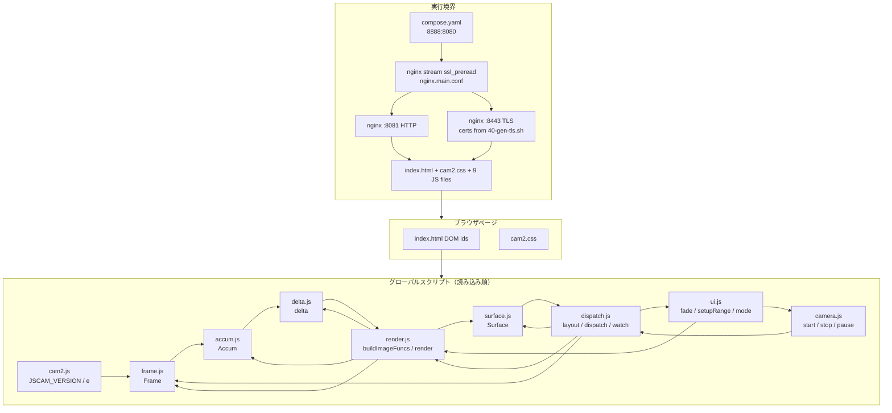
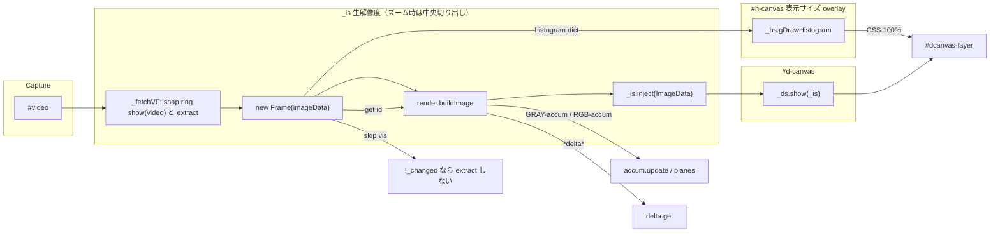
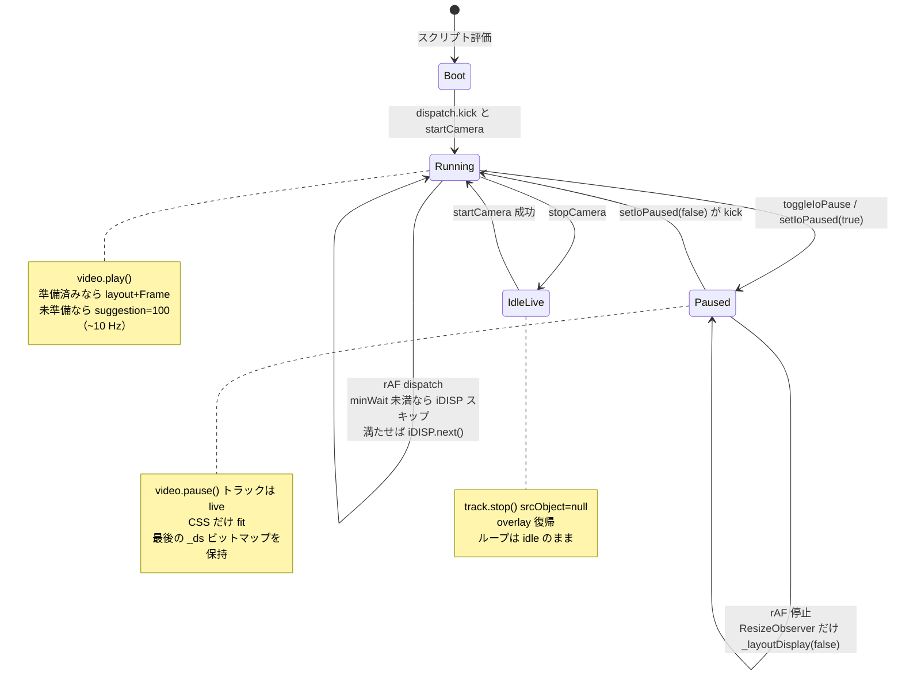

# JSCam (`cam2`) 現行システム設計書

| 項目 | 内容 |
| --- | --- |
| 文書タイトル | JSCam live-camera bench 現行アーキテクチャ設計書 |
| 対象 | `/app/jscam/` の分割グローバルスクリプト（`cam2.js` / `frame.js` / `accum.js` / `delta.js` / `render.js` / `surface.js` / `dispatch.js` / `ui.js` / `camera.js`）および付随する HTML / CSS / Docker / nginx |
| 著者 | JSCam maintainers |
| 日付 | 2026-10-07 |
| ステータス | Draft（PR 1–3, 5–8 実装済み。PR 4 延期。画素プール／GC 観測は方式検討のみ。RGBaccum 再マージ：RGB 平面 getter、`Raw(RGBA-packed)` / `RGB-planar`、既定は packed 素通し） |
| 種別 | 現行システムの記述（greenfield 再設計ではない） |

---

## Overview

JSCam はブラウザ上で動作するライブカメラ画像処理ベンチである。`getUserMedia` の映像は `dispatch.snap`（Surface 5 枚のリング）に保持し、vis で `show(video)` してから `extract` する。`Frame` は今 vis の切り出しだけを持ち、過去 Frame の LRU は無い。RGB は packed RGBA から `red` / `green` / `blue` 平面を遅延生成し、`get('rgb')` は `[R,G,B]` を返す。グレー／YUV／エッジ／ヒストグラム／Otsu／蓄積差分を計算し、内部面 `_is` へ `inject` して `#d-canvas`（`_ds`）に `show` する。ホイール／ピンチは中央切り出し。パンはオフセット。フリップは表示 Surface の水平 CTM。ヒストグラムは `#h-canvas`（`_hs`）。蓄積は `render.accum` と `delta.accum` の 2 本。キャプチャ vis は rVFC（または zoom/pan/kick/fit）が `_changed` を立てたときだけ走る。rVFC 未対応 UA は dispatch 評価時に throw。FPS は out / in / view% / run%。既定モードはセレクト先頭の `Raw(RGBA-packed)`。ページロードで insecure でなければ先頭カメラを `startCamera()` する。

本システムは `cam.js` の後継である。画像処理カーネル・描画・UI・カメラ起動はバンドラ無しのグローバルスクリプトに分割している（PR 6）。`cam.js` にあった typo / 計算バグ（`videoHeight`、RGB プレーン参照、Laplacian の符号、ヒストグラム均等化の `Vmin`、Frame ID 衝突、FPS 統計、`histogram` 命名、蓄積バッファサイズ）を修正したうえで、contain レイアウト・I/O 一時停止・明示的なカメラ停止・secure context カメラ起動・単一 rAF ループ・単一ポート HTTP/HTTPS 多重化を足している。サーバ側は Docker 上の nginx がホストポート `8888` を `ssl_preread` で HTTP (`8081`) と TLS (`8443`) に振り分ける。

---

## Background & Motivation

### 現行の位置づけ

`/app/jscam` は単一ページの静的アプリである。ビルドツールもモジュールバンドラも無く、`index.html` が `cam2.css` と次の順のグローバルスクリプトを直読みする（PR 6）:

`cam2.js`（`JSCAM_VERSION`, `e`）→ `frame.js` → `accum.js` → `delta.js` → `render.js` → `surface.js` → `dispatch.js` → `ui.js` → `camera.js`

ES module の `import` / `export` は無い。契約は DOM id とページグローバルである。現行 JS（`cam2.js` と 8 分割ファイル）のインデントはタブ。オブジェクトリテラルのメソッド本体は `{` の内側で 1 段下げる（`cam.js` 由来の `Frame.prototype` / `buildImageFuncs` のずれは直した）。`cam.js` スナップショットはスペースのまま。

### `cam.js` から `cam2` への修正（事実）

| 箇所 | `cam.js` | 現行 `cam2` |
| --- | --- | --- |
| ビデオ寸法 | `video.videoHeigh`（typo。常に `undefined` → 0 判定が壊れる） | `video.videoHeight` |
| エッジ method 例外 | `` `not support ${methdo}` `` | `` `not supported ${method}` `` |
| RGB Sobel プレーン | `G = plane[0]`, `B = plane[0]`（R を 3 回使う） | `G = plane[1]`, `B = plane[2]` |
| Laplacian | `Uint8ClampedArray` に符号付き和を直接代入（負値が 0 にクランプされ、コントラストが潰れる） | `Int16Array` に生値を書き、既定モードは `Math.abs` してから `Uint8ClampedArray` へ。opt-in の `laplacian.signed` は零を 128 にシフト |
| 均等化 `Vmin`（cdf-min） | `V.reduce(Math.min, 0)`。CDF `V[i]∈[0,1]` なので `Vmin` は **常に 0**。補正が走らず `E = V[g]*255`。`255/(1-Vmin)` は常に 255 で、`Infinity` には到達しない | `reduce(..., Infinity)` で真の CDF 最小を取る |
| 均等化ゼロ除算 | 上記のため未到達。全画素がビン 0（`Vmin===1`）のケースは未処理 | `((1-Vmin)==0) ? 0 : 255/(1-Vmin)`。一様黒画像をガード |
| Frame ID | `Math.round(performance.now()*10)`（同一ミリ秒で衝突しうる） | `++Frame.serial` の単調増加 |
| FPS Graph | `values=[0]`, `min=0`, `sum` に生 `fpc` を加算、`scale = height/abs(max)`（max=0 で Inf） | 空配列開始、`min=Infinity` / `max=-Infinity`、平滑値を統計に使い、`max==0` なら scale=0 |
| 命名 | `histgram` | `histogram`（`Object.create(null)`。`{}` にしない） |
| 蓄積バッファ | `accum` は `_next` の長さでしか拡張しない。初回は `_next=[]` のためサイズが足りない | 先に `current = frame.getGray()` の長さで `aBuffer` を拡張 |

### 解決している運用上の痛み

1. **getUserMedia は secure context 必須**。LAN IP の `http://` ではカメラが動かない。nginx stream で同一ポート `8888` に HTTP と HTTPS を載せ、`http://127.0.0.1:8888` か `https://<host>:8888` で開ける。
2. **表示サイズと内部解像度の分離**。処理はカメラ生解像度、表示は全画面ステージへの contain フィット。Controls / トップバーは映像の上に overlay。
3. **一時停止でフレームを残す**。`canvas.width` / `height` 代入はビットマップをクリアするため、pause 中は CSS サイズだけ更新する（`ResizeObserver`。rAF では layout しない）。
4. **カメラ開始・停止は同じ HUD スロット。** `.io-hud` 左端が `Start camera` ⇄ `Stop camera`（同時には出さない）。ライブ中だけ右に `Pause`。中央 overlay は説明と insecure ヘルプのみ。レイアウト幅は取らない。
5. **モードに関係ないスライダを出さない**。蓄積係数は `GRAY-accum` / `BW-delta` / `Gray-delta` のときだけ `#field-afactor` を見せる。
6. **ヒストグラムは映像から独立**。`Draw histogram` は `Draw image` とは別チェック。内部 `ImageData` はクリーン（PR 3）。
7. **カメラ LED を明示的に消せる**。`Stop camera` と `pagehide` / `beforeunload` で `track.stop()`（PR 2）。pause は `video.pause()` のみでトラックは live。

---

## Goals & Non-Goals

### Goals（現行システムの守るべき契約）

- ブラウザだけでカメラ映像をリアルタイム処理し、モード切替で結果を確認できること。
- 内部処理解像度は `video.videoWidth` × `video.videoHeight`。表示はアスペクト比を保った contain。
- トップバー・Controls・Pause/Stop は映像レイヤ上の overlay。Controls 背景は 50% 透明。ステージは常に全画面。`#layers` クリック（操作部品以外）で chrome を全非表示／再表示。
- 選択中の画像モードに関係ない設定をパネルから隠すこと（現行は Accumulation factor のみ）。
- 一時停止中は最後の処理フレームを表示し続け、ウィンドウリサイズには CSS だけで追従すること。
- カメラ停止は全トラックを `stop()` し、`srcObject` を外し、overlay を戻すこと。pause とは別操作。
- 起動前に `enumerateDevices` で `videoinput` をスキャンすること。1 台なら従来どおり起動。2 台以上なら列挙の先頭で起動し、`#camera-select` で切替できること。
- 使っているカメラの `getCapabilities()` に、再構成なしで変えられる項目があれば Controls の `#camera-params` に出すこと。width/height/frameRate は出さない。
- 入力プレビュー `#video` の表示は縦横とも最大 640 CSS px。超える辺はアスペクト比を保って縮小（内部処理解像度は生サイズのまま）。
- ヒストグラムは `#h-canvas` overlay。ビットマップは表示サイズ（`#d-canvas` と同じ contain CSS px）。画素契約は hc 座標（x=10、1px×256、高さ `height/3`、底 `height-1`、キーあたり色 2 つ）。`Draw histogram` は映像から独立。
- 非 secure context ではカメラを呼ばず、localhost HTTP / 同一ポート HTTPS への誘導を出すこと。
- ホスト `8888` 一ポートで HTTP と HTTPS の両方を受け付けること。
- グローバルスクリプト分割をバンドラ無しで維持し、`histogram` は `Object.create(null)` のままにすること。

### Non-Goals（現行は対象外。本設計書も再発明しない）

- サーバサイド画像処理、WebSocket、録画、ファイルアップロード。
- WebGL / WebGPU / WASM / Worker へのオフロード（現状はメインスレッドの画素ループ）。
- 認証・マルチユーザ・永続設定。
- `cam.js` との並行メンテ。正本は分割後の cam2 スクリプト群。`cam.js` 自体は修正前スナップショットとしてリポジトリに残す（決定 5）。
- マイク、キャプチャ解像度キャップ（PR 4 は延期。プレビュー表示の 640px 制限は対象。constraints の `width`/`height` ideal は入れない）。
- ES modules / TypeScript / バンドラ。現状はグローバルスクリプト（ファイルは分割済み）。
- `file://` で開くこと。`originWithScheme` は `location.port` が空だと `:8888` 無しの URL を作り、誘導リンクが壊れる。

---

## Proposed Design

現行実装の構造を、実行境界 → モジュール → フレームパイプライン → レイアウト → 制御ループの順で記述する。

### 実行境界（Docker / nginx）

ホストは `compose.yaml` でコンテナポート `8080` を `8888` に出す。

```
Host :8888  ──►  container :8080  (nginx stream, ssl_preread)
                      │
                      ├─ $ssl_preread_protocol == ""  →  127.0.0.1:8081  (HTTP)
                      └─ otherwise (TLS)              →  127.0.0.1:8443  (HTTPS)
```

| ファイル | 役割 |
| --- | --- |
| `/app/compose.yaml` | `jscam:local` を build。`8888:8080`。`TLS_SAN` を渡す。下記「再マウント vs 再ビルド」参照。Compose の `healthcheck:` キーは無い。 |
| `/app/.gitignore` | `tmp/`。作業ディレクトリ。イメージには入らない。 |
| `/app/jscam/.dockerignore` | 先頭 `*` のあと許可リスト。イメージに入れるファイルは `!` を足す。抜けると `COPY` が checksum / not found で落ちる。 |
| `/app/jscam/Dockerfile` | `nginx:1.27-alpine` + openssl。`40-gen-tls.sh` を `/docker-entrypoint.d/` に置く。静的ファイル（`index.html` `cam2.css` と 9 本の JS）を `/usr/share/nginx/html/` へ COPY。`EXPOSE 8080`。**イメージの** `HEALTHCHECK` が `wget -qO- http://127.0.0.1:8081/healthz`（Alpine `wget` の実行は本設計書では未検証）。8081 応答はポート 8080 / `ssl_preread` の生存を証明しない（Open Question 6）。 |
| `/app/jscam/nginx.main.conf` | `stream { ssl_preread on; }` で 8080 を 8081/8443 に分岐。`http { include conf.d/*.conf; }`。`proxy_timeout 1d`（長寿命接続向け。静的配信では実害は小さい）。 |
| `/app/jscam/nginx.conf` | 8081 と 8443 で同じ document root。`Cache-Control: no-store`。`Permissions-Policy: camera=(self), microphone=()`。`/healthz` → `200 ok`。 |
| `/app/jscam/40-gen-tls.sh` | 起動時に自己署名証明書。SAN 既定 `DNS:localhost,IP:127.0.0.1`。`TLS_SAN` で追加（例 `IP:192.168.1.10`）。825 日、RSA 2048。 |

カメラが動く URL:

- `http://127.0.0.1:8888/` または `http://localhost:8888/`（secure context 例外）
- `https://<host>:8888/`（自己署名のため、ヘルプは "Advanced, then Proceed" を案内する）

`http://<LAN-IP>:8888/` は insecure のため `getUserMedia` は呼ばない。`startCamera` が `window.isSecureContext` を見てヘルプを出す。

再マウント vs 再ビルド:

| 変更対象 | 反映方法 |
| --- | --- |
| `index.html`, `cam2.css`, `cam2.js`, `frame.js`, `accum.js`, `delta.js`, `render.js`, `surface.js`, `dispatch.js`, `ui.js`, `camera.js` | compose の ro bind mount。ブラウザ再読込（`Cache-Control: no-store`）。イメージ再ビルド不要。 |
| `nginx.conf` → `/etc/nginx/conf.d/default.conf` | ファイルはマウントされるが nginx は自動 reload しない。`nginx -s reload` またはコンテナ再作成。stream / `ssl_preread` / `proxy_timeout` はここには無い。 |
| `nginx.main.conf`（8080 多重化, `proxy_timeout`） | イメージに COPY されるだけ。`--build` が必要。 |
| `40-gen-tls.sh`, `Dockerfile` | `--build`。 |
| `TLS_SAN` | エントリポイントが証明書を作り直すのでコンテナ再作成。イメージ再ビルドは不要。 |

### フロントエンド構成

```
index.html          lang="en"。画面コピーは英語
 ├─ cam2.css          レイアウト / テーマ / overlay / #h-canvas / caption wrap
 ├─ cam2.js           JSCAM_VERSION, e(id)
 ├─ frame.js          Frame / カーネル（過去 Frame の LRU は無い）
 ├─ accum.js          Accum コンストラクタ
 ├─ delta.js          残差 + 独自 Accum
 ├─ render.js         buildImageFuncs, render.accum, render.image / L4
 ├─ surface.js        Surface（2d canvas の fit / show / extract / inject / histogram）
 ├─ dispatch.js       layout, rAF kick, zoom/pan, rVFC, fps, Surface インスタンス
 ├─ ui.js             パネル, モード, range, print, wheel/pinch/pan
 └─ camera.js         start / stop / pause, preview。末尾で startCamera()
      overlay canvas  #h-canvas （#dcanvas-layer 内。表示サイズビットマップ、CSS 100%）
```

DOM の役割分担:

- `#video` … getUserMedia のシンク。サイドパネルの `Input preview`。`autoplay playsinline muted`。CSS: `max-width: min(100%, 640px); max-height: 640px; object-fit: contain`。内部処理は `videoWidth/Height` の生解像度。ラベル右の `#preview-size` に同じ生サイズ（`W×H`）を出す。
- `#field-camera-select` / `#camera-select` … 2 台以上のときだけ表示。起動前スキャンの先頭デバイスで開始し、change で `deviceId.exact` 切替。
- `#camera-params` … ライブ `getCapabilities()` で動かせる項目だけ。`applyConstraints`。width/height / frameRate は出さない（再構成の待ち）。Stop で hidden。
- `_is` … 内部処理バッファ（未接続 Surface、`willReadFrequently`）。ヒストグラムは描かない。小さい ImageData は `inject` で全面へ拡大する。
- `#d-canvas` … ユーザに見える出力 `_ds`。`#dcanvas-layer` 内。`_ds.show(_is)`。
- `#h-canvas` … ヒストグラム overlay `_hs`。ビットマップは表示サイズ。CSS は `#d-canvas` と同様に layer いっぱい（`position:absolute; inset:0; width/height:100%; pointer-events:none`）。
- `#dcanvas-layer` … 表示サイズの CSS ボックス。一時停止 HUD と `#h-canvas` の containing block。
- `#layers` (`.stage`) … contain フィットの親。ヘッダー下の `.workspace` 内。CSS `padding: 0.5rem`。JS は padding を書かない。`ResizeObserver` の対象。`#d-canvas` のダブルタップで `.app.chrome-hidden` をトグル（`button` / `.panel` / `.topbar` / `.io-hud` 上は無視）。
- `#side-panel` … `.workspace` 内の overlay（右。幅 720px 以下は下からのシート）。ヘッダーとは重ならない。背景 `rgba(18, 21, 29, 0.5)`。初期状態は開。レイアウト幅は取らない。
- `#field-afactor` … `data-modes="GRAY-accum,BW-delta,Gray-delta,RGB-accum"`。初期 `hidden`。`syncModeSettings` がトグル。
- `.io-hud` … `#camera-start` と `#camera-stop` は同じ左端スロット（排他表示）。ライブ中のみ `#io-pause` と badge。`position:absolute; top/left:0.5rem`。レイアウト幅を取らない。`#camera-overlay` より前面。

### モジュール構造


```mermaid
flowchart TB
  subgraph Runtime["実行境界"]
    Compose["compose.yaml<br/>8888:8080"]
    Stream["nginx stream ssl_preread<br/>nginx.main.conf"]
    HTTP["nginx :8081 HTTP"]
    TLS["nginx :8443 TLS<br/>certs from 40-gen-tls.sh"]
    Static["index.html + cam2.css + 9 JS files"]
    Compose --> Stream
    Stream --> HTTP
    Stream --> TLS
    HTTP --> Static
    TLS --> Static
  end

  subgraph Page["ブラウザページ"]
    HTML["index.html DOM ids"]
    CSS["cam2.css"]
  end

  Static --> Page

  subgraph Scripts["グローバルスクリプト（読み込み順）"]
    Cam2["cam2.js<br/>JSCAM_VERSION / e"]
    FrameF["frame.js<br/>Frame"]
    AccumF["accum.js<br/>Accum"]
    DeltaF["delta.js<br/>delta"]
    RenderF["render.js<br/>buildImageFuncs / render"]
    SurfF["surface.js<br/>Surface"]
    DispF["dispatch.js<br/>layout / dispatch / watch"]
    UiF["ui.js<br/>fade / setupRange / mode"]
    CamF["camera.js<br/>start / stop / pause"]
    Cam2 --> FrameF --> AccumF --> DeltaF --> RenderF --> SurfF --> DispF --> UiF --> CamF
  end

  HTML --> Scripts

  DispF --> RenderF
  DispF --> SurfF
  RenderF --> FrameF
  RenderF --> AccumF
  RenderF --> DeltaF
  DispF --> FrameF
  CamF --> DispF
  UiF --> RenderF
```

クラスモジュールや `export` は無い。以下はファイル境界に沿った事実上の責務である。

| シンボル | ファイル | 種類 | 責務 |
| --- | --- | --- | --- |
| `JSCAM_VERSION` | `cam2.js` | 文字列 | 実装の一意 ID。`ui.js` が Controls 末尾 `#app-version` に書く。**コードまたは設計の修正の最後に必ず更新する。** 形式は `YYYY.MM.DD-HHMMSSZ-<git short HEAD>`（UTC）。 |
| `e` | `cam2.js` | 関数 | `document.getElementById` の短縮。 |
| `Frame` | `frame.js` | コンストラクタ + 静的メソッド | 今 vis の画素派生。第 2 引数 timestamp（省略時 `performance.now()`）。LRU / `id` / `map` は無い。 |
| `Accum` | `accum.js` | コンストラクタ | space（`gray` / `rgb` / `yuv`）ごとの指数平滑。`get`/`set('factor')`。 |
| `render.buildImageFuncs` | `render.js` | オブジェクト | モード名 → `ImageData` 生成。`render.buildImage` が現在の関数。 |
| `delta` | `delta.js` | オブジェクト | `delta.accum`（別 Accum）に対する残差。 |
| `Surface` | `surface.js` | コンストラクタ | 2d canvas。`fit` / `show` / `extract` / `inject` / `gFlip` / ヒストグラム描画。 |
| `render.accum` | `render.js` | `Accum` | GRAY-accum / RGB-accum 用。delta とはインスタンスが別。 |
| `dispatch` / `dispatch.iDISP` | `dispatch.js` | 関数 + rAF + generator | メインループ。`kick([true])`。pause は vis 後にキック停止。 |
| `dispatch.watcher.video` | `dispatch.js` | rVFC | コールバックが `_changed = true`。未対応は throw。canvas/video 操作は置かない。 |
| `dispatch.watcher.fps` | `dispatch.js` | 関数 | 500ms で HUD。旧 `Graph` / `watch`。Surface で `#fps-chart`。 |
| `cUI` / `fade` | `ui.js` | オブジェクト | print、パネル fade。 |
| chrome トグル | `ui.js` | `#d-canvas` ダブルタップ（pointer） | `.app.chrome-hidden`。 |
| `setupRange` | `ui.js` | 関数 | range + ± ボタン + output をコールバックに接続。 |
| `currentImageMode` / `syncModeSettings` | `ui.js` | 関数 | `#image-mode` のキーと `[data-modes]` の `hidden` を同期。 |
| `startCamera` / `stopCamera` / `switchCamera` | `camera.js` | 関数 | 許可プローブ → enumerate → 先頭 `deviceId` で起動。ページロード末尾で `startCamera()`。2 台以上はセレクト。切替は旧 track を stop して取り直し。 |
| `syncCameraParams` / `clearCameraParams` | `camera.js` | 関数 | ライブ caps から Controls を生成。`applyConstraints`。attach で同期、stop でクリア。 |
| `syncPreviewSize` | `camera.js` | 関数 | `#preview-size` に生解像度。`loadedmetadata` / `resize` / attach / stop。 |
| `scanCameraSupport` | `camera.js` | 関数 | 対応スキャン。`#support-report` に YES/PARTIAL/NO。ストリームは止めない。 |
| I/O pause 一式 | `camera.js` | 関数 | `dispatch.paused` と `video.pause()`。トラックは止めない。 |

### 1 フレームのデータフロー


```mermaid
flowchart LR
  subgraph Capture
    V["#video"]
  end

  subgraph Internal["_is 生解像度（ズーム時は中央切り出し）"]
    GI["_fetchVF: snap ring show(video) と extract"]
    FR["new Frame(imageData)"]
    BI["render.buildImage"]
    PI["_is.inject(ImageData)"]
  end

  subgraph Overlay["#h-canvas 表示サイズ overlay"]
    HG["_hs.gDrawHistogram"]
  end

  subgraph Display["#d-canvas"]
    SH["_ds.show(_is)"]
  end

  V --> GI --> FR
  FR --> BI
  BI --> PI --> SH
  FR -->|get id| BI
  FR -->|histogram dict| HG
  BI -->|GRAY-accum / RGB-accum| AccumObj["accum.update / planes"]
  BI -->|*delta*| DeltaObj["delta.get"]
  FR -->|skip vis| Skip["!_changed なら extract しない"]
  HG -->|CSS 100%| Layer["#dcanvas-layer"]
  SH --> Layer
```

`dispatch.iDISP` の本体:

1. `video.videoWidth/Height == 0` なら suggestion=100 して continue。
2. `_layoutDisplay(true)` … CSS とビットマップ fit。順は `_ds.fit(disp)` → 真なら `_ds.show(_is)` → `_is.fit(video)` → `_hs.fit(disp)`。いずれかが真なら `_changed` を立てる（ウィンドウリサイズ vis で表示もヒストグラムも空白にしない）。
3. `!_changed` なら **continue**（リングを回さず `extract` しない）。`_changed` は rVFC コールバック、zoom / pan / `kick(true)` / fit。minWait 早期 return は `_changed` を落とさない。
4. `_fetchVF` … `dispatch.snap`（5 枚）を pop/unshift し、先頭に `fit(video size)` と `show(_video)`。続いて `dispatch.snap[0].extract(_scale, _offset)`（src 無し。既に snap 上の映像から切る）。座標は `| 0`。処理画素がそのサイズ。
5. `new Frame(imageData, video.currentTime)`。過去 Frame は持たない。
6. `render.buildImage(newFrame)` → `_is.inject` → `_ds.show(_is)`。`showHistogram` なら `_showHistogram`。vis が走ればカーネルは走る。

generator 先頭で `yield suggestion`。初回 `next` は yield 0 のみ。`dispatch()` は `minWait = max(duration, lastSuggestion)` を満たしてから `iDISP.next()`。満たさなければ `kick` して return（pause 中でも interval 待ちはキックする）。vis のあと `paused` ならキックしない。Resume が `kick()`。`kick(true)` は `_changed` を立ててからキック（Flip／モード／ヒストグラム）。

処理はメインスレッド。目標 FPS は rAF + `duration` + rVFC 間引き。`Frame interval` 既定 0。未準備は suggestion 100。HUD は out（rAF Hz）、in（rVFC Hz）、view%（viewed/rAF）、run%（rAF コールバック＋rVFC コールバックの壁時計割合）。チャートは run 系列。rVFC 未対応は throw。

負荷の目安:

| 解像度 | 画素数 | RGBA `ImageData` | 典型モード（灰+Sobel） |
| --- | --- | --- | --- |
| 640×480 | 3.07e5 | 1.23 MiB | メインスレッドで数十 FPS が見込める |
| 1280×720 | 9.22e5 | 3.69 MiB | モード次第で 15–30 FPS 前後 |
| 1920×1080 | 2.07e6 | 8.29 MiB | Sobel/Laplacian/RGB エッジは単桁〜十数 FPS になりうる |

実 FPS は CPU とカメラドライバに依存する。HUD は 500ms で rAF 回数と viewed vis 回数を換算する。pause 中は vis 後に rAF が止まる。

### カメラ起動シーケンス

```mermaid
sequenceDiagram
  participant U as User
  participant Start as #camera-start
  participant Stop as #camera-stop
  participant SC as startCamera
  participant XC as stopCamera
  participant Ctx as window.isSecureContext
  participant GUM as mediaDevices.getUserMedia
  participant V as #video
  participant OV as #camera-overlay
  participant P as setIoPaused

  U->>Start: click
  Start->>SC: onclick
  SC->>V: muted / autoplay / playsinline
  SC->>Ctx: 検査
  alt insecure
    SC->>U: showInsecureHelp<br/>http://127.0.0.1:8888 と https://host:8888
  else secure
    alt mediaDevices.getUserMedia が無い
      SC->>U: This browser does not support the camera API.
    else API あり
      SC->>SC: ++startCamera.generation<br/>Start を disabled
      SC->>GUM: 許可プローブ {audio:false, video:true}
      alt 許可かつ generation 一致
        GUM-->>SC: probe stream
        SC->>SC: probe を即 stop（処理ループには載せない）
        SC->>SC: enumerateDevices → videoinput
        Note over SC: 2台以上なら #camera-select を表示
        SC->>GUM: 先頭 deviceId.exact（id 無ければ video:true）
        GUM-->>SC: MediaStream
        SC->>V: 旧 stream を stop; srcObject = stream; play()
        SC->>OV: classList.add("is-live")
        SC->>P: setIoPaused(false)
        Note over P: Pause / Stop camera を enabled
      else 許可だが generation 不一致（Stop 後など）
        GUM-->>SC: MediaStream
        SC->>SC: stopStreamTracks(stream) して破棄
      else 拒否 / デバイス無し
        GUM-->>SC: error.name + message
        SC->>U: camera disabled: ...
      end
    end
  end

  U->>Stop: click
  Stop->>XC: onclick
  XC->>XC: ++generation（進行中 GUM を無効化）
  XC->>V: 全 track.stop(); srcObject=null
  XC->>OV: classList.remove("is-live")
  XC->>P: setIoPaused(false)
  Note over XC: pagehide / beforeunload でも同じ
```

ページロード時にも `!window.isSecureContext` なら `showInsecureHelp()` を呼ぶ（ボタンを押す前に理由を出す）。secure ならスクリプト末尾で `startCamera()` する（`#camera-start` と同じ経路。許可ダイアログはロード直後）。`#link-localhost` / `#link-https` は `originWithScheme` で現在のポートを保った URL に差し替える。

成功後 `#camera-overlay` に `.is-live` が付き `display:none`。失敗時および `stopCamera` 後はオーバーレイが残る / 戻る。`stopCamera` は rAF を落とさない。ループは `videoWidth==0` の idle（suggestion 100）に戻る。

### Pause と Run ループ


```mermaid
stateDiagram-v2
  [*] --> Boot: スクリプト評価
  Boot --> Running: dispatch.kick と startCamera
  Running --> Running: rAF dispatch<br/>minWait 未満なら iDISP スキップ<br/>満たせば iDISP.next()
  Running --> Paused: toggleIoPause / setIoPaused(true)
  Paused --> Running: setIoPaused(false) が kick
  Paused --> Paused: rAF 停止<br/>ResizeObserver だけ _layoutDisplay(false)
  Running --> IdleLive: stopCamera
  IdleLive --> Running: startCamera 成功
  note right of Paused
    video.pause() トラックは live
    CSS だけ fit
    最後の _ds ビットマップを保持
  end note
  note right of Running
    video.play()
    準備済みなら layout+Frame
    未準備なら suggestion=100（~10 Hz）
  end note
  note right of IdleLive
    track.stop() srcObject=null
    overlay 復帰
    ループは idle のまま
  end note
```

`dispatch`（`dispatch.js`）:

- `dispatch.kick()` が rAF を 1 回予約する。コールバックは `dispatch` 自身。末尾でまた `kick` する。
- vis のあと `dispatch.paused` ならキックしない（**次の rAF を予約しない**）。Resume が `kick`。interval 待ち中は pause でもキックする。
- レイアウトは `ResizeObserver`（`#layers`）が `_layoutDisplay(false)` する。100ms poll は無い。
- 非 pause: `minWait = max(dispatch.duration, lastSuggestion)`。`now - lastProcessedEnd < minWait` なら処理スキップ。満たせば `iDISP.next()` → `lastSuggestion = r.value` → `lastProcessedEnd = performance.now()`（終了直後）。
- カメラ未起動 / 停止後は suggestion 100 で約 10 Hz idle。
- `r.value` はいまの `next()` が yield した suggestion（直前イテレーションが書いた値）。未準備時 100、通常 0。最初の `next()` の yield は初期値 0。

`setIoPaused`（`camera.js` 20–34 行）:

- `dispatch.paused` を設定。
- ストリームがあるとき `video.pause()` または `video.play()`（play の rejection は `print`）。**トラックは `stop()` しない。**
- `syncIoPauseButtons` が HUD を同期: `.io-hud.is-live` と `hidden`。未起動は `#camera-start` のみ。ライブは Start を隠し `#camera-stop` と `#io-pause` を出す。`attachLiveStream` は params 構築より先に HUD を同期する（params 例外で Pause が残らないように）。

**なぜ pause で `Surface.fit` しないか。** `HTMLCanvasElement.width` / `height` の代入はコンテキストをリセットしビットマップを透明にする。一時停止中にウィンドウやパネル幅が変わると `_layoutDisplay(..., true)` は凍結フレームを消す。よって pause パス（`ResizeObserver`）は `resizeBitmap=false` で `#dcanvas-layer` の CSS `width`/`height` だけ変え、`#d-canvas` / `#h-canvas` は CSS で引き伸ばす。

**pause と stop の違い。** pause は最後の処理フレームを残しカメラ LED を付けたまま。stop はデバイスを解放し overlay を戻す。進行中の `getUserMedia` は `startCamera.generation` 不一致なら stream を直ちに `stop()` して捨てる。

### レイアウト（contain、パネル幅）

`_fitDisplaySize(videoW, videoH)`（`dispatch.js`）:

1. `#layers` の `clientWidth/Height` から **既存の CSS padding**（`.stage` の `0.5rem`）だけを引く。パネル幅はここでは触らない。
2. `scale = min(maxW/videoW, maxH/videoH)`。
3. `floor` した整数 CSS ピクセルを返す。最小 1。

`_layoutDisplay` は `#dcanvas-layer` にそのサイズを書き、`aspect-ratio: auto` で CSS 初期値 `4/3` を上書きする。`resizeBitmap` が真のときだけ `_ds.fit(disp)`（真なら `_ds.show(_is)`）→ `_is.fit([videoWidth, videoHeight])` → `_hs.fit(disp)`。表示ビットマップ `#d-canvas` とヒストグラム `#h-canvas` はどちらも **CSS ピクセル**（`disp`）であり、`devicePixelRatio` は掛けない。内部面 `_is` は生解像度。`#d-canvas` / `#h-canvas` は CSS `width/height:100%`（hc は `inset:0`）で layer に乗る。2× ディスプレイでは出力が柔らかい（R16）。

pause / リサイズパスで `width = cssW * dpr` してはならない。ビットマップ代入は凍結フレームを消す（R2）。dpr 対応を足すなら、リサイズ前にビットマップをコピーする。

`.io-hud` は layer の absolute 子であり、`fitDisplaySize` の計算に入らない。これが「pause / start / stop ボタンはレイアウト空間を取ってはならない」という制約の実装である。Start と Stop は左端の同じスロット。Pause はライブ時だけその右。

パネル配置:

- `.app` は `grid-template-rows: auto 1fr`。`.topbar` は 1 行目（フロー。パネルや Pause と重ならない）。`.workspace` は 2 行目で映像 + overlay。
- `#side-panel` と Settings FAB は `.workspace` 内。右 overlay（`z-index: 15`、幅 `min(22rem, 100vw)`）。背景 50% 透明 `rgba(18, 21, 29, 0.5)`。ヘッダーの下にだけ乗る。
- 幅 720px 以下ではパネルは workspace 下端シート（高さ最大 58dvh）。上側の映像をタップして chrome を隠せる。
- `slide.OUT` がパネルだけ `display:none`。`slide.IN` は 250ms opacity（1ms `setTimeout`）。
- `.app.chrome-hidden` はトップバー、パネル、FAB、`.io-hud`、`#camera-overlay` をまとめて `display:none`。トップバー行が潰れて映像が全画面になる。再クリックで外す。
- `#panel-close-button` はパネル見出し内。`#panel-open-button` はパネル閉かつ chrome 表示のとき FAB。
- リサイズは `#layers` の `ResizeObserver` のみ。pause 中でも凍結フレームの CSS フィットは追従する。

### 画像処理の詳細

#### `Frame` ライフサイクル

コンストラクタは `ImageData` 必須（それ以外は throw）。`feed` のあと vis ローカルとして使う。`Frame.serial` / `id()` / `array` / `map` / HIGH / LOW は無い。過去フレームは `dispatch.snap`（映像 Surface 5 枚）が持つ。

`feed` がメタと画素ディスパッチを付ける:

- `size()` → `[width, height]`
- `num()` → `width * height`
- `get(id)` → まず `this.getter[id]`。無ければ `Frame._getters[id].call(this)`。どちらも無ければ throw
- `feed` が載せるのは `getter['ImageData']` だけ（元の `ImageData` 参照）。`rgba` 以降は初回 `_get*` のあと `getter[id]` に差し替え
- `histogram` は `Object.create(null)`（`for…in` がプロトタイプキーを見ない。`{}` に置き換えないこと）
- 計算系の初回関数は `Frame._getters[id]`（null 原型）。`ImageData` は `feed` が `getter` に載せる。未知 id は throw。大文字小文字は厳密一致

**注意:** vis は毎 vis `new Frame` し、accum/delta は今フレームだけを見る。空の `new Frame`×4 など死ローカルは PR 1 で削除済み。Frame LRU は廃止（決定 6）。

#### 色空間

- **Gray** (`_getGray`): `Math.round(0.299R+0.587G+0.114B)` を `Uint8ClampedArray` に代入。`histogram['gray']`。`Math.round` は半数を +∞ 方向。
- **YUV** (`_getYUV`):
  - `Y = 0.299R + 0.587G + 0.114B` を `Uint8ClampedArray` に代入（ECMAScript `ToUint8Clamp`。半数は even、範囲外は 0/255）。
  - `U = -0.169R - 0.331G + 0.500B`、`V = 0.500R - 0.419G - 0.081B` を素の `Array` に符号付き float のまま。
  - インターリーブ `UV = [u0, v0, u1, v1, …]`（長さ `num*2`）。
  - `histogram['gray']` を **上書き**する。
- **Y と Gray は一致しない。** `GRAY-frame` は `get('yuv').Y` を使う。`.5` の丸めとクランプ経路が違うため、`get('gray')` とは 1 階調ずれうる。先に gray を計算するとヒストグラムキーも衝突する。
- **RGB 平面** (`__getComponent` / `_getRed` / `_getGreen` / `_getBlue`): packed `rgba` からチャネル 1 本を `Uint8ClampedArray`（長さ `num`）に抜き、`histogram['R'|'G'|'B']` を書く。`get('rgb')` は `[get('red'), get('green'), get('blue')]`。8colors / RGB-accum / `sobel.rgb` はこの 3 本を使う。
- **Equalize** (`_getEqualized`): gray の CDF `V[i]∈[0,1]`、`Vmin = min(V)`（初期値 `Infinity`）、`E = (V[g]-Vmin)*factor`。`factor = (1-Vmin)==0 ? 0 : 255/(1-Vmin)`（全画素ビン 0 で `Vmin===1`）。

#### エッジ

オフセット `O` は幅 `w` の 3×3 近傍を **1 次元 packed バッファ** にしたもの:

```
O = [-w-1, -w, -w+1,  -1, 0, 1,  w-1, w, w+1]
start = O[8] = w+1
end   = src.length + O[0] = len - w - 1
```

ループは `for (i = start; i < end; ++i)`。2 次元の `x=1..w-2, y=1..h-2` ではない。

640×480 の例: `i` は `641 .. 306558`。

- **未書き込み（`dst.fill(0)` のまま）:** 先頭行ほぼ全部、2 行目の col0、最終行とそれに接する数画素。
- **左右端は書く。** 行の col0 / col(w-1) でも `i±1` が前行末・次行頭にラップする。左右はゼロボーダーではなく **行跨ぎのラップアーティファクト**。
- 真の 2-D ハローを足す PR は `x=1..w-2`, `y=1..h-2` で回し、左右をスキップすること。

| method | 実装 | 出力 |
| --- | --- | --- |
| `'laplacian'` | カーネル `[1,1,1, 1,-8,1, 1,1,1]` を `Int16Array` に畳み込み、`Math.abs` して `Uint8ClampedArray`（>255 は 255） | 8 近傍 Laplacian の絶対値。`Edge(Laplacian)` |
| `'laplacian.signed'` | 同じ生値に `+128` して `Uint8ClampedArray`（零 → 128。負は暗、正は明。範囲外は 0/255） | 符号付きプレビュー。`Edge(Laplacian signed)`（PR 8） |
| `'sobel'` | Gx/Gy、`sqrt(Ix²+Iy²)` を gray に。代入先が `Uint8ClampedArray` なので 255 クランプ | 勾配強度 |
| `'sobel.rgb'` | 各プレーンに Sobel、画素ごと `max(eR,eG,eB)` | 色エッジ |

未知 method は throw。結果は getter スロットと `histogram[id]` に残す。既存 `Edge(Laplacian)` の画素は変えない。

#### Otsu (`Frame.calcThreshold`)

256 bin のクラス間分散 `w1*w2*(m1-m2)²` を最大にする閾値 `k`。`w1==0 || w2==0` はスキップ。`8colors`（R/G/B 独立）と `Bin-edge`（`sobel.rgb`）が使う。

#### `Accum` / `delta`

```
planes[space][c][t] = (1-factor)*planes[space][c][t-1] + factor * extract(delayRGBA, space, c)
out[c][i]           = abs( current[space][c][i] - planes[space][c][i] )
```

- `new Accum()`。グローバルシングルトン `accum` は無い。`render.accum` がプレビュー用、`delta.accum` が残差用。`#afactor` は両方へ `set('factor', v)`。
- `update(frame, space)` が指定 space だけ進める。未知 space は `Accum.SPACES` で throw。
- `get`/`set('factor')`。既定 `Accum.FACTOR` 0.5。残差は factor でスケールしない。
- vis ごとの EMA（旧 `accum.time` 100ms ゲートは削除）。遅延 RGBA 1 本をコピーしてから混ぜる。
- `_ensure` が張り替えた vis は一時 `factor=1` で今フレームを載せる（ズームで `num` が変わっても黒フェードしない）。
- 遅延入力は space ごとではなく **RGBA 1 本のコピー**（`get('rgba')` を `_delay.set`。エイリアス禁止）。遅延は 1 表示フレームではなく **1 accum 周期（既定 ~100ms）**。
- コールドスタート: 遅延が空の成功 tick は混ぜず、今の RGBA を遅延へ。背景はゼロ埋め。遅延が既にある状態で未使用 space を初めて `update` すると、0 埋めの直後にその遅延から混ぜる。
- `'gray'` と `'yuv'` の Y は同一視しない。gray 入力は `get('gray')`（`Math.round`）、遅延からの抜き出しも同じ round。Y 入力は `get('yuv')` 相当の `ToUint8Clamp`。
- `GRAY-accum` は `accum.update(frame, 'gray')` のあと float の `planes('gray')[0][i]` を `ImageData` へ代入。表示時に `ToUint8Clamp`。
- `RGB-accum` は `update(..., 'rgb')` のあと R/G/B 平面をパック。`#field-afactor` 表示。
- `delta.get(frame, space)` は `delta.accum.update` のあと、今 vis の生平面と背景の絶対差。`'gray'` は U8 1 本。`'rgb'` / `'yuv'` は平面配列。
- 互換エイリアス `delta.factor` / `delta.time` / `delta.aBuffer` / `delta.accum()` は削除。`delta.accum` は Accum インスタンス。
- `delta.id` / `delta.threshold` は削除済み（PR 1）。`BW-delta` は `d[i]==0` かどうかで白黒。

### 描画とヒストグラム overlay

`Surface` が 2d canvas を持つ。`dispatch` がインスタンスを持つ: `_ds`（`#d-canvas`）、`_is`（未接続、`willReadFrequently`）、`_hs`（`#h-canvas`）、`snap`（取り込み、copy キャンバス + `willReadFrequently`）、fps チャート。`#i-canvas` は HTML から削除済み。`render.image(frame)` は `frame.size()` の空 `ImageData`。

`_is.inject` は共有オフスクリーンへ `putImageData` してから内部面へ `drawImage`（ズーム切り出しで小さい ImageData は全面へ拡大。処理は既に小さい `Frame` で終わっている）。ヒストグラムは焼かない（PR 3）。

### デジタルズーム（処理画素の中央切り出し）

表示専用の CSS transform 拡縮はしない。ホイール／ピンチは `dispatch._scale` を変え、次 vis の `_fetchVF` が `snap[0]` に映像を載せ、`extract(_scale, _offset)` が中央を切り出す。切り出し後の画素で Frame / カーネル / accum が走る。

- `_scaleStep` は非負整数。`_scale = 1 / 1.1^step`。step 0 は正確な `1`（`=== 1` 高速経路）。
- `dir === 0` は何もしない。`dir > 0` は step を減らし（ズームアウト、下限 0）、それ以外は増やしてズームイン。`1/1.1^step <= 1/32` ならインしない。
- `scale < 1` のとき `sw,sh,sx,sy` は `| 0`（正値では切り捨て）してから `drawImage` のソース／デストと `getImageData` に同じ整数を渡す。描く矩形と読む矩形を揃え、API 内部丸めの 1 画素ずれを抑える。
- ホイールは `#d-canvas` の `wheel`（`passive: false`、`preventDefault`、`dispatch.zoom(deltaY)`）。ピンチは pointer 2 本のときだけ二乗距離の差。3 本では更新しない。開始 `pointerId` は固定しない（採用済み）。
- `.stage` / `.topbar` は `touch-action: none`。`.panel` は `pan-y`。パネルの iOS ダブルタップズームは `touchend` 350ms 以内 2 回目を `preventDefault`。

ポインタは `#d-canvas`。`pointerdown` で `setPointerCapture`。1 本はパン（`dispatch.move`、CSS 移動×ビデオ／表示スケール）。2 本はピンチ（二乗距離、`Object.keys` 先頭 2 本、3 本では無視）。ホイールは `dispatch.zoom(deltaY)`。ダブルタップで chrome トグル。

フリップは `dispatch.move.flip`（`_ds.gFlip` とパン符号 `_vx`）。`kick(true)` で再 vis。pause 中のカメラ切替は表示を更新しない（制限）。

`dispatch.showHistogram` が真なら `_hs.gClear` のあと `newFrame.histogram` の **すべてのキー** について `_hs.gDrawHistogram`。偽ならその vis では overlay を触らない。`Draw histogram` の uncheck は `ui.js` が `#h-canvas` の `display:none` と `kick(true)`。

ヒストグラムの画素契約は **`#h-canvas`（表示サイズ = `#d-canvas`）座標系**。CSS は `inset:0; width/height:100%`。バーは表示ピクセルで 1px。狭いウィンドウでは 266px ストリップが切れる（R4）。

- バー: `fillRect(x, hc.height-1-h, 1, h)`。`x` は 10 から 1px 刻みで 256 本（カバー幅 266px、左下寄せ）。
- バー高さ = `bins[i] * (hc.height/3) / max(bins)`。CDF 線高さスケール = `(hc.height/3) / numPixels`。底は `hc.height-1`。
- キーごとに `_rgba(++color)` を **2 回**（バー、続いて CDF）。`_COLORS` は 16 色。`n % length`。
- `gBeginHistogram` は `color=0` から始めるため、最初のキーのバーは `_COLORS[1]`（緑）、CDF は `_COLORS[2]`（黄）。**インデックス 0（赤）は最初の `++` でスキップされる。**
- `index.html` の "The histogram overlays the bottom-left of the image." はコピー上の表現。実装は左下 256px ストリップであり、全幅の下帯ではない。

`#h-canvas` は独立レイヤである。`Show histogram` を外せば映像は動き、overlay は消える。

`render.L4` は `Edge4(Sobel)` の 4 段階グレー（強度を 64 で割った 0–3）。ヒストグラム色は `Surface` 内部の `_COLORS`。

### 起動時配線（スクリプト評価の副作用）

`index.html` 末尾の script 順が評価順である。

1. `cam2.js` … `JSCAM_VERSION` / `e` 定義。
2. `frame.js` … `Frame` 定義。
3. `accum.js` … `Accum` コンストラクタ。
4. `delta.js` … `delta`（`new Accum()`）。
5. `render.js` … `buildImageFuncs`、`render.accum`、`render.image` / `L4`。初期 `buildImage` は `'Raw(RGBA-packed)'`。ui は挿入順でセレクトを埋め、`options[0]`（同じ packed）へ差し替える。
6. `surface.js` … `Surface` コンストラクタ。
7. `dispatch.js` … layout、rVFC、fps watcher、`kick()`。`_ds` / `_is` / `_hs`。`dispatch.snap` 5 枚。rVFC 未対応は throw。
8. `ui.js` … パネル fade、`#d-canvas` ポインタ、`render.buildImageFuncs` でモード填充、`#afactor` は両 Accum へ。`#show-preview` 既定オフ。`Draw image` は削除。
9. `camera.js` … pause/resume、`switchCamera`、preview `loadedmetadata`、末尾 `startCamera()`。pause 中切替は制限（表示は更新しない）。

`dispatch.iDISP` に空 `new Frame`×4 は無い。未使用ローカル `ic`/`dc`、`watch.last`、コメントの `delta.accum`、`delta.id` / `delta.threshold`、コメントアウト `setupRange('dthreshold')` も削除済み（PR 1）。

---

## API / Interface Changes

本節は現行の「公開相当」インタフェースである。ES module の public API は無い。契約は DOM id とグローバル関数/オブジェクト。

### DOM id 契約（カメラ/I/O を含む）

`e(id)` と CSS セレクタが依存する id。改名は JS と HTML と CSS を同時に変えること。ブログ記事埋め込み用の `s18-` プレフィックスは廃止した（単体ページのため）。`cam.js` スナップショットは旧 id のまま。

| id | 要素 | 契約 |
| --- | --- | --- |
| `video` | `<video autoplay playsinline muted>` | getUserMedia シンク兼プレビュー。`srcObject` の有無が「カメラ起動済み」。表示は max 640×640 contain。処理は生 `videoWidth/Height`。 |
| `preview-size` | `<output for="video">` | `Input preview` の右。生解像度 `W×H`。未起動・0 サイズは空。`loadedmetadata` / `resize` / attach / stop で `syncPreviewSize`。 |
| `field-camera-select` | `.field` | 2 台以上のとき `hidden=false`。1 台以下と stop 後は hidden。 |
| `camera-select` | `<select>` | `enumerateDevices` の `videoinput`。value は `deviceId`。change で `switchCamera`。GUM 待ち中 disabled。 |
| `camera-params` / `camera-params-fields` | 動的フィールド | ライブ制約 UI。caps に幅または 2 値以上あるキーだけ。`cam-<key>`。 |
| `i-canvas` | （削除） | 内部面は `new Surface(null, null, true)`（未接続 `_is`）。取り込みは `dispatch.snap` 5 枚。 |
| `d-canvas` | `<canvas width=640 height=480>` | 表示 `_ds`。CSS は layer いっぱい。ビットマップは CSS px（dpr なし）。ホイール／ポインタ。 |
| `h-canvas` | `<canvas width=640 height=480>` | ヒストグラム overlay `_hs`。ビットマップは表示サイズ。CSS `inset:0; 100%`。`pointer-events:none`。 |
| `dcanvas-layer` | `.stage-layer` | 表示ボックス。JS が px 幅高さを書く。`.io-hud` と `#h-canvas` の親。 |
| `layers` | `.stage` | contain 計算の基準。全画面。CSS padding のみ。`ResizeObserver`。`touch-action: none`。 |
| `fps-chart` | `<canvas 240×56>` | fps watcher の run スパークライン。 |
| `fps-caption` | `<p>` | `out:` rAF Hz、`in:` rVFC Hz、`view:` viewed/rAF %、`run:` rAF+rVFC 時間%。CSS: wrap 可、`max-width: 22rem`。 |
| `side-panel` | `<aside class="panel">` | `.workspace` 内 overlay。ヘッダー下。背景 50% 透明。初期 display=block。`slide` が display/opacity。幅 720px 以下は下端シート。 |
| `panel-open-button` | `.panel-fab` | CSS 既定 `display:none`。パネル閉後に JS が `block`。 |
| `panel-close-button` | `.panel-close` | パネル見出し内。`position:static`。初期表示。 |
| `image-mode` | `<select>` | JS が `buildImageFuncs` のキーで `Option` を add。change で `syncModeSettings`。 |
| `show-histogram` | checkbox | `dispatch.showHistogram`。false で overlay をクリアし `display:none`。 |
| `show-preview` | checkbox | 既定オフ。`#video` の `display`。 |
| `flip-horizontal` | checkbox | `dispatch.move.flip`（`_ds.gFlip` + パン符号）+ `kick(true)`。 |
| `field-afactor` | `.field[data-modes]` | 蓄積 UI のラッパ。`data-modes="GRAY-accum,BW-delta,Gray-delta,RGB-accum"`。初期 `hidden`。 |
| `afactor` / `-output` / `-increase` / `-decrease` | range 一式 | `setupRange` 命名規則 `name`, `name-output`, `name-increase`, `name-decrease`。range は `onchange`（ドラッグ中は無視）。 |
| `pause` / `-output` / `-increase` / `-decrease` | range 一式 | `dispatch.duration`（ms）。I/O pause とは別。`data-modes` 無し（常時表示）。ラベルは `Frame interval`。 |
| `support-scan` | button | カメラ対応スキャン。ライブトラックがあれば `getCapabilities` / `getSettings` も読む。 |
| `support-report` | `<pre>` | スキャン結果。`textContent`。初期 `hidden`。`#message` の 7 行リングとは別。 |
| `message` | ログ | `print` が直近 7 行を `<br>` で描く。 |
| `app-version` | `<p class="app-version">` | Controls の最後。`JSCAM_VERSION`（`cam2.js`）。ログの下。 |
| `io-pause` | button `[data-io-pause]` | ライブ中だけ表示。セレクタは `data-io-pause`。ラベル `Pause` / `Resume`。 |
| `io-paused-badge` | span | `hidden` トグル。表示時 `Paused`。 |
| `camera-stop` | button | `Stop camera`。`hasStream` のときだけ enabled。 |
| `camera-overlay` / `camera-status` / `camera-help` | 空状態の説明 | ボタンは持たない。`.is-live` と `.chrome-hidden` で非表示。 |
| `camera-start` / `camera-stop` | `.io-hud` | 同じスロット。未起動は Start（GUM 待ち中 disabled）。ライブは Stop。 |
| `link-localhost` / `link-https` | 誘導リンク | insecure 時に href/text を書き換え。 |

`setupRange(name, label, cb)` は `name` をベースに 4 id を要求する。新しいスライダを足すなら HTML をこの規則に合わせる。モード限定ならラッパに `data-modes` を付け、`.field` / `.check` を使う（後述）。

### モード連動設定

```javascript
currentImageMode();   // #image-mode の selected value。未選択なら ''
syncModeSettings();   // document.querySelectorAll('[data-modes]') の hidden を同期
```

契約:

- `data-modes` はカンマ区切りの `buildImageFuncs` キー。`split(',')` のみ。**空白は trim しない**（`GRAY-accum, BW-delta` は一致しない）。
- 現在のモードがリストに無ければ `element.hidden = true`。あれば `false`。
- 呼ぶタイミング: `image-mode` の option 填充直後、および `onchange`。
- 隠すのは UI だけ。`setupRange` のコールバックと `accum.factor` / `dispatch.duration` は hidden 中も有効。

現行のマーク:

| 要素 | `data-modes` | 初期 |
| --- | --- | --- |
| `#field-afactor` | `GRAY-accum,BW-delta,Gray-delta,RGB-accum` | HTML に `hidden`。起動時モードは `Raw(RGBA-packed)` なので同期後も隠れる |
| `#pause` の field | （属性なし） | 常時表示（`Frame interval`） |
| `Draw image` / `Draw histogram` / `Input preview` / `Log` | （属性なし） | 常時表示 |
| `#field-camera-select` | （属性なし） | 初期 hidden。`videoinput` が 2 以上のとき `syncCameraSelect` が表示 |

CSS: `.field { display: grid }` が UA の `[hidden] { display: none }` を上書きするため、`.field[hidden], .check[hidden] { display: none }` が必須。新しいモード限定コントロールを `.field` / `.check` 以外にするなら、同じ上書きを足すこと。

### `Frame`

```javascript
const f = new Frame(imageData); // ImageData 以外は throw
f.size();               // [width, height]
f.num();                // width*height
f.get('rgba');          // Uint8ClampedArray 長さ num*4（ImageData 共有）
f.get('ImageData');     // ImageData（canvas の render.getImage とは別）
f.get('gray');          // Uint8ClampedArray, Math.round(BT.601)
f.get('yuv');           // { Y: Uint8ClampedArray ToUint8Clamp, UV: Array }
                        // UV = [u0,v0,...]; U=-0.169R-0.331G+0.500B; V=0.500R-0.419G-0.081B
                        // Y と get('gray') は丸めが違い、GRAY-frame は Y を使う
f.get('equalized');     // Uint8ClampedArray。histogram キーは 'equalization' のまま
f.get('red');           // Uint8ClampedArray。histogram['R']
f.get('green');         // histogram['G']
f.get('blue');          // histogram['B']
f.get('rgb');           // [get('red'), get('green'), get('blue')]
f.get('laplacian');     // ほか 'laplacian.signed' | 'sobel' | 'sobel.rgb'
f.histogram;            // Object.create(null): gray?, equalization?, R?, G?, B?,
                        // laplacian?, 'laplacian.signed'?, sobel?, 'sobel.rgb'?
Frame._getters;         // 計算系 id → 初回関数（ImageData は feed が載せる）
Frame.calcThreshold(histogram256); // Otsu k
```

静的カーネル `Frame._Laplacian(dst, src, O)` / `Frame._Sobel(dst, src, O)` は `O` が長さ 9 の画素オフセットであることを前提にする。`dst.fill(0)` する。

### `dispatch.watcher.fps`

旧 `Graph` / `watch`。`dispatch()` 先頭で 500ms ごと `watcher.fps()`。caption は `out`（rAF Hz）、`in`（rVFC Hz）、`view%`（viewed vis / rAF）、`run%`（rAF+rVFC コールバック時間 / 壁時計）。チャートは run 系列。窓のあと `_stat.reset()`（rAF / rVFC / viewed / running）。skip は `_changed` だけを見るので、reset で vis は増えない。`dispatch.count` / `dispatch.time` は廃止。

### `Surface`

```javascript
new Surface(canvas, shape, rBoost, copy);
// canvas 無しまたは copy 真なら未接続 canvas を作る。rBoost は willReadFrequently
s.fit(size);                 // 幅高さ変更時だけ代入。flip を掛け直す。dirty
s.shape();                   // [width, height]
s.clientRect();
s.show(src);                 // Surface または CanvasImageSource を全面 drawImage
s.inject(imageData);         // 共有オフスクリーン putImageData → 全面 drawImage
s.extract(scale, offset, src); // [ImageData, ox, oy]。src があればそこから描いて読む
s.gFlip(yes);                // 水平 CTM。fit 後に掛け直す
s.gClear / gFillRect / gFillStyle / gIdentity
s.gBeginHistogram(num) / gDrawHistogram(bins256) / gEndHistogram
```

`dispatch` のインスタンス: `_ds`（`#d-canvas`）、`_is`（未接続, rBoost）、`_hs`（`#h-canvas`）、`dispatch.snap`（映像リング 5、copy + rBoost）、fps チャート。vis は `snap.pop` / `unshift` して `snap[0]` に `show(video)` してから `extract`。

### `render`

```javascript
render.buildImageFuncs;      // モード名 → (frame) => ImageData
render.buildImage;           // 現在の関数。ui が差し替え
render.accum;                // new Accum()。GRAY/RGB-accum 用
render.image(frame);         // frame.size() の空 ImageData
render.L4;                   // Edge4(Sobel) の 4 段階
```

### `Accum`

```javascript
const a = new Accum();
Accum.SPACES;                // ['gray','rgb','yuv']。_check が includes
Accum.FACTOR;                // 0.5
a.set('factor', v); a.get('factor');
a.update(frame, space);      // 省略時 'gray'。毎 vis 混ぜる。遅延 RGBA コピー
a.planes(space);             // float 平面。未 update は空
```

インスタンスは `render.accum` と `delta.accum` の 2 本。スライダは両方へ書く。

### `delta`

```javascript
delta.accum;                 // new Accum()。残差用。render.accum とは別
delta.get(frame, space);     // delta.accum.update のあと |current − planes|
```

### `dispatch`

```javascript
dispatch.paused;
dispatch.kick(noskip);       // noskip 真なら _changed。rAF デバウンス _AFkicked
dispatch.duration;
dispatch.showHistogram;
dispatch.zoom(dir);          // 0 無視。>0 アウト
dispatch.move(dx, dy);       // CSS 移動 → ビデオ座標オフセット
dispatch.move.flip(yes);     // _ds.gFlip + パン符号
dispatch.snap;               // Surface[5]。映像スナップショット
dispatch.watcher.video.kick();
dispatch.watcher.fps();
dispatch.iDISP;
```

### `buildImageFuncs` キー

`(frame) => ImageData`。

| キー | 入力 | 出力 |
| --- | --- | --- |
| `Raw(RGBA-packed)` | `get('ImageData')` | 入力をそのまま返す。セレクト先頭＝既定 |
| `RGB-planar` | `get('rgb')` | R/G/B 平面を packed RGBA に戻す（A=255） |
| `GRAY-frame` | `get('yuv').Y`（`get('gray')` ではない） | Y を RGB に複製 |
| `GRAY-Histogram equalization` | `get('equalized')` | 均等化グレー |
| `YUV-frame` | `get('yuv')` | Y+1.402V, Y-0.344U-0.714V, Y+1.772U（canvas がクランプ） |
| `UV:RG-frame` | `get('yuv').UV` | R=U+128, G=V+128, B=0 |
| `GRAY-accum` | `render.accum.update` + `planes('gray')[0]` | 蓄積グレー。`#field-afactor` 表示 |
| `RGB-accum` | `render.accum.update` + `planes('rgb')` | 蓄積 RGB。`#field-afactor` 表示 |
| `BW-delta` | `delta.get` | 非零を 255。`#field-afactor` 表示 |
| `Gray-delta` | `delta.get` | 絶対差分。`#field-afactor` 表示 |
| `8colors` | `get('rgb')` + Otsu(`histogram['R'|'G'|'B']`) | チャネルごと 0/255 |
| `Edge(Laplacian)` | `get('laplacian')` | 絶対 Laplacian |
| `Edge(Laplacian signed)` | `get('laplacian.signed')` | 零 = 128 の符号付き |
| `Edge(Sobel)` | `get('sobel')` | グレー Sobel |
| `Edge4(Sobel)` | `get('sobel')` | `L4[floor(e/64)]` 4 段階グレー |
| `Edge2(Sobel)` | `get('sobel')` | 127 超を 255 |
| `Edge(Bin)` | `get('sobel.rgb')` + Otsu | 二値エッジ |

キー文字列は UI ラベルそのもの。リネームはセレクトの表示とログ `image mode:` と、該当する `data-modes` 属性を変える。

### カメラ起動 / 停止

```javascript
gumConstraints(deviceId); // deviceId があれば {audio:false, video:{deviceId:{exact}}}
                          // 無ければ {audio:false, video:true}
startCamera();            // #camera-start とページロード末尾
                          // 1) 許可プローブ GUM → 即 stop（処理には載せない）
                          // 2) enumerateDevices で videoinput をスキャン
                          // 3) 先頭 deviceId で本起動。2台以上なら #camera-select
                          // generation 不一致なら stream を stop して破棄
                          // insecure なら GUM せずヘルプ
switchCamera(deviceId);   // #camera-select change。旧 track.stop のあと取り直し
                          // pause 状態は維持。overlay は live のまま
stopCamera();             // #camera-stop, pagehide, beforeunload
                          // generation++、全 track.stop()、srcObject=null
                          // overlay の .is-live を外す、セレクトを隠す
showInsecureHelp();
setCameraStatus(msg);
syncPreviewSize();      // #preview-size ← video.videoWidth×videoHeight。0 なら空
syncCameraParams();     // attach 後。getCapabilities 同期。GUM のやり直しはしない
clearCameraParams();    // stop
originWithScheme(scheme, hostname);
```

pause はここには無い。`setIoPaused` はトラックを止めない。`dispatch.paused` が真のとき rAF は繋がず、Resume が `dispatch.kick()` する。

### I/O pause

```javascript
document.querySelectorAll('[data-io-pause]'); // 全ボタン
setIoPaused(boolean);
toggleIoPause();
syncIoPauseButtons(); // Pause/Resume と #camera-stop の enabled
```

HTML は `#io-pause` に `data-io-pause`。未起動時は Pause / Stop が `hidden`。JS は Pause を data 属性で探す。Start と Stop は `.io-hud` 左端の排他表示。

### カメラ対応スキャン

```javascript
scanCameraSupport(); // #support-scan。非同期。結果は #support-report（textContent）
```

現行ストリームは止めない。`takePhoto()` は呼ばない。insecure なら 5 項目とも `NO`。

| # | 項目 | YES | PARTIAL | NO |
| --- | --- | --- | --- | --- |
| 1 | Camera selection | `videoinput` が 2 台以上かつ `deviceId` あり | 1 台だけ、または許可前で id/label が空 | `enumerateDevices` 無し／0 台 |
| 2 | Resolution | ライブ `getCapabilities().width/height` の範囲 | UA は `width`/`height` を知るがトラック無し | UA も非対応 |
| 3 | Zoom / focus | トラックに `zoom` または `focusMode` / `focusDistance` | UA は制約名を知るがこのカメラは出さない | どちらも無し |
| 4 | Frame rate | トラックに `frameRate` 範囲 | UA のみ | どちらも無し |
| 5 | ImageCapture.takePhoto | コンストラクタと `takePhoto` がトラック上で使える | コンストラクタはあるがトラック無し／生成失敗 | `ImageCapture` 無し |

解像度は仕様どおり範囲であり離散列挙ではない、とレポートに書く。`InputDeviceInfo.getCapabilities` があれば幅高さ範囲を追記する。

---

## Data Model Changes

永続ストレージは無い。状態はメモリと DOM。

### フレーム状態

```
dispatch.snap: Surface[5]   // 映像リング。vis で pop/unshift、読むのは [0]
Frame 1 個あたり（今 vis のみ）:
  ImageData (width*height*4 bytes)
  必要に応じて gray / Y / UV / E / R,G,B / edge
  histogram: Object.create(null) { [key: string]: number[256] }
```

Frame LRU は無い。1080p で派生配列が揃うと今フレーム数十 MiB になりうる。映像側は 5 枚のフル解像度 canvas。現行ループはローカル `newFrame` のみ。

### 蓄積バッファ

`accum` の平面は `update` された space だけ持つ。`frame.num()` がその space の長さと違う vis ではその space と遅延 RGBA を張り替え、`factor=1` で今フレームを載せる（ズーム切り出しやカメラ切替）。他 space は次の `update` まで旧長さのまま。モード切替では他 space を捨てない（凍結）。

### ループ状態

`dispatch.lastProcessedEnd` / `lastSuggestion` / `time` はメモリのみ。ページリロードで消える。

### マイグレーション

サーバ状態が無いのでマイグレーションは不要。静的ファイルを置き換えればよい。HTML / CSS / 9 JS の bind mount は再ビルド無しでブラウザ再読込に反映する。`nginx.conf` はマウントされても reload が要る。`nginx.main.conf` / 証明書スクリプトは `--build` またはコンテナ再作成。証明書はコンテナ起動ごとに作り直す（永続ボリューム無し）。

---

## Alternatives Considered

現行コードが選んでいるものと、意図的に採っていない案。

### 1. 処理解像度 = 表示解像度（棄却）

表示 canvas だけを使い、フィット後のピクセルで処理する案。実装は単純で CPU も減る。棄却理由: エッジや Otsu がウィンドウサイズに依存し、パネル開閉で閾値が変わる。現行は内部を生解像度に固定し、表示だけスケールする。

### 2. `requestAnimationFrame` メインループ（**採用済み、PR 7**）

以前は `setTimeout(dispatch.duration + suggestion)` + generator だった。現行は **単一 rAF**（`dispatch.kick`）。`minWait = max(duration, lastSuggestion)` で Frame interval と idle 100ms を保つ。pause 中は rAF を切る。vsync 毎の idle `iDISP` はしない（~10 Hz idle を維持）。`watch` はループ内 500ms。単一 `while (true) { await delay(...) }` は未採用。

### 3. ヒストグラムを別 canvas / overlay DOM にする（**採用済み、PR 3**）

以前は内部 canvas に半透明描画していた。現行は `#h-canvas` overlay + `#show-histogram`。内部 `ImageData` はクリーン。画素契約（表示座標、x=10、1px×256、高さ 1/3、底 height-1、キーあたり色 2 つ）。dc 後段への直描き（sx/sy 手動）は採っていない。

### 4. Worker + `OffscreenCanvas`（未採用）

1080p Sobel のメインスレッド占有を避ける。ただし `ImageBitmap` 転送とグローバル状態（`accum`、`_is`）の分割が要る。現行の「グローバルスクリプトで追える」ことを優先。ファイル分割（PR 6）はバンドラ無しの script 順であり、Worker 化ではない。

### 5. HTTP と HTTPS を別ホストポートにする（棄却）

`8888` と `8443` を両方 publish する方が nginx stream より単純。棄却理由: 利用者には「どのポートがカメラ用か」を増やしたくない。`ssl_preread` で同一 `8888` にまとめる。localhost HTTP の secure context 例外と、LAN 向け自己署名 HTTPS を一本の URL 規則で案内する。

### 6. Laplacian を符号付きのまま疑似カラーする（一部採用）

ゼロ交差の可視化は opt-in モード `Edge(Laplacian signed)`（零 = 128）として追加した（PR 8）。既定の `Edge(Laplacian)` はエッジ強度ベンチとして `abs` + 0–255 クランプのまま。`abs/k` スライダ（Open Question 7）は未実装。

### 7. Let's Encrypt / 正規 CA vs 起動時自己署名（棄却）

LAN デモで公開 DNS と 80 番 ACME を要求しない。`40-gen-tls.sh` の自己署名 + `TLS_SAN` で足りる。ブラウザ警告は受容。HSTS も載せない。

### 8. 表示ビットマップに `devicePixelRatio` を掛ける（未採用）

シャープになるが、pause 中の `canvas.width = cssW * dpr` は凍結フレームを消す（R2）。現行は CSS px の backing store（`#d-canvas`）。HiDPI は後続で、リサイズ前コピーが前提。

### 9. ES modules / バンドラで分割する（棄却）

PR 6 は既存のグローバル境界に沿った `<script src>` 順である。`type="module"` や bundler は Non-goal。`histogram` の `Object.create(null)` と script 順の副作用（`watch` が camera より先）を維持する。

### 10. LRU 追い出し平面の手動プール（**未実装。方式検討**）

採用も棄却もしない。実装するなら先に確保流量の観測（後述）でベースラインを取る。詳細は「方式検討メモ」節。

---

## 方式検討メモ（画素配列プールと GC 観測）

2026-09-19 起稿。コード未着手。2026-10-05 時点で Frame LRU（HIGH/LOW/`map`）は廃止済み。現行 vis はローカル `new Frame` 1 本と映像 Surface 5 枚。本節は当時の「安定時だけ手動プール」案の記録であり、現行コードの契約ではない。

### 現状の寿命

毎 vis `new Frame(imageData)`。過去 Frame は持たない。ループはローカル `newFrame` のみ。平面は `_get*` 初回の `new` をクロージャでメモ化する。vis 終了後は参照が切れれば GC。映像は `dispatch.snap` 5 枚が canvas として残る。

遅延入力は `accum` が RGBA をコピー所有する（成功 tick、既定 10 Hz）。Frame の gray をエイリアスしない。

`getXXX` が Frame に残すもの（1080p 目安）:

| バッファ | 型 | 1 枚 | LRU 破棄で回収しうるか |
| --- | --- | ---: | --- |
| gray / Y / E / edge 出力 | `Uint8ClampedArray(num)` | 2.1 MB | しうる |
| R, G, B | 同上 ×3 | 6.2 MB | しうる |
| UV | `Array(num*2)`（packed double） | **約 33 MB** | しうる（本丸） |
| ヒストグラム 256 | `Array` | 無視できる | 対象外 |
| Laplacian `Int16Array`、`sobel.rgb` の eR/eG/eB | メソッド局所 | 4–6 MB | **しない。** `_getEdge` 終了時に参照が無い |
| 入力 `ImageData` | `getImageData` が毎回新規 | 8.3 MB | **しない。** 現行 2D API では既存バッファへ書けない |

表示用 `new ImageData(w,h)`（`buildImageFuncs`）も Frame に載らない。毎 vis の `new Frame` オブジェクトとクロージャ自体は、平面や `ImageData` に対して誤差（秒あたり数十オブジェクト）。

### 現行 2D API では入力 `ImageData` をプールできない

`render.getImage` は `drawImage` + `getImageData(0,0,w,h)`。WHATWG の `getImageData` は毎回新規 `ImageData` を作り bitmap をコピーする。`settings` は `colorSpace` / `pixelFormat` のみ。`createImageData` は空の新規。`putImageData` は逆方向。`getImageData` 結果を pooled へ `set` すると確保が残りコピーが足る。

`willReadFrequently` は readback を CPU 側に寄せうるが、返すオブジェクトは新規のまま。Non-goal。

### Non-goal API の予測（採用しない。比較用）

WebGL `readPixels(..., pixels)` は既存 `Uint8Array` に書ける。ただし `texImage2D(video)` の直後に全フレーム readback するのは、デスクトップ GL の同期 `glReadPixels` と同じクラス（帯域より GPU/CPU 同期）。JS カーネルを残すなら抽出が数 ms 速くなっても 1080p Sobel に飲まれる。メモリ改善は入力 LRU の 80–170 MB と 250 MB/s の new が消える分に限る。

`VideoFrame.copyTo(既存 buffer)` は全フレーム読み出し向けで、I420 なら 1080p 約 3.1 MB かつ gray/YUV の RGB 経由を省略できる。今のパイプラインを保ったまま入力をプールするなら WebGL より短い。COOP やデコーダ形式は別契約。

画素を CPU に戻さない（シェーダ化）なら readback 問題は消える。それは Non-goal を外す判断であり、本メモのプール案ではない。

### 検討中のプール方式

安定時: LRU が捨てる getXXX 平面を型×長さのスタックへ。次の `_get*` が完全一致なら再利用。miss は `new`。

切替時: 次のイベントで **プールを空** にする（参照を切って GC 待ち。OS へ即返還はしない）。

- 入力解像度変化（`video.videoWidth/Height`。`_layoutDisplay` / `_is.fit` と同じ。0→実サイズも含む）
- `#image-mode` 変更（`ui.js` onchange）
- 推奨: `stopCamera`（停止後に YUV が 10 枚残らない）

付帯契約:

- **遅延 RGBA は `accum` 所有のコピー。** 成功 tick で `_delay.set(get('rgba'))`（約 10 Hz）。Frame プールに入れない。モード変更では残す。`num` 変化では遅延と今の space を張り替える。
- キー: `Uint8ClampedArray(num)` は gray/Y/R/G/B/E/edge で共有可。UV の `Array`（または将来の `Float32Array`）は別。256 ビンは入れない。
- 上限: おおよそ `LOW` × そのモードの平面数。無制限 Salvage は UV でピークが GC より悪くなる。
- 長さ不一致は切らない（長いバッファの先頭だけ使うと、縮まない `aBuffer` と同型）。

`HIGH` 超過で一度に 10 枚落ち、その vis の `render.frame` が使う。コンストラクタは今フレームを `map` に入れてから古い id を `delete` する。Salvage してよいのは `shift` した id だけ。

### 独自プール vs GC に任せる

| | 独自プール（検討案） | GC（現行） |
| --- | --- | --- |
| 安定時の平面 `new` | ほぼ 0 | 毎 vis |
| ピーク（平面） | LRU 分＋プール分。上限と開放を誤ると GC より悪い | LRU 分で頭打ち |
| モード／解像度切替 | 自分で空にし、旧世代を Salvage しない契約が要る | 旧 Frame が押し出されれば自然に落ちる |
| `_next` | コピー必須 | エイリアスでよい |
| 画素バグ | エイリアス・0 埋め漏れ・長さ・開放穴 | 参照が切れていれば低い |
| 入力 `ImageData` / scratch | どちらも毎 vis new | 同じ |

得が出るのは **同一解像度・同一モードが続く区間** だけ。切替では手動キャッシュを捨てて GC モデルに戻す。GC の上位互換ではない。

分岐:

1. gray / delta が主 → プールは見合わない。GC のまま。`_next` はエイリアス。
2. YUV を 1080p で長く見る → まず UV を `Float32Array`（GC のまま確保を安くする）。それでも鋸歯と FPS min が残れば U8＋UV だけ安定時プール。
3. 入力 8.3 MB × 20 枚 → どちらの方式でも落ちない。LRU 枚数か Non-goal 読み出し。

1080p・30 fps の流量目安（安定時、毎 vis new する場合）: 入力約 250 MB/s、gray 約 63 MB/s、UV の packed double 約 1 GB/s。Node/V8 での `_calc` 相当: packed `Array` の再利用 EMA は TypedArray より速いことがあり、`aBuffer` を `Float32Array` にするのは安定時プールとは別判断（メモリ半減、この V8 ではループが遅い）。UV の `new Array(num*2)` への書きは holey→packed で数十 ms になりうる。`Float32Array` 化はプールしなくてもここを削る。

### 実装するなら閉じる穴

1. **先に `_next` をコピー。** エイリアスのまま Salvage すると EMA が自己参照する。
2. **プールだけ空にして LRU を残さない。** 旧モード／旧サイズの Frame が次の 10 vis で落ち、空にしたプールに UV や旧 `num` が戻る。同じイベントで LRU も空にするか、Salvage を今の `(num, モードが使う種類)` に限るか、Frame に generation を刻む。一番単純なのはプールと LRU を両方空（`Frame.map` は vis から未使用。決定 1 の「LRU 機構を残す」と、空にする瞬間だけ衝突する）。
3. **drain。** 配列は `getGray = () => gray` 等のクロージャにしか無い。`delete Frame.map[id]` だけでは Salvage できない。破棄前に配列を外し、旧メソッドを空にする。
4. **`get('rgb')` は 3 本セット。** `get('yuv')` は Y（U8）と UV（`Array`）でキーを分ける。
5. **再利用後の 0 埋め。** `new Uint8ClampedArray` は 0。再利用は中身が残る。gray / 平面 / UV は全画素書く。エッジは `_Sobel` / `_Laplacian` の `dst.fill(0)` を Salvage 後も前提にする。
6. **delta の 3 バッファはプールに入れない。** 解像度で張り替え、モードでは残す（戻ったとき背景が黒フェードしない）。
7. **pause 中リサイズ。** ビットマップは消さない（R2）。プールと generation は解像度イベントで空にする。再開後に旧サイズ Frame が Salvage されないこと。
8. **`showImage === false`。** getXXX せず Frame だけ積む。drain は no-op。想定どおり。

### GC 負荷の観測（未実装。プールより先）

ブラウザはページに GC イベントを出さない（`PerformanceObserver({type:'gc'})` は Node の `perf_hooks`）。測るのは **画素 `new` の流量** と、ヒープ／ストールの代理。既存 `watch`（500 ms、`dispatch.time` リセット、`#fps-caption`）に載せる。rAF ホットパスに文字列連結や `console` を置かない。

加算は vis あたり数回。画素 for の内側では足さない。`new` の直後に長さを足す。同じ Frame のメモ化 2 回目は 0。idle（suggestion 100）と pause では `dispatch.time` と同様に増やさない。

| バケツ | 加算点 | 読む判断 |
| --- | --- | --- |
| `in` | `render.getImage` の `getImageData`（`num*4`） | アプリプールでは消えない |
| `u8` | gray / Y / R,G,B / E / edge 出力 | 安定時に減れば平面プール |
| `uv` | `_getYUV` の `Array(num*2)`（要素×8。F32 なら ×4） | 突出ならまず型、それでも痛ければプール |
| `scratch` | Int16、eR/eG/eB | LRU プール対象外 |
| `delta` | `aBuffer` / `_delta` / 将来 `_next` の **張り替え時だけ** | 安定時 0 が正常 |

`watch` で 0.5 s あたり MB/s にしてゼロへ。caption 既定は `alloc X MB/s` 程度。内訳は Log か `#support-report` 型。`#fps-caption` は wrap、`max-width: 22rem`。

補助（任意）:

- `performance.memory`（Chrome/Edge）。500 ms の `used` と前回差。TypedArray backing を十分に含まない版がある。映像デコーダフレームは JS ヒープ外が多い。ヒープ単独を GC 負荷と呼ばない。
- 既にある `frm` / `get` と FPS min–max。長いポーズの代理だが Sobel や `getImageData` と区別できない。alloc が高い vis でだけ読む。
- `longtask`: gray モードで 50 ms 超が出るか。エッジではカーネル自身が longtask になる。

載せない: 毎フレームのヒープ読み、COOP/COEP + `measureUserAgentSpecificMemory`（nginx / Pages 契約を変える）、`new Uint8ClampedArray` の全域フック（256 ビンが混ざる）。

同一解像度で 10 秒以上置いた 500 ms 行の読み方:

| 見え方 | 解釈 |
| --- | --- |
| `in` だけ大きい | 入力 `ImageData`。LRU 枚数か Non-goal |
| `uv` が支配的 | まず `Float32Array`。鋸歯と FPS min が残ればプール |
| `u8` が gray 1 枚分 | 平面プールは見合わない |
| `scratch` が `u8` 並み | グローバル作業バッファ（LRU と別） |
| alloc 大だが `frm` がカーネル相当で min が近い | ポーズは主因でない |
| alloc 中程度なのに FPS min が時々落ち、ヒープが鋸歯 | GC ポーズ側。安定時プールの候補 |
| 切替直後だけ跳ね、その後落ちない | 毎 vis new が続いている |

確保カウンタはエンジン非依存。ヒープは欠番でよい。**プール実装より先にこの観測を入れる。** 先にプールするとベースラインが消える。

---

## Security & Privacy Considerations

| 脅威 | 深刻度 | 扱い |
| --- | --- | --- |
| カメラ映像の漏洩 | High | 映像はブラウザ内だけ。サーバへは上がらない。静的ファイルのみ。 |
| 非 HTTPS での getUserMedia | High | `isSecureContext` で API を呼ばない。誘導 UI。 |
| 自己署名 TLS | Medium | ブラウザ警告。MITM 耐性は無い。LAN デモ用。`TLS_SAN` で IP/DNS を合わせる。 |
| 証明書の再生成 | Low | 起動のたび新しい鍵。HSTS は未設定（自己署名と相性が悪い）。 |
| マイク | Low | constraints で audio false。`Permissions-Policy: microphone=()`。 |
| XSS via `print` | Low | `print` は `innerHTML` で文字列連結。`msg` にカメラエラー名が入る。現状ソースは自分たちだが、エスケープしていない。FPS caption は `innerText`。 |
| キャッシュ | Low | `Cache-Control: no-store`。古い JS がカメラ権限付きで残るのを避ける。 |
| 権限ポリシー | Low | `Permissions-Policy: camera=(self)` は **クロスオリジン iframe** のカメラを拒否する。同一オリジンの `self` 埋め込みは許可。 |
| CSP | Low | 未設定。LAN デモとしては許容。インライン script は HTML に無く、script は 9 本のグローバルファイル。 |
| ストリーム生存 | Medium | `Stop camera` と `pagehide` / `beforeunload` で `track.stop()`。一時停止は `video.pause()` のみでトラックは live（意図的。凍結表示のため）。Stop せずタブを開き続けると LED は付いたまま。 |
| 競合する getUserMedia | Low | `startCamera.generation` で古い解決を破棄し、その stream も `stop()` する。 |
| `file://` | Low | Non-goal。`originWithScheme` のヘルプリンクが `:8888` 無しになる。 |

認証・CSRF・Cookie は対象外（ステートレス静的サイト）。

---

## Observability

- **ログ UI:** `#message`。リング 7 本。`print()`。サイズ変更、モード、range、camera enabled（先頭デバイス名）/disabled/stopped、`camera: <label>`（切替）、io paused/resumed、playback failed、`support scan done`。
- **対応スキャン:** `#support-report`。`scanCameraSupport` が選択・解像度・ズーム/フォーカス・フレームレート・ImageCapture の YES/PARTIAL/NO を書く。ライブトラックが無いと範囲は UA レベルまで。
- **FPS HUD:** 500ms。`out` / `in` / `view%` / `run%`。チャートは run EMA。
- **ステージ時間:** 廃止。`run%` は rAF コールバックと rVFC コールバックの合計時間割合。
- **カメラ状態:** `#camera-status` と `print` の二重。getUserMedia 失敗は `error.name` + `message`。API 欠如は固定英語 `This browser does not support the camera API.`。video 欠如は `video element not found`。insecure は `Camera is blocked at …` と "Advanced, then Proceed"。停止は `camera stopped`。
- **nginx:** アクセスログ既定、error_log notice。`/healthz` は access_log off。**イメージ `HEALTHCHECK`** はコンテナ内 HTTP 8081 のみ（stream の 8080 / `ssl_preread` は見ない。Open Question 6）。Compose `healthcheck:` は無い。
- **メトリクスバックエンド:** 無し。ブラウザ Performance パネルと HUD が観測手段。画素 `new` 流量とヒープ代理の HUD 載せ（`dispatch.alloc` 相当）は方式検討のみ。GC イベント API は Web に無い。
- **アラート:** 無し。カメラ失敗は画面メッセージのみ。

---

## Rollout Plan

現行はすでに動作する静的アプリ + コンテナである。本設計書は実装済みスタック（PR 1–3, 5–8）に追従するドキュメント更新である。

1. **PR 0（元文書）:** コード変更なし。設計書を `/app/jscam/cam2-design.md` に置いた。
2. **このスタックで完了:** PR 1, 2, 3, 5, 6, 7, 8。**残りは PR 4（解像度 cap）のみで延期。** 必須チェーンには入れない。
3. **フラグ:** コードの feature flag は無い。モード select と checkbox が実行時スイッチ。破壊的変更は `buildImageFuncs` キーを残し新キーを足す（PR 8 の `Edge(Laplacian signed)` がその例）。
4. **ステージング:** `docker compose up --build`。検証 URL は `http://127.0.0.1:8888/` と `https://<LAN>:8888/`。HTML/CSS/JS だけの変更は mount 済みなら再ビルド不要（9 JS すべて mount）。
5. **ロールバック:** 静的ファイルとイメージタグを戻す。サーバ状態なし。bind mount 開発の HTML/CSS/JS は git revert で即反映。nginx stream / TLS はイメージ戻し。
6. **証明書:** 起動時生成。ロールバック単位に含めない。

---

## Key Decisions

現行実装が固定している判断。変更するなら互換性とこの節を更新する。

1. **正本は分割後の cam2 スクリプト群。`cam.js` は修正前スナップショットとしてリポジトリに残す。**  
   理由: typo と計算バグが処理結果を変える。メンテ対象は cam2 側のみ。`cam.js` は対照用に削除しない（決定 5）。ファイル分割後もバンドラは導入しない（決定 17）。

2. **内部 canvas はカメラ生解像度、表示 canvas は contain フィット。表示 backing store は CSS ピクセルで、`devicePixelRatio` を掛けない。**  
   理由: アルゴリズムをビューポートから独立させる。表示側の `width/height` 代入はリサイズ時だけ。dpr を pause パスで掛けると R2 で凍結フレームが消える。`#h-canvas` のビットマップも表示サイズで、CSS 100% で同じ box に乗る。

3. **一時停止は処理ループと `<video>` を止め、canvas ビットマップはリサイズしない。**  
   理由: `canvas.width` 代入が凍結フレームを消す。HUD は `#dcanvas-layer` の CSS overlay で、レイアウト幅に入れない。pause 中の layout は rAF ではなく `ResizeObserver`。

4. **ヒストグラムは `#h-canvas` overlay（表示サイズ、CSS 100%）。内部 canvas には焼かない。**  
   理由: 独立チェックボックス `Draw histogram` とクリーンな内部 `ImageData` が必要だった（旧決定 2 / PR 3）。画素契約は x=10、幅 1px×256、高さ `hc.height/3`、底 `hc.height-1`、キーあたり色 2 つ。`gBeginHistogram` の `color=0` と `++` のため最初は緑バー + 黄 CDF。`index.html` の "bottom-left of the image" は全幅下帯ではなく、この左下ストリップを指す。

5. **既定 Laplacian は符号付き畳み込み → abs → 0–255 クランプ。符号付きプレビューは別キー。**  
   理由: `Uint8ClampedArray` へ負値を直接書くと 0 になりエッジが消える（`cam.js` のバグ）。abs 後も 255 超は飽和する。零交差の可視化は `Edge(Laplacian signed)`（零 = 128）で opt-in（PR 8）。既存キーの画素は変えない。

6. **過去 Frame の LRU は置かない。映像は `dispatch.snap`（Surface 5 枚）に保持する。**  
   理由: パイプラインは今 vis の `new Frame` だけを見る。過去画素はビデオフレームの canvas で足りる。`Frame.map` / `id()` / HIGH / LOW は削除。

7. **メインループは単一 rAF。予約は `dispatch.kick()`。pause は vis のあとキックしない。**  
   理由: `minWait` 未満でも pause 中はキックして interval を待つ。vis 後に `paused` なら止める。`kick(true)` は `_changed`。`dispatch.run` は廃止。

8. **ホスト 8888 を `ssl_preread` で HTTP/HTTPS 多重化。**  
   理由: getUserMedia の secure context。localhost HTTP と LAN HTTPS を同じポート番号で案内できる。

9. **キャプチャ解像度は UA 既定のまま（`width`/`height` ideal は入れない）。切替時だけ `deviceId.exact`。入力プレビューの表示は最大 640×640 contain。ライブで待たない制約（zoom / focus / torch / 露出 / WB / 画質 / pan / tilt）だけ Controls に出す。**  
   理由: 処理は生 `videoWidth/Height`。`getCapabilities` は同期。`applyConstraints` はトラック再取得しない。frameRate と解像度はパイプライン再構成がありうるので出さない。PTZ のために `zoom: true` で GUM し直さない（追加許可ダイアログを避ける）。PR 4 は延期のまま。

10. **派生画像はインスタンス表 `getter[id]` のスロット差し替えでメモ化する。`get(id)` が表を呼ぶ。**  
    理由: 同一フレームで gray と Laplacian と histogram が gray を共有。再計算しない。`feed` が表を作り直すまで無効化も無い。prototype の `get` にスロットを付けない（全 Frame で共有される）。未知 id は throw。`id` / `num` / `size` は画素 `get` に入れない。

11. **ヘッダーは専用行。Controls はヘッダー下の映像エリアに overlay。JS は `paddingRight` を書かない。CSS `cqw` の 4:3 ボックスはライブ後に `aspect-ratio:auto` で破棄。**  
    理由: トップバーと Close / Pause が重なると操作不能になる。chrome 非表示時はヘッダー行が潰れ映像が全画面。Controls 背景 50% 透過。`fitDisplaySize` は `#layers` から CSS padding だけ引く。

12. **蓄積は `Accum` コンストラクタ。平面は `Array`。遅延は RGBA コピー。毎 vis 混ぜる。`render.accum` と `delta.accum` は別インスタンス。**  
    理由: プレビュー EMA と残差 EMA を独立にする。factor スライダは両方へ。`ImageData` には積まない。gray と Y は同一視しない。

13. **`showHistogram` は overlay 専用。`Draw image` / `dispatch.showImage` は削除。**  
    理由: 負荷は rVFC 間引きと Frame interval。vis が走ればカーネルは走る。ヒストグラムを外すと映像は動き overlay だけ消える。

14. **キャプチャ vis は `_changed`。rVFC コールバックが立てる。**  
    理由: `requestVideoFrameCallback` で間引く。未対応 UA は dispatch 評価時に throw。zoom/pan/`kick(true)` / `Surface.fit` が真も `_changed`。HUD の `_stat.reset` は skip に使わない。rVFC コールバックでは canvas/video を触らない（一部 UA で rAF の `drawImage` が止まる）。

15. **モードに関係ない設定は `[data-modes]` + `syncModeSettings` で隠す。値は隠しても保持する。**  
    理由: Accumulation factor は `GRAY-accum` / `RGB-accum` / `BW-delta` / `Gray-delta` 以外では無意味。`Frame interval` は全モードの待ち時間なので常時出す。カンマ区切りは trim しない。`.field[hidden] { display: none }` を落とすと grid が表示を復活させる。

16. **Pause と Stop camera は別操作。**  
    理由: pause は凍結フレームを残すため `video.pause()` のみ（トラック live、LED 点灯）。rAF は切る。stop は全 `track.stop()`、`srcObject=null`、overlay 復帰、generation token で進行中 GUM を破棄。`pagehide` / `beforeunload` でも stop。R10 の緩和。

17. **スクリプト分割はグローバルのまま、読み込み順を契約にする。**  
    理由: バンドラ無し（Non-goal）。順は `cam2.js` → `frame.js` → `accum.js` → `delta.js` → `render.js` → `surface.js` → `dispatch.js` → `ui.js` → `camera.js`。Dockerfile COPY と compose bind mount と `.dockerignore` 許可リストに 9 本すべてを含める。`histogram` は `Object.create(null)` のまま。

18. **デジタルズームは処理画素の中央切り出し。パンはオフセット。表示だけの CSS 拡縮はしない。**  
    理由: 拡縮後の `ImageData` でカーネルと accum を回す。`_scaleStep` 整数で等倍は正確な `1`。切り出しは `| 0`。ピンチは 2 本・`Object.keys` 先頭 2 本（採用済み）。ウィンドウリサイズの形は CSS。ビットマップを消したら `_ds.show(_is)`。`_ds.fit` を `_is.fit` より先にし、fit が真なら `_changed` で skip を外す。

19. **2d canvas 操作は `Surface`。`render.iop` / `dop` / `hop` は置かない。**  
    理由: 取り込み・内部・表示・ヒストグラム・fps チャートを同じ API（`fit` / `show` / `extract` / `inject`）に揃える。`rBoost` は読み取り面だけ `willReadFrequently`。ページロードで先頭カメラを `startCamera()` する。

20. **vis の映像取り込みはリング先頭へ `show(video)` してから `extract`（src 無し）。**  
    理由: 過去フレーム相当は Surface 上のビデオ画素。`buildImage` は `(frame) => ImageData`。

21. **RGB は packed と平面を分ける。既定モードはセレクト先頭。**  
    理由: `get('red'|'green'|'blue')` がチャネルを抜き、`get('rgb')` は 3 本の配列。旧 `'RGB-frame'` は `'Raw(RGBA-packed)'`。再パック表示は `'RGB-planar'`。`buildImageFuncs` 先頭が packed なので起動時は素通し（受け入れ済み）。

---

## コーディングルール（`GAF04571@nifty.com`）

文書化された linter ではなく、当該作者の cam2 差分から抽出した慣習である。新規コードはこの章に合わせる。実行経路に無い公開定数は置かない。

### 置き場所と名前

- ループや layout をファイル先頭の裸関数にせず、`dispatch.kick` / `cUI.print` / `Surface.prototype.show` のように名前空間のプロパティにする。
- 結果は名詞（`imageData`、`_ds` / `_is` / `_hs`）、動作は短い動詞（`kick`、`zoom`、`move`、`fit`、`show`）。
- 内部は `_`（`_scale`、`_changed`、`_getters`）。公開と初回計算関数を分ける。
- vis 経路は短い識別子（`sw,sh,sx,sy`、`ev`）。ポインタ系は接頭辞 `p`（`pdown` / `pup` / `pdist`）。
- 関数内定数は大文字（`SCALE_MIN`、`SCALE_FACTOR`）。オブジェクトに出さない。

### オブジェクトと関数

- 辞書は `Object.create(null)`。`for…in` とプロトタイプを混ぜない。
- カンマ先出しと列揃え（`const sw = …` の次行 `, sh = …`。オブジェクトキーのコロン位置）。
- イベントはアロー `(ev)=>{`。共有表で `this` が要るラッパは `function () { return this._getXxx() }`。
- 単式アローは `()=>(value)`。
- UI 配線は IIFE。ファクトリは同じオブジェクトに小さく置く（`Surface` の `_getGC`）。
- カタログは実行経路に載せる（`Frame._getters` を `get` が引く、`Accum.SPACES.includes`）。未参照の `Frame.ids` / `accum.spaces` は置かない。

### 制御と数値

- 早い return。深い `if` や死んだラベルより `if (dir === 0) return`。
- 往復が必要な倍率は整数ステップ（`_scaleStep` と `1/1.1^step`）。等倍は `step === 0` で正確な `1`。
- 番兵・本数は `!=`（`k.length != 2`）。0/1 フラグは `===`。
- 正のキャンバス座標の整数化は `| 0`。描く矩形と読む矩形は同じ変数。
- 大小比較だけなら距離は二乗のまま。sqrt しない理由を短く書いてよい。
- 副作用関数は値も返してよい（dirty フラグ、`Surface.fit` の戻り）。

### エラーとコメント

- throw は `new Error('…')`。メッセージは短い英語（`'not supported ' + id`）。
- コメントは理由だけ。行列の読み方や処理の言い直しは書かない。`width` 代入で transform が消える、遅延 RGBA でエイリアスを避ける、など。
- `return` / `throw` 直後のセミコロンは省略してよい。`const` 分解の終わりは `;`。

### DOM とイベント

- ステージ操作は映像面（`#d-canvas` / `#layers`）。パネルは兄弟なのでリスナーを共有しない。
- `preventDefault` するなら `{ passive: false }`。
- ピンチはちょうど 2 本。3 本目は無視。pointerId 組の固定は必須にしない。
- `pointerdown` で `setPointerCapture`。
- `.stage` / `.topbar` は `touch-action: none`。`.panel` は `pan-y`。iOS ダブルタップズームはパネル `touchend` 350ms。

### コミット

- 主題は短い英語。レビュー指摘は Issue 単位で切る。
- バージョンは `YYYY.MM.DD-HHMMSSZ-<short HEAD>`（UTC）。本変更では設計更新時にバンプする。

---

## 既知の制約とリスク

| ID | 内容 | 深刻度 | 緩和（現行 / 今後） |
| --- | --- | --- | --- |
| R1 | getUserMedia は secure context 必須。LAN の HTTP は失敗する | High | 起動時検査、localhost / HTTPS 誘導、8888 多重化 |
| R2 | 表示 canvas のビットマップリサイズは内容クリア | High | Observer は CSS のみ（`false`）。ライブ vis は `_ds.fit` のあと `_ds.show(_is)`。fit が真なら `_changed`。pause 中 RO は CSS だけ |
| R3 | 既定 Laplacian abs + Uint8 clamp。符号と 255 超の強度を失う | Medium | 符号付きバッファ経由。可視化は `Edge(Laplacian signed)`（零 = 128）。`abs/k` スライダは未提供 |
| R4 | ヒストグラム overlay は表示座標。`hc.width < 266` だとバーが切れる | Low | overlay 分離済み（内部 ImageData はクリーン）。狭いウィンドウでストリップが崩れる |
| R5 | メインスレッド画素ループ。1080p + `sobel.rgb` で UI が固まりうる | High | モード切替、`Frame interval`、rVFC 間引き。解像度 cap（PR 4）は延期。Worker は未実装 |
| R6 | 自己署名証明書。警告無視が必要。SAN 不一致だとまた警告 | Medium | `TLS_SAN`。ドキュメントで手順を固定 |
| R7 | rVFC 未対応 UA は dispatch 評価時に throw | Medium | 意図した契約。フォールバックは置かない |
| R8 | `get('gray')` と `get('yuv')` が両方 `histogram['gray']` を書く | Low | 呼び出し順でヒストグラム重畳が変わる。`GRAY-frame` は YUV 経路 |
| R9 | `print` の `innerHTML` 非エスケープ | Low | 入力は内部文字列。外部入力を足すなら textContent へ |
| R10 | pause してもカメラ占有（トラック live） | Low | 意図的。明示 `Stop camera` と `pagehide` / `beforeunload` で解放済み |
| R11 | EMA は毎 vis。遅延 1 フレームの RGBA。プレビュー Accum と delta Accum は独立 | Low | 張り替え vis は factor=1。スライダは両方へ |
| R12 | CSS `.stage-layer` の 4:3 はカメラ前プレースホルダ。実カメラが 16:9 でも起動前は 4:3 | Low | 起動後 JS が上書き |
| R13 | `fade` が timeout。バックグラウンドタブでパネルアニメが伸びる | Low | 機能影響なし。メインループの rAF とは別 |
| R14 | `YUV-frame` / `UV:RG-frame` の計算値が 0–255 外。ImageData 経由でクランプ | Low | 色ずれとして受容 |
| R15 | 畳み込みは 1-D 範囲 `w+1 .. len-w-2`。左右端は行跨ぎラップ。上下はほぼ未書き込み 0。1px ゼロボーダーではない | Low | 真のハローは `x=1..w-2, y=1..h-2`。現状を「外周 1px 修正」してはならない |
| R16 | 表示ビットマップ = CSS px。`devicePixelRatio` 無し。HiDPI で柔らかい | Medium | 現行契約。pause 中に dpr を掛けない（R2）。シャープ化はリサイズ前コピーが前提 |
| R17 | pause 中のカメラ切替は表示を更新しない | Low | 制限。Resume 後の vis で新しいカメラになる |
| R18 | `data-modes` は `split(',')` のみで trim しない。キー前後の空白は一致しない | Low | 現行 HTML は空白無し。新しい属性もカンマ直後に空白を置かない |

---

## Open Questions

### 決定済み（2026-09-12、これ以上議論しない）

1. **`Frame` LRU を残すか。**  
   **決定:** 廃止（2026-10-05）。過去画素は `dispatch.snap`（映像 Surface 5 枚）。`Frame.map` / `id()` / HIGH / LOW は削除。

2. **ヒストグラムを映像から分離するか。**  
   **決定:** 分離する。**PR 3 で実装済み。** `#h-canvas` + `#show-histogram`。画素は表示サイズ（`hc` = `#d-canvas`）座標。

4. **カメラ解像度を固定するか。**  
   **決定:** 固定しない。`{audio:false, video:true}` の UA 既定を維持する。PR 4 は延期。負荷はモード切替・`Frame interval`・rVFC 間引き。

5. **`cam.js` をリポジトリに残すか。**  
   **決定:** 残す。修正前スナップショット。正本は分割後の cam2 スクリプト群。並行メンテはしない。

### 未決

3. **`dispatch.duration` と I/O pause の用語衝突。** UI は `Frame interval`、コードは `pause`。リネームは DOM 契約変更。
6. **healthcheck を stream ポート 8080 経由にするか。** 現状 8081 直叩きなので `ssl_preread` の死を検知しない。
7. **Laplacian のスケール。** 既定 abs 後 255 clamp で強いエッジが飽和する。符号付きプレビューは PR 8 で追加済み。`min(255, abs/k)` の k をスライダにするかは未決。
8. **getXXX 平面を手動プールするか、GC に任せるか。** 方式検討メモ参照。未実装。Frame LRU は廃止済みなので「破棄 vis で Salvage」前提は現状に合わない。入力 `ImageData` は現行 `getImageData` ではプール不可。

---

## References

- `/app/jscam/cam2.js` — `JSCAM_VERSION`, `e`
- `/app/jscam/frame.js` — `Frame` / カーネル。`red`/`green`/`blue`/`rgb`
- `/app/.gitignore` — `tmp/`
- `/app/jscam/accum.js` — 指数平滑背景
- `/app/jscam/delta.js` — 残差
- `/app/jscam/render.js` — `buildImageFuncs`, `render.accum`
- `/app/jscam/surface.js` — `Surface`
- `/app/jscam/dispatch.js` — layout, rAF ループ, watcher, Surface インスタンス
- `/app/jscam/ui.js` — パネル / モード / range
- `/app/jscam/camera.js` — start / stop / pause。ロード末尾で `startCamera()`
- `/app/jscam/cam.js` — 修正前。バグ対照用
- `/app/jscam/index.html` — DOM 契約と script 順
- `/app/jscam/cam2.css` — overlay / contain / パネル / `#h-canvas` / caption wrap
- 本ファイル「方式検討メモ（画素配列プールと GC 観測）」— 未実装。採用／棄却は Open Question 8
- `/app/compose.yaml`, `/app/jscam/Dockerfile`, `/app/jscam/nginx.main.conf`, `/app/jscam/nginx.conf`, `/app/jscam/40-gen-tls.sh`
- [getUserMedia secure contexts](https://developer.mozilla.org/en-US/docs/Web/API/MediaDevices/getUserMedia)
- [Canvas の width/height 代入はビットマップをリセットする](https://html.spec.whatwg.org/multipage/canvas.html#attr-canvas-width)
- Otsu, N. “A Threshold Selection Method from Gray-Level Histograms,” IEEE Trans. SMC, 1979
- BT.601 luma 係数 `0.299 / 0.587 / 0.114`

---

## PR Plan

現行はこのスタックまでマージ可能な状態である。以下は **残作業を独立レビュー可能な単位に割った順序（歴史的計画）**。PR 0 以外はコード変更だった。

**Completed（このスタック / HEAD の実装）:** PR 1, 2, 3, 5, 6, 7, 8。PR 0 は元設計書。**残りは PR 4（解像度 cap）のみ。延期のまま実装しない。**

依存（ファイル分割をループ改修の後に置く、という当時の DAG）:

```
PR 0
 ├─ PR 1 死コード（LRU は残す）     ─┐  done
 ├─ PR 2 カメラ stop                 │  done
 ├─ PR 3 histogram overlay           ┘  done
 ├─ PR 5 計測 ──► PR 7 rAF ──► PR 6 ファイル分割  done
 └─ PR 8 新 Laplacian キー                          done

PR 4 解像度 cap — 延期（必須チェーン外。決定 4）← 残作業
```

当時の制約: PR 5 / 7 の対象は分割前の単一 `cam2.js`。PR 6 は 5 と 7 の後。独立マージできるのは直交枝だけ（1∥2、3∥1、8∥5）。5/7/6 はチェーン。PR 4 は必須ではない。

各 PR の完了条件（当時 / 今も回帰観点）: `http://127.0.0.1:8888/` でカメラ開始、全 `buildImageFuncs` キー切替、`GRAY-accum` / delta でのみ Accumulation factor 表示、パネル開閉での contain、一時停止後の凍結フレーム保持、ウィンドウリサイズ、insecure URL でのヘルプ表示。加えて現行: Stop camera、Draw histogram 独立、caption のステージ時間、signed Laplacian。

### PR 0 — Document existing JSCam / cam2 architecture

- **ステータス:** done（元文書）
- **タイトル:** `docs: cam2.js 現行システム設計書`
- **対象ファイル:** `/app/jscam/cam2-design.md`（本文書の初版）。コードなし。
- **依存:** なし
- **内容:** アーキテクチャ、DOM 契約、`buildImageFuncs` キー、`[data-modes]`、pause の CSS-only フィット、grid パネル、nginx 8888 多重化、既知リスクを固定する。以降の PR の判断基準。

### PR 1 — Dead code hygiene (behavior-preserving)

- **ステータス:** done
- **タイトル:** `refactor: remove unused Frame warmup and dead locals`
- **対象:** 当時 `/app/jscam/cam2.js`（今は分割後の各ファイルに反映済み）
- **依存:** PR 0
- **内容:** 削除したもの:
  - `dispatch.iDISP` 先頭の `new Frame`×4
  - 同 IIFE の未使用ローカル `ic`, `dc`
  - `watch.last = 0`
  - `//delta.accum(newFrame)`
  - 未使用 `delta.id` / `delta.threshold`
  - コメントアウト `setupRange('dthreshold')`
  - `histgram` 識別子は残っていない（リネーム済み）。触らない。
  - **`getId` / `Frame.map` / LRU は削除しない**（決定 1）。コメントアウトもしない。
  **画素計算は変えない。**

### PR 2 — Explicit camera stop and stream lifecycle

- **ステータス:** done
- **タイトル:** `feat: stop MediaStream tracks when leaving live view`
- **対象:** `camera.js`, `index.html`, `cam2.css`（当時は `cam2.js`）
- **依存:** PR 0。PR 1 と並列可だった
- **内容:** `#camera-stop`（ラベル `Stop camera`）。全 `track.stop()`、`srcObject=null`、overlay を戻す、`setIoPaused` を disabled に。generation token で古い getUserMedia を破棄。`pagehide` / `beforeunload` でも stop。pause（凍結表示）と stop（デバイス解放）を UI で分ける。R10 の緩和。

### PR 3 — Histogram overlay that does not mutate the internal frame

- **ステータス:** done
- **タイトル:** `feat: draw histograms on a dedicated overlay, not i-canvas`
- **対象:** `render.js`, `dispatch.js`, `ui.js`, `index.html`, `cam2.css`
- **依存:** PR 0。PR 1 と並列可だった。決定 2。
- **内容:** `show-image` から独立した `Draw histogram`（`#show-histogram`）。内部 `ImageData` をクリーンに保つ。`#h-canvas` のビットマップを `ic` と同じ `videoWidth×videoHeight` にし、`render.histogram` をそこに描き、layer CSS で `#d-canvas` と同じ contain スケールする。
  **画素パリティ:** x=10、幅 1px × 256 bin、高さ `ic.height/3`、底 `ic.height-1`、キーあたり色 2 つ、ループ前 `color=0` のため最初は赤バー + 緑 CDF（`COLOR8[0]` 黒はスキップ）。左下ストリップ。R4。

### PR 4 — Camera constraints (resolution cap) — 延期

- **ステータス:** deferred（このスタックでは実装しない。残作業）
- **タイトル:** `feat: allow ideal capture resolution to cap CPU`（実装しない。記録のみ）
- **対象:** なし（必須チェーン外）
- **依存:** なし。決定 4 により **延期**。再開する場合は PR 2 の後が望ましい。
- **内容:** セレクト（既定 / 640 / 1280 / 1920）と `video.width.ideal` は採用しない。constraints は `{audio:false, video:true}` のまま。負荷対策は R5（モード、`Frame interval`、`showImage`）。この PR を必須作業としてスケジュールしない。

### PR 5 — Processing-time instrumentation in the FPS HUD

- **ステータス:** done
- **タイトル:** `feat: log per-stage frame times next to Graph`
- **対象:** `dispatch.js`, `cam2.css`（当時は分割前 `cam2.js`）
- **依存:** PR 0。PR 7 / PR 6 より前だった
- **内容:** `getImage` / `new Frame`+`buildImage` / `histogram` / `show` を `performance.now()` で計測し、500ms 集約して `#fps-caption` に `get / frm / hist / show` を足す。caption CSS は wrap、`max-width: 22rem`。**`suggestion==100` のとき `dispatch.count` を増やさない。** HUD を capture/processing メータに近付けた。

### PR 7 — requestAnimationFrame display path with duration still honored

- **ステータス:** done
- **タイトル:** `feat: vsync-aligned dispatch while keeping pause`
- **対象:** `dispatch.js`（当時は分割前 `cam2.js`）
- **依存:** PR 5。PR 6 より前だった
- **内容:** `setTimeout` の `dispatch` をやめ、**rAF ループは 1 本**（`dispatch.loop`）。`dispatch()` は開始/再開だけ。
  1. `lastProcessedEnd` と `lastSuggestion` を保持する。
  2. `run===true` のとき rAF を 1 回予約。`run===false` なら次を予約しない。
  3. 各 rAF 末尾（pause 中も含む）で次の rAF を予約する。rAF と `setTimeout` を混在させない（`watch` は例外で 500ms）。
  4. `dispatch.paused`: **`iDISP` も `count++` もしない。** `layoutDisplay` もこの rAF では呼ばない。レイアウトは `ResizeObserver`（`#layers` および `#side-panel`）だけが `layoutDisplay(video,false)` する。
  5. 非 pause: `minWait = max(dispatch.duration, lastSuggestion)`。既定 `duration=0` かつ未準備 `suggestion=100` でも **~10 Hz idle**。count は PR 5 どおり 100 をスキップ。

### PR 8 — Signed Laplacian / unclamped edge preview (opt-in mode)

- **ステータス:** done
- **タイトル:** `feat: add Laplacian signed-magnitude view`
- **対象:** `frame.js` (`getEdge`) と `render.js` (`buildImageFuncs` 新キー)
- **依存:** PR 0。分割より前の計画だったが、現行は分割後ファイルに入っている。
- **内容:** 既存 `G-edge(Laplacian)` は互換維持。新キー `G-edge(Laplacian signed)` / `getEdge('laplacian.signed')` で零を 128 にした符号付き。R3 / Open Question 7 の一部。

### PR 6 — Split cam2.js along existing module boundaries

- **ステータス:** done（この PR / この worktree）
- **タイトル:** `refactor: split Frame, delta, render, camera into script files`
- **対象:** `/app/jscam/frame.js` 等、`index.html` の script 順、`Dockerfile` / `compose.yaml` の COPY と volume
- **依存:** PR 1, 3, 5, 7, 8（histogram 所属とキーとループが安定したあと）
- **内容:** グローバル契約は維持（バンドラ無し）。順は `cam2.js`（`e`, `Graph`）→ `frame.js` → `delta.js` → `render.js` → `dispatch.js` → `ui.js` → `camera.js`。`histogram` は `Object.create(null)` のまま。Dockerfile COPY と compose mounts に全 JS を含める。回帰は全モードの目視と `#field-afactor` の表示切替。Key Decision 1 の正本を複数ファイルに拡張した。
